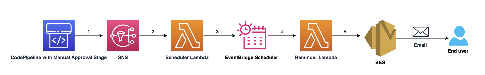
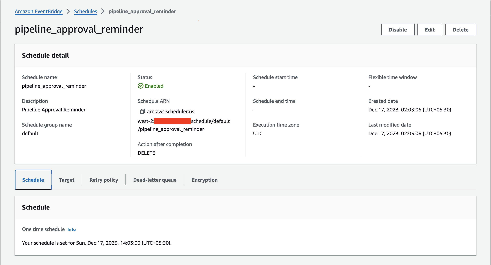

# Using EventBridge Scheduler to send reminder email for a CodePipeline Manual Approval Action using AWS Lambda & Amazon SES.

This pattern demonstrates how to create an EventBridge scheduler that would send a reminder email if no action is taken on a CodePipeline Manual Approval action after a given duration.

Learn more about this pattern at Serverless Land Patterns: << Add the live URL here >>

Important: this application uses various AWS services and there are costs associated with these services after the Free Tier usage - please see the [AWS Pricing page](https://aws.amazon.com/pricing/) for details. You are responsible for any AWS costs incurred. No warranty is implied in this example.

## Requirements

* [Create an AWS account](https://portal.aws.amazon.com/gp/aws/developer/registration/index.html) if you do not already have one and log in. The IAM user that you use must have sufficient permissions to make necessary AWS service calls and manage AWS resources.
* [AWS CLI](https://docs.aws.amazon.com/cli/latest/userguide/install-cliv2.html) installed and configured
* [AWS Cloud Development Kit](https://docs.aws.amazon.com/cdk/v2/guide/cli.html)


## Deployment Instructions

1. Create a new directory, navigate to that directory in a terminal and clone the GitHub repository:
    ``` 
    git clone https://github.com/aws-samples/serverless-patterns
    ```
2. Change directory to the pattern directory:
    ```
    cd cdk-codepipeline-manual_approval-lambda-scheduler-ses
    ```
3. Install dependencies
    ```
    npm install
    ```
4. From the command line, configure AWS CDK:
    ```
    cdk bootstrap aws://ACCOUNT-NUMBER/REGION

    eg: 
    cdk bootstrap aws://123456789012/us-east-1
    ```

5. Synthesize CloudFormation template from the AWS CDK app:
    ```
    cdk synth
    ```
6. To deploy your stack, run the following the command line : 
    ```
    cdk deploy --all --parameters SenderEmail={source-email-address} --parameters ReceiverEmail={receiver-email-address} --parameters {sns-topic-arn}

    ```
    Here, 
    
    * Replace {source-email-address} with the email address that should be sending reminder email address. The email address should be verified identity from Amazon SES.
    * Replace {receiver-email-address} with the email address that would be receiving the reminder email address. The email address should be verified identity from Amazon SES.
    * Substitute "{sns-topic-arn}" with the actual Amazon SNS topic ARN linked to the CodePipeline pipeline's manual approval action. Ensure to provide the SNS topic associated with any pipeline existing in your AWS account, featuring a Manual Approval action as part of its pipeline configuration 

## Architecture 



## How it works

Let us now dive deeper into the architecture : 


Let's delve deeper into the architecture:

1. Manual Approval Action in CodePipeline:

Any CodePipeline within your AWS account featuring a Manual Approval action employs an SNS topic to facilitate the manual approval or rejection of the deployment. In our scenario, once the pipeline deployment reaches the manual approval stage, the associated SNS topic is notified.

2. Notification Process via SNS Topic:

The SNS topic then disseminates notifications to its subscribers, including the Scheduler Lambda.

3. Scheduler Lambda Invocation:

Upon receiving the notification, the Scheduler Lambda is invoked. It dynamically retrieves pipeline details associated with the SNS topic. Utilizing these details, the Scheduler Lambda orchestrates the creation of an EventBridge scheduler. This scheduler is configured with the Reminder Lambda function as its target and encompasses information about the pipeline along with specifics about the manual approval action as the scheduler's payload.

4. EventBridge Scheduler Activation:

The EventBridge Scheduler is scheduled to trigger precisely 6 hours after the CodePipeline reaches the Manual Approval action. This duration is customizable to suit your requirements. Upon activation, the scheduler invokes the Reminder Lambda function, passing the payload received from the Scheduler Lambda. EventBridge scheduler has ActionAfterCompletion set to 'DELETE' ensuring that the scheduler is deleted once it invokes the Reminder Lambda function.

5. Reminder Lambda Function Execution:

The Reminder Lambda function, armed with the pipeline and manual approval action details, queries the pipeline to ascertain its current state and the status of the approval action. If no action has been taken on the Manual Approval stage, the Reminder Lambda utilizes Amazon SES (Simple Email Service) to dispatch a new email notification. This email serves as a reminder, prompting users to review and take necessary actions on the pending manual approval within the CodePipeline.

## Testing

You can customise the time after which the eventbridge scheduler should invoke the Reminder Lambda function by updating `ScheduleExpression` in `scheduler_function/eventbridge_scheduler.py` before deploying the CDK stack. After deploying the stack, initiate a new deployment in the pipeline that includes the SNS topic associated with the Manual Approval action, and ensure it's integrated with this pattern's stack. As the pipeline progresses to the Manual Approval stage, navigate to the EventBridge scheduler in the AWS Management Console. There, you'll observe the creation of a new EventBridge schedule named **pipeline_approval_reminder**.

The schedule will look like this : 



Review the **Target** section below to locate the designated Target, in this instance, the Reminder Lambda function. Additionally, within this section, you'll discover the payload that will be transmitted to the Reminder Lambda function during its execution.

After 6 hours, if no action is yet taken on the Manual approval action then an email will be sent to the email address provided for the parameter "ReceiverEmail". The subject of this email would be **CodePipeline Action**. This email would contain detail of the pipeline on which action is needed. 

## Cleanup
 
1. Delete the stack
    ```bash
    cdk destroy --all
    ```
    
----
Copyright 2023 Amazon.com, Inc. or its affiliates. All Rights Reserved.

SPDX-License-Identifier: MIT-0