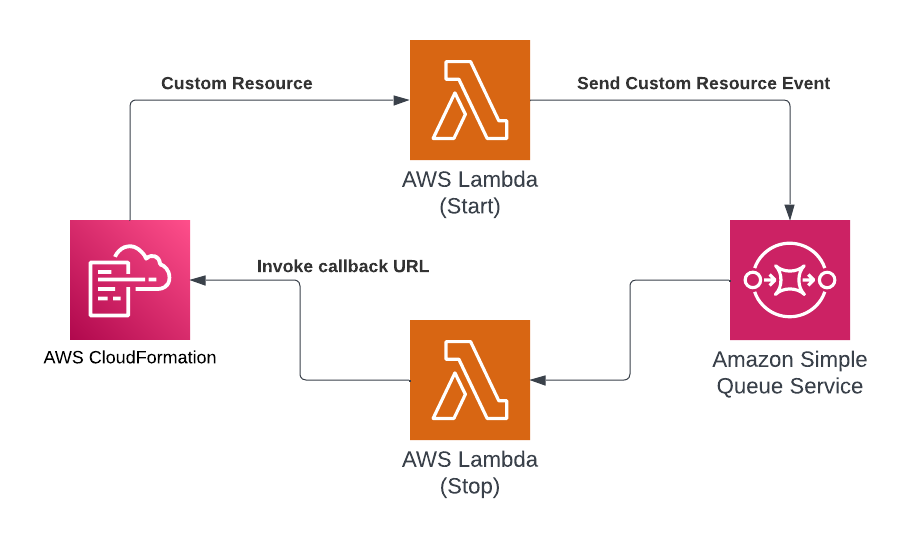

# Use multiple AWS Lambda functions to manage an AWS CloudFormation custom resource

This project contains a sample AWS CDK template for implementing an [AWS CloudFormation](https://aws.amazon.com/cloudformation/) custom resource that can take up to one hour to create or update.

This pattern illustrates how `Response URL` can be forwarded from one process to another, so that the overall duration is no longer limited to the 15-minutes timeout of an [AWS Lambda](https://aws.amazon.com/lambda/) function.



We are using [Amazon SQS](https://aws.amazon.com/sqs/) and the `Stop` Lambda function for illustrative purposes and they can be replaced with a different set of services for managing the custom resource. For example, [Implementing long running deployments with AWS CloudFormation Custom Resources using AWS Step Functions](https://aws.amazon.com/blogs/devops/implementing-long-running-deployments-with-aws-cloudformation-custom-resources-using-aws-step-functions/) illustrates an alternative implementation using [AWS Step Functions](https://aws.amazon.com/step-functions/).

Important: this application uses various AWS services and there are costs associated with these services after the Free Tier usage - please see the [AWS Pricing page](https://aws.amazon.com/pricing/) for details. You are responsible for any AWS costs incurred. No warranty is implied in this example.

## Requirements

* [Create an AWS account](https://portal.aws.amazon.com/gp/aws/developer/registration/index.html) if you do not already have one and log in. The IAM user that you use must have sufficient permissions to make necessary AWS service calls and manage AWS resources.
* [AWS CLI](https://docs.aws.amazon.com/cli/latest/userguide/install-cliv2.html) installed and configured
* [Git Installed](https://git-scm.com/book/en/v2/Getting-Started-Installing-Git)
* [Node and NPM](https://nodejs.org/en/download/) installed
* [AWS Cloud Development Kit](https://docs.aws.amazon.com/cdk/latest/guide/cli.html) (AWS CDK) installed

## Deploy

1. Clone the project to your local working directory

   ```sh
   git clone https://github.com/aws-samples/serverless-patterns
   ```

1. Change the working directory to this pattern's directory

   ```sh
   cd cdk-custom-resource-multiple-lambdas
   ```

1. Install the project dependencies

   ```sh
   npm install
   ```

1. Deploy the stack to your default AWS account and region

   ```sh
   cdk deploy --require-approval never
   ```

## Test

You can review Amazon CloudWatch logs for both `Start` and `Stop` Lambda functions to confirm that there were invoked successfully.

## Cleanup

Run the given command to delete the resources that were created. It might take some time for the CloudFormation stack to get deleted.

```sh
cdk destroy -f
```

## References

1. [Custom resources](https://docs.aws.amazon.com/AWSCloudFormation/latest/UserGuide/template-custom-resources.html)
2. [Implementing long running deployments with AWS CloudFormation Custom Resources using AWS Step Functions](https://aws.amazon.com/blogs/devops/implementing-long-running-deployments-with-aws-cloudformation-custom-resources-using-aws-step-functions/)

----
Copyright 2024 Amazon.com, Inc. or its affiliates. All Rights Reserved.

SPDX-License-Identifier: MIT-0