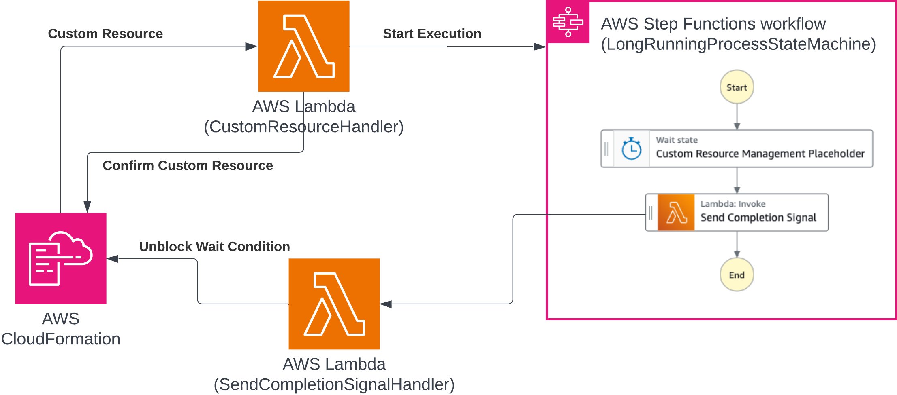

# Use AWS CloudFormation Wait Conditions for long-running custom resources

This project demonstrates how to implement [AWS CloudFormation](https://aws.amazon.com/cloudformation/) custom resources that can run for up to 12 hours using [Wait Conditions](https://docs.aws.amazon.com/AWSCloudFormation/latest/UserGuide/using-cfn-waitcondition.html).

AWS Lambda functions have a 15-minute execution timeout, limiting CloudFormation custom resources to short-running operations. This pattern extends custom resource execution time to 12 hours by decoupling lifecycle management from process execution.



## How it works

The architecture uses four components:

1. **Custom Resource Handler Lambda** - Receives CloudFormation lifecycle events and starts a Step Function execution, then returns success immediately to prevent timeouts
2. **Step Function** - Orchestrates the long-running process with built-in retry mechanisms and error handling
3. **Completion Signal Handler Lambda** - Sends success/failure signals to the Wait Condition Handle when the process completes
4. **Wait Condition** - Blocks CloudFormation stack completion until receiving the completion signal

This approach enables asynchronous processing with proper CloudFormation integration, supporting use cases like database migrations, complex infrastructure provisioning, and third-party system integrations that exceed Lambda's 15-minute limit.

Important: this application uses various AWS services and there are costs associated with these services after the Free Tier usage - please see the [AWS Pricing page](https://aws.amazon.com/pricing/) for details. You are responsible for any AWS costs incurred. No warranty is implied in this example.

## Requirements

* [Create an AWS account](https://portal.aws.amazon.com/gp/aws/developer/registration/index.html) if you do not already have one and log in. The IAM user that you use must have sufficient permissions to make necessary AWS service calls and manage AWS resources.
* [AWS CLI](https://docs.aws.amazon.com/cli/latest/userguide/install-cliv2.html) installed and configured
* [Git Installed](https://git-scm.com/book/en/v2/Getting-Started-Installing-Git)
* [Node and NPM](https://nodejs.org/en/download/) installed
* [AWS Cloud Development Kit](https://docs.aws.amazon.com/cdk/latest/guide/cli.html) (AWS CDK) installed

## Deploy

1. Clone the project to your local working directory

   ```sh
   git clone https://github.com/aws-samples/serverless-patterns
   ```

1. Change the working directory to this pattern's directory

   ```sh
   cd cdk-custom-resource-with-wait-condition
   ```

1. Install the project dependencies

   ```sh
   npm install
   ```

1. Deploy the stack to your default AWS account and region

   ```sh
   cdk deploy --require-approval never
   ```

## Test

You can review Amazon CloudWatch logs for the Lambda functions and Step Function execution to confirm that the long-running process completed successfully and the wait condition was signaled.

## Cleanup

Run the given command to delete the resources that were created. It might take some time for the CloudFormation stack to get deleted.

```sh
cdk destroy -f
```

## Useful commands

* `npm run build`   compile typescript to js
* `npm run watch`   watch for changes and compile
* `npm run test`    perform the jest unit tests
* `npx cdk deploy`  deploy this stack to your default AWS account/region
* `npx cdk diff`    compare deployed stack with current state
* `npx cdk synth`   emits the synthesized CloudFormation template

## References

1. [Custom resources](https://docs.aws.amazon.com/AWSCloudFormation/latest/UserGuide/template-custom-resources.html)
2. [Using wait conditions](https://docs.aws.amazon.com/AWSCloudFormation/latest/UserGuide/using-cfn-waitcondition.html)
3. [Implementing long running deployments with AWS CloudFormation Custom Resources using AWS Step Functions](https://aws.amazon.com/blogs/devops/implementing-long-running-deployments-with-aws-cloudformation-custom-resources-using-aws-step-functions/)

----
Copyright 2025 Amazon.com, Inc. or its affiliates. All Rights Reserved.

SPDX-License-Identifier: MIT-0
