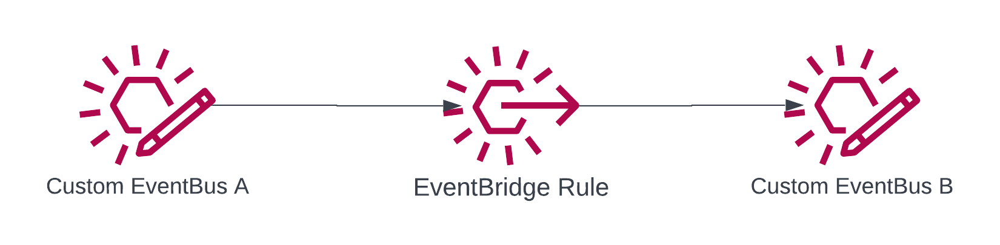
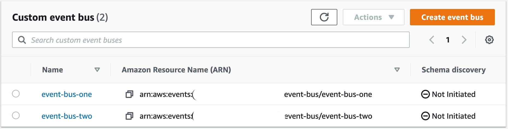

# EventBus Mesh Pattern

This pattern demonstrates how to connect two EventBridge Custom Buses together via EventBridge Rules with CDK



By connecting two or more EventBuses together forming a mesh, the rules associated with the consumers and producers can be more isolated and closer to the features that are producing and consuming those messages. This layer of isolation gives a feature/service the ability to work more autonomously and reduces the risk of rules overlapping or permissions being too liberal.

Learn more about this pattern at Serverless Land Patterns: << Add the live URL here >>

**Important**: this application uses various AWS services and there are costs associated with these services after the Free Tier usage - please see the [AWS Pricing page](https://aws.amazon.com/pricing/) for details. You are responsible for any AWS costs incurred. No warranty is implied in this example.

## Requirements

-   [Create an AWS account](https://portal.aws.amazon.com/gp/aws/developer/registration/index.html) if you do not already have one and log in. The IAM user that you use must have sufficient permissions to make necessary AWS service calls and manage AWS resources.
-   [AWS CLI](https://docs.aws.amazon.com/cli/latest/userguide/install-cliv2.html) installed and configured
-   [Git Installed](https://git-scm.com/book/en/v2/Getting-Started-Installing-Git)
-   [Node and NPM](https://nodejs.org/en/download/) installed
-   [AWS CDK](https://docs.aws.amazon.com/cdk/v2/guide/getting_started.html) (AWS CDK) installed

## Deployment Instructions

1. Create a new directory, navigate to that directory in a terminal and clone the GitHub repository:

```
git clone https://github.com/aws-samples/serverless-patterns
```

2. Change directory to the pattern directory:

```
cd cdk-eventbridge-mesh
```

3. Install the project dependencies

```
npm install
```

4. Deploy the stack to your default AWS account and region

```
make deploy
```

## How it works

This pattern is designed to create two separate Custom EventBridge EventBuses and connect them together via an EventBridge Rule. The output of a generated message will be the triggering of a State Machine that simply runs a Succeed Task

Once the pattern is deployed to AWS, you will have the following resources created with the described capabilities

-   EventBusOne `event-bus-one` which is the source bus for events to be produced onto
-   EventBusTwo `event-bus-two` which is the consuming bus that is "meshed" with Bus One
-   State Machine `SampleStateMachine` that will be the target of an additional rule in EventBusTwo that demonstrates consuming the originally produced event

Those resources will look like the below in the AWS Console

#### EventBuses



#### State Machine


## Testing

Included in this repository is a `Makefile` that looks like the following

```Makefile
deploy:
	cdk synth
	cdk deploy

destroy:
	cdk destroy

test-events:
	./tests/put-event.sh
```

After running `make deploy` create a couple of test events

### Testing Success

`make test-events`

```bash
aws events put-events --entries '[ { "Source": "com.binaryheap.sample", "Detail": "{ \"fieldA\": \"Hello\", \"fieldB\": \"World\" }", "DetailType": "Busing", "EventBusName": "event-bus-one" }, { "Source": "com.binaryheap.sample", "Detail": "{ \"fieldA\": \"Hello\", \"fieldB\": \"Again! Hi!\" }", "DetailType": "Busing", "EventBusName": "event-bus-one" } ]'
```

The Make command will run this AWS CLI command to put 2 events on `event-bus-one`

### Inspecting in the AWS Console

StepFunctions - `SampleStateMachine` will be created when deployed and executed upon running the command above

The results should appear like below


## Cleanup

1. Delete the stack

```bash
make destroy
```

## Documentation

-   [EventBridge CDK Documentation](https://docs.aws.amazon.com/cdk/api/v2/docs/aws-cdk-lib.aws_events-readme.html)
-   [AWS EventBridge Custom Bus](https://docs.aws.amazon.com/eventbridge/latest/userguide/eb-create-event-bus.html)

---

Copyright 2023 Amazon.com, Inc. or its affiliates. All Rights Reserved.

SPDX-License-Identifier: MIT-0
