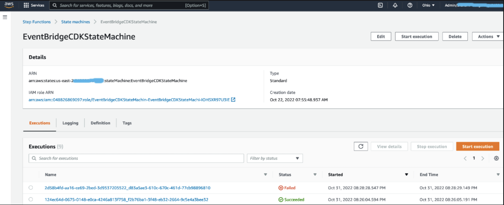
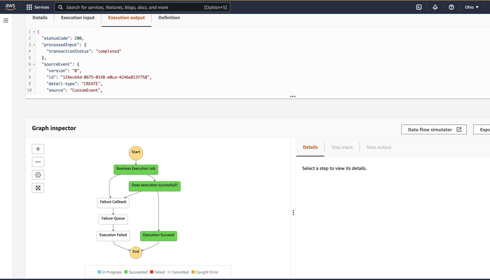
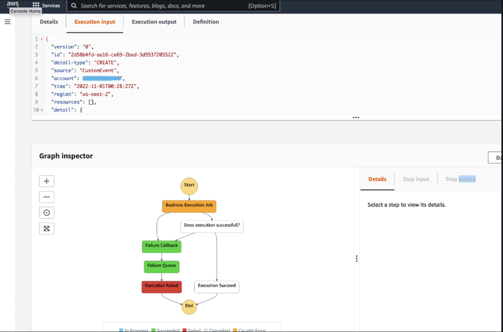
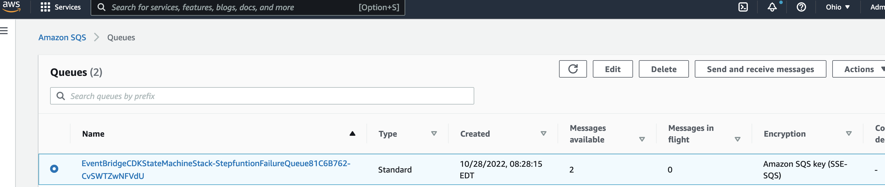
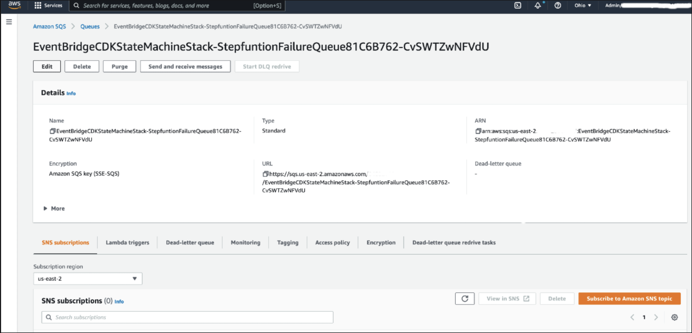
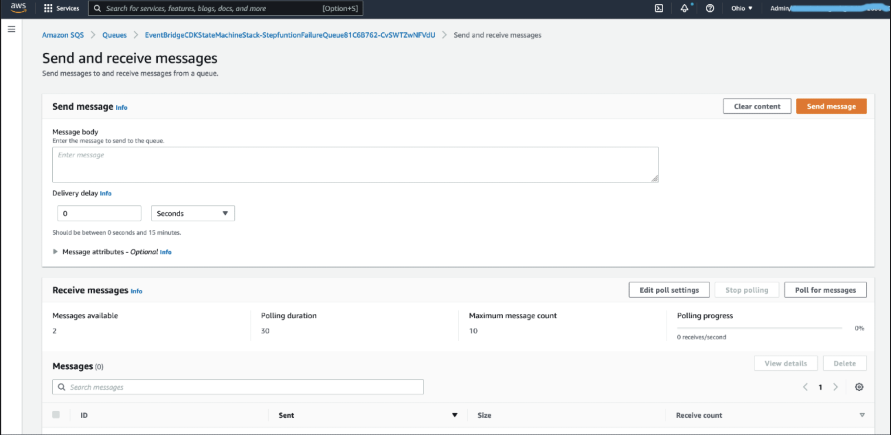

# Amazon EventBridge -> AWS Step Functions -> SQS

This pattern creates an Amazon EventBridge event bus, a AWS Step Functions workflow, and subscribes the AWS Step Functions workflow to be executed when a `customEvent` event is published to the event bus. The AWS Step Functions workflow executes Lambda function for business worflow. AWS Lambda can occasionally experience transient service errors. In this case, invoking Lambda results in a 500 error, such as ServiceException, AWSLambdaException, or SdkClientException. As a best practice, proactively handle these exceptions in your state machine to Retry invoking your Lambda function, or to Catch the error and move to Failed Queue for operational needs. 

Important: this application uses various AWS services and there are costs associated with these services after the Free Tier usage - please see the [AWS Pricing page](https://aws.amazon.com/pricing/) for details. You are responsible for any AWS costs incurred. No warranty is implied in this example.

## Architecture


## StateMachine Flow


## Requirements

* [Create an AWS account](https://portal.aws.amazon.com/gp/aws/developer/registration/index.html) if you do not already have one and log in. The IAM user that you use must have sufficient permissions to make necessary AWS service calls and manage AWS resources.
* [AWS CLI](https://docs.aws.amazon.com/cli/latest/userguide/install-cliv2.html) installed and configured
* [Git Installed](https://git-scm.com/book/en/v2/Getting-Started-Installing-Git)
* [Node.js Installed](https://nodejs.org/en/download/)
* [AWS CDK](https://docs.aws.amazon.com/cdk/v2/guide/cli.html)

## Deployment Instructions

1. Create a new directory, navigate to that directory in a terminal and clone the GitHub repository:
    ``` 
    git clone https://github.com/aws-samples/serverless-patterns
    ```
1. Change directory to the pattern directory:
    ```
    cd cdk-eventbridge-stepfunction-sqs
    ```
2. Inside the `cdk-eventbridge-stepfunction-sqs` directory run ` npm install` to fetch the cdk project's dependencies

3. Run `cdk bootstrap`

4. From the command line, use CDK to deploy the AWS resources for the pattern. You'll be prompted to approve security related changes during the deployment.
    ```
    cdk deploy
    ```
5. This command will take sometime to run. After successfully completing, it will print out a few output variables.  Your output should look something like this which contain the resource names which are used for testing.
```
Outputs:
EventBridgeCDKStateMachineStack.EventCustomBus = EventBridgeCDKStateMachineStackcustomEventBusXXXXXXX
EventBridgeCDKStateMachineStack.StepFunction = EventBridgeCDKStateMachine
EventBridgeCDKStateMachineStack.StepfunctionFailureEventsQueue = EventBridgeCDKStateMachineStack-StepfuntionFailureQueue81C6B762-XXXXXXX
EventBridgeCDKStateMachineStack.EventBridgeFailureDLQ = EventBridgeCDKStateMachineStack-aysncdlqQueueA1EEE5D6-XXXXXXX
```
## How it works

* Let's create two custom events through AWS Console one for failure and another one for successfull execution. 
  Successfull event invokes AWS Step Functions and executes lambda function successfully and completes the step function state machine successfully 
  Failure event invokes AWS Step Functions and executes lambda function which throws custom exception and get retried 2 times using AWS Step Functions error hanlder. After retry is exhausted, Catch handler moves the state machine failure queue. AWS Step Functions writes failure message to the AWS SQS using "SendMessage" task which can be handled for operational needs. 

## Testing

### Send an event to the event bus to trigger the Step Functions workflow

Let's create two custom events for success and failure execution, To do this, log into the AWS Console at [https://console.aws.amazon.com](https://console.aws.amazon.com) you can send a two custom messages separately to the event bus using the AWS Console. 

1) Go to the Amazon EventBridge service page. View a list of event buses by selecting the "Event buses" link on the left navigation menu.(e.g. `EventBridgeCDKStateMachineStackcustomEventBusXXXXXX`)


1.a Publish "success" event
    Click on the "Send Events" button at the top right. This brings up a screen that you can use to publish events to the EventBridge.
    
    * Event bus: Select the CustomBus (EventBridgeCDKStateMachineStackcustomEventBusXXXXXX).
    * Event source: Enter `CreateEvent` - This is required field 
    * Detail type: Enter `CREATE` - This is required field
    * Event detail: In the event detail, you should craft a JSON payload that sets the `failure` field to be false.
```json
{
  "failure": false
}
```
1.b Click the "Send" button and the confirmation will be displayed:


2.a Publish "failure" event
    Click on the "Send Events" button at the top right. This brings up a screen that you can use to publish events to the EventBridge.
    
    * Event bus: Select the CustomBus (EventBridgeCDKStateMachineStackcustomEventBusXXXXXX).
    * Event source: Enter `CreateEvent` - This is required field 
    * Detail type: Enter `CREATE` - This is required field
    * Event detail: In the event detail, you should craft a JSON payload that sets the `failure` field to be true.
```json
{
  "failure": true
}
```
2.b Click the "Send" button and the confirmation will be displayed:


### Check that the Step Functions workflow started

In the AWS Console, navigate to the AWS Step Functions service. You should see your new state machine in the list.


Click on your state machine, and you should see a list of executions. Click on the latest to view the result of the execution and you will notice two recent executions. 



Click the " Succeeded" status execution to see the state machine, and details. 



Click the "Failed" status execution to see the state machine, and details. After the execution the failed event is send to failed AWS SQS queue.



### Check that the Failure SQS recieved the failed messages

In the AWS Console, navigate to the AWS SQS service. You should see your new failure queue in the list.



Click the "EventBridgeCDKStateMachineStack-StepfuntionFailureQueue81XXXXX", and you should see the "Send and Receive messages" on the top right side. Click the "Send and Receive messages" to navigate to "Poll message" screen. 



Click the "Poll for messages", and you should see the failure messages displayed on the bottom.


### Making changes

You can customize the AWS Step Functions configuration by editing the code at `./lib/eventbridge-stepfunction-sqs-stack.ts`. To deploy changes, use the `cdk deploy` command.

## Cleanup
 
1. Delete the stack
    ```
    cdk destroy
    ```

2. Confirm the stack has been deleted. Login to the AWS console and navigate to the AWS Cloudformation service page "EventBridgeCDKStateMachineStack" is deleted or run the below 
    ```bash
    aws cloudformation list-stacks --query "StackSummaries[?contains(StackName,'EventBridgeCDKStateMachineStack')].StackStatus"
    ```

You should expect to see a message confirming `DELETE_COMPLETE`.

----
Copyright 2021 Amazon.com, Inc. or its affiliates. All Rights Reserved.

SPDX-License-Identifier: MIT-0

