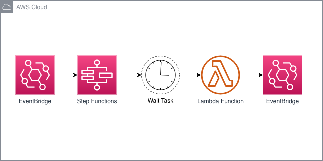
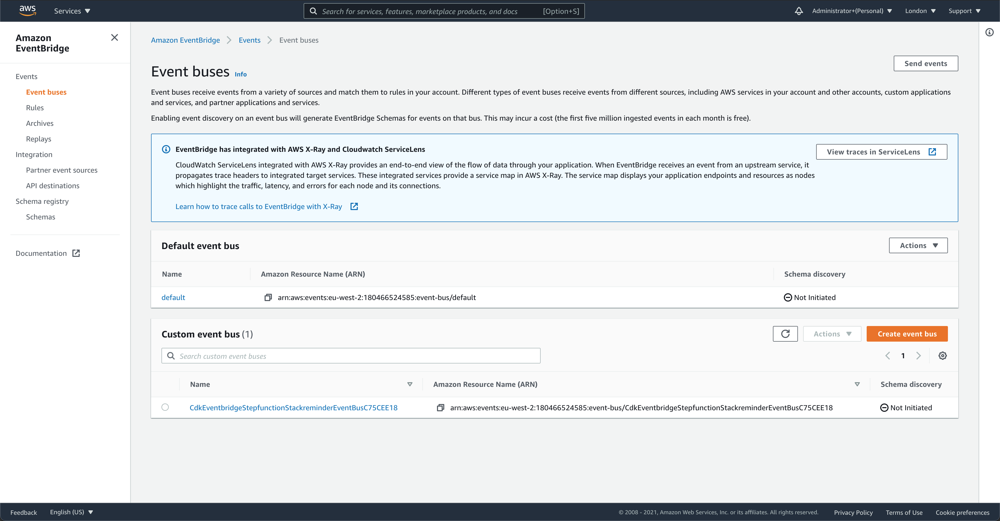
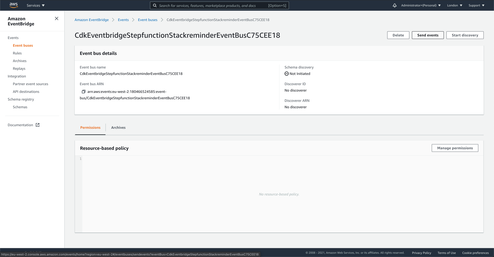
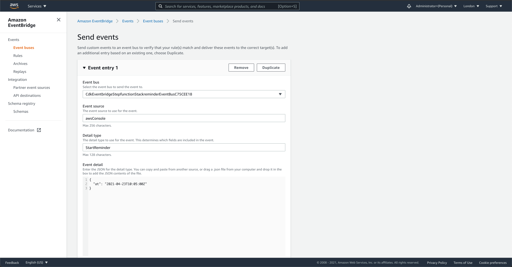
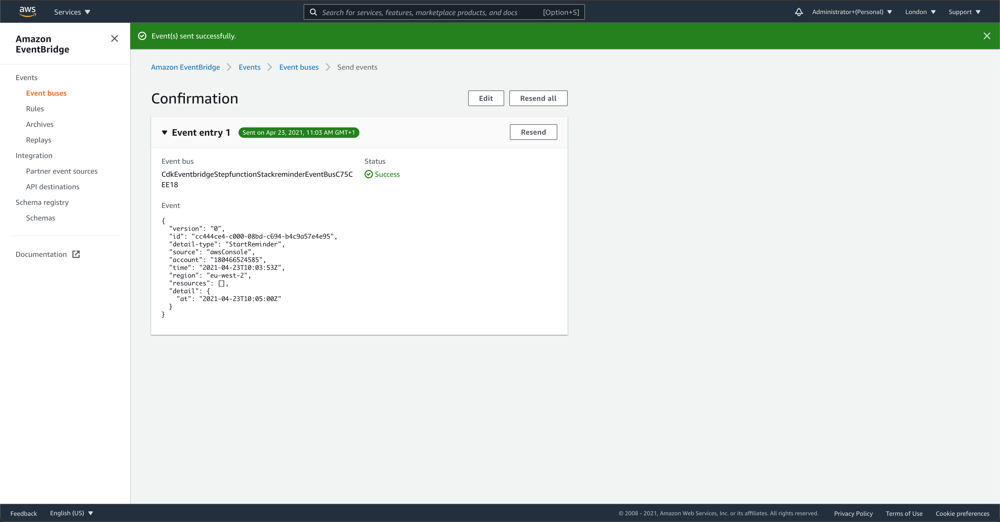
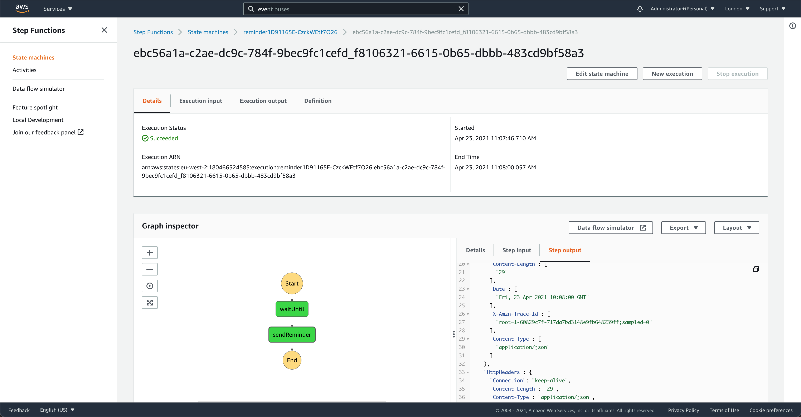
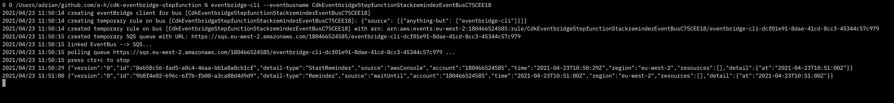

# Amazon EventBridge to AWS Step Functions



This pattern creates an EventBridge event bus, a Step Functions workflow, and subscribes the Step Functions workflow to be executed when a `StartReminder` event is published to event bus. The Step Functions workflow waits until the specified date before publishing a `Reminder` event to the event bus using a Lambda function.

Learn more about this pattern at Serverless Land Patterns: https://serverlessland.com/patterns/cdk-eventbridge-stepfunction

Important: this application uses various AWS services and there are costs associated with these services after the Free Tier usage - please see the [AWS Pricing page](https://aws.amazon.com/pricing/) for details. You are responsible for any AWS costs incurred. No warranty is implied in this example.

## Requirements

* [Create an AWS account](https://portal.aws.amazon.com/gp/aws/developer/registration/index.html) if you do not already have one and log in. The IAM user that you use must have sufficient permissions to make necessary AWS service calls and manage AWS resources.
* [AWS CLI](https://docs.aws.amazon.com/cli/latest/userguide/install-cliv2.html) installed and configured
* [Git Installed](https://git-scm.com/book/en/v2/Getting-Started-Installing-Git)
* [Node.js Installed](https://nodejs.org/en/download/)
* [https://github.com/spezam/eventbridge-cli Installed (helps with testing)](https://github.com/spezam/eventbridge-cli)

## Deployment Instructions

1. Create a new directory, navigate to that directory in a terminal and clone the GitHub repository:
    ``` 
    git clone https://github.com/aws-samples/serverless-patterns
    ```
1. Change directory to the pattern directory:
    ```
    cd cdk-eventbridge-stepfunction
    ```
1. Install Node.js dependencies:
    ```
    npm i
    ```
1. From the command line, use CDK to deploy the AWS resources for the pattern. You'll be prompted to approve security related changes during the deployment.
    ```
    npx cdk deploy
    ```
1. Note the outputs from the CDK deployment process. These contain the resource names which are used for testing.

## How it works

At the end of the deployment the CDK output will list an output of the name of the new EventBridge event bus that the stack created.

Your output should look something like this:

    ```
    Outputs:
    CdkEventbridgeStepfunctionStack.reminderBus = CdkEventbridgeStepfunctionStackreminderEventBusXXXXXXX
    ```

## Testing

### Monitor the EventBridge

First, let's configure the [https://github.com/spezam/eventbridge-cli](https://github.com/spezam/eventbridge-cli) tool to monitor everything that happens on the EventBridge event bus. You will need to run this tool using a terminal or command line interface.

The tool will create a temporary subscription to the EventBridge event bus that allows you to see all of the messages that are sent to the bus.

For the `--eventbusname` parameter, use the name of the `reminderBus` EventBridge which was just output by the CDK deploy command.

```
eventbridge-cli --eventbusname CdkEventbridgeStepfunctionStackreminderEventBusXXXXXXX
```

Keep this running in the background while invoking the Step Functions workflow.

### Send an event to the event bus to trigger the Step Functions workflow

Once the tool is running, you can send a message to the event bus using the AWS Console. To do this, log into the AWS Console at [https://console.aws.amazon.com](https://console.aws.amazon.com)

Select the same region that you used to deploy the CDK project, and navigate to the Amazon EventBridge service page.

View a list of event buses by selecting the "Event buses" link on the navigation menu.



Click on the name of your new event bus (e.g. `CdkEventbridgeStepfunctionStackreminderEventBusXXXXXXX`) to view the details of the event bus.



Click on the "Send Events" button at the top right. This brings up a screen that you can use to publish events to the EventBridge.

* Event bus: Ensure that your new event bus is selected.
* Event source: Enter `awsConsole`.
* Detail type: Enter `StartReminder` - this is essential because only `StartReminder` events trigger the Step Functions workflow.
* Event detail: In the event detail, you should craft a JSON payload that sets the `at` field to be a date that's a few minutes in the future. Make sure to adjust the time based on your local timezone in the `at` field.

```json
{
  "at": "2021-04-26T19:00:00Z"
}
```



Click the "Send" button and the confirmation will be displayed:



### Check that the Step Functions workflow started

In the AWS Console, navigate to the Step Functions service. You should see your new state machine in the list.


Click on your state machine, and you should see a list of executions. Click on the latest to view the result of the execution.



After the `at` date is reached, the execution status will be "Succeeded" and a message will be send to the Event Bus.

### Monitor the event bus

Once the Step Functions workflow has completed, at your terminal or command line, you should be able to see that the `reminder` Step Functions workflow has sent a `Reminder` message to the event bus.



### Making changes

You can customize the Step Functions configuration by editing the code at `./lib/cdk-eventbridge-stepfunction-stack.ts`. To deploy changes, use the `npx cdk deploy` command.

## Cleanup
 
1. Delete the stack
    ```bash
    npx cdk destroy
    ```

2. Confirm the stack has been deleted
    ```bash
    aws cloudformation list-stacks --query "StackSummaries[?contains(StackName,'CdkEventbridgeStepfunctionStack')].StackStatus"
    ```

You should expect to see a message confirming `DELETE_COMPLETE`.

----
Copyright 2021 Amazon.com, Inc. or its affiliates. All Rights Reserved.

SPDX-License-Identifier: MIT-0

