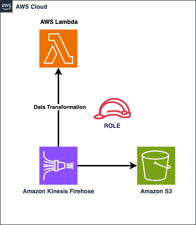

# KinesisFirehose Transformation with Lambda Integration



## Requirements

* [Create an AWS account](https://portal.aws.amazon.com/gp/aws/developer/registration/index.html) if you do not already have one and log in. The IAM user that you use must have sufficient permissions to make necessary AWS service calls and manage AWS resources.
* [AWS CLI](https://docs.aws.amazon.com/cli/latest/userguide/install-cliv2.html) installed and configured
* [Git Installed](https://git-scm.com/book/en/v2/Getting-Started-Installing-Git)
* [AWS CDK Toolkit](https://docs.aws.amazon.com/cdk/latest/guide/cli.html) installed and configured
* [Java 11+](https://docs.aws.amazon.com/corretto/latest/corretto-11-ug/downloads-list.html) installed
* [Docker](https://docs.docker.com/get-docker/) Installed

## Deployment Instructions

1. Create a new directory, navigate to that directory in a terminal and clone the GitHub repository:

    ```
    git clone https://github.com/aws-samples/serverless-patterns
    ```
2. Change directory to the pattern directory:

    ```
    cd serverless-patterns/cdk-firehose-s3-transform-java
    ```
3. From the command line, use AWS CDK to deploy the AWS resources for the serverless application

    ```bash
    cd infrastructure
    ```
4. From the command line, Synthesize the cdk stack to emits the synthesized CloudFormation template. Set up will make sure to build and package
   the lambda functions residing in software directory.

    ```bash
    cdk synth
    ```
5. From the command line, use AWS CDK to deploy the AWS resources.

    ```bash
    cdk deploy
    ```
   Alternatively infrastructure/deploy.sh can be used to build and deploy the stack

## How it works

This Kinesis Data Firehose invoke Lambda to transform incoming stream of data. This data processing pattern makes use of the L2 contructs aws-kinesisfirehose-alpha [Solution construct](https://constructs.dev/packages/@aws-cdk/aws-kinesisfirehose-alpha/v/2.101.1-alpha.0?lang=java) to create the infrastructure.

Lambda written in Java gets triggered based on the events from the Kinesis Data Firehose. For any error in invocation of the lambda function or transformation outcome of the events, they are persisted in the configured S3 buckets.

In the example the Kinesis Data Firehose transformation lambda function is configured with max 5 retries, buffering interval of 5 minutes and max buffer size of 3 MB.

Lambda code for transformation is a simple code which concantenates the sample data posted via Firehose to add additional element summary in the json written to S3 bucket.

For more details on handling Success and Failure conditions in Kinesis Data firehose, refer the [documentation](https://docs.aws.amazon.com/firehose/latest/dev/data-transformation.html).

## Testing
After CDK deploy gets completed, navigate to the Kinesis Data Firehose which got created and navigate to the testing secition in the console and click on the StartStreaming demom data. The transformed data will get created as files with json objects in the S3 bucket.

## Cleanup

1. Delete the stack
    ```bash
    cdk destroy
    ```
----
Copyright 2023 Amazon.com, Inc. or its affiliates. All Rights Reserved.

SPDX-License-Identifier: MIT-0