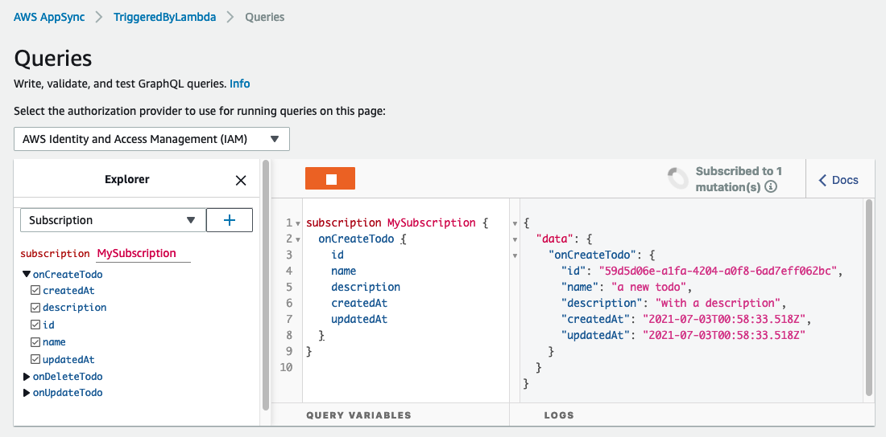

# Lambda function calling AppSync GraphQl API

This project contains a sample AWS CDK template for calling [AWS AppSync](https://aws.amazon.com/appsync/) from an [AWS Lambda](https://aws.amazon.com/lambda/).

In this pattern, AWS AppSync provides a schema that allows you to manage and read todos. A Lambda function is implemented that can interact with the GraphQL API. This function can create todos by using the codegen generated from the schema by the [Amplify CLI codegen](https://docs.amplify.aws/cli). The codegen provides the operations and the variable types, which makes it simple to interact with the AppSync GraphQL API from the Typescript function. This pattern is useful in event driven design that trigger your AppSync function from the backend. Those changes can then easily be reflected on front-end clients in real time by using AppSync subscriptions.

Important: this application uses various AWS services and there are costs associated with these services after the Free Tier usage - please see the [AWS Pricing page](https://aws.amazon.com/pricing/) for details. You are responsible for any AWS costs incurred. No warranty is implied in this example.

## Requirements

* [Create an AWS account](https://portal.aws.amazon.com/gp/aws/developer/registration/index.html) if you do not already have one and log in. The IAM user that you use must have sufficient permissions to make necessary AWS service calls and manage AWS resources.
* [AWS CLI](https://docs.aws.amazon.com/cli/latest/userguide/install-cliv2.html) installed and configured
* [Git Installed](https://git-scm.com/book/en/v2/Getting-Started-Installing-Git)
* [Node and NPM](https://nodejs.org/en/download/) installed
* [AWS Cloud Development Kit](https://docs.aws.amazon.com/cdk/latest/guide/cli.html) (AWS CDK) installed

Make sure you install the Amplify CLI:

* [Amplify CLI](https://docs.amplify.aws/cli/start/install): `npm install -g @aws-amplify/cli`

## Deploy

1. Clone the project to your local working directory

   ```sh
   git clone https://github.com/aws-samples/serverless-patterns
   ```

2. Change the working directory to this pattern's directory

   ```sh
   cd cdk-lambda-appsync/cdk
   ```

3. Install the project dependencies

   ```sh
   npm install
   ```

4. Deploy the stack to your default AWS account and region. The output of this command shows the GraphQL API id, URL, and the lambda function ARN and name.

   ```sh
   cdk deploy
   ```

## Test

You can test creating a new todo from your Lambda function, by visiting the Lambda console, selecting your function, and running a test.

Alternatively, you can test directly from your terminal:

```sh
# replace <functionName> with the outputs values from `cdk deploy`
aws lambda invoke --function-name <functionName> --payload '{}' /tmp/response.json
```

You can see your subscription triggered by your mutation by starting a subscription from the console as shown below:



You can run a query directly from your terminal:

## Cleanup

Run the given command to delete the resources that were created. It might take some time for the CloudFormation stack to get deleted.

```sh
cdk destroy
```

## References

1. [Exporting AppSync operations to a Lambda layer for easy reuse](https://docs.amplify.aws/guides/functions/appsync-operations-to-lambda-layer/q/platform/js)
2. [Simplify access to multiple microservices with AWS AppSync and AWS Amplify](https://aws.amazon.com/blogs/mobile/appsync-microservices/)
3. [Tutorial: HTTP Resolvers](https://docs.aws.amazon.com/appsync/latest/devguide/tutorial-http-resolvers.html)

----
Copyright 2021 Amazon.com, Inc. or its affiliates. All Rights Reserved.

SPDX-License-Identifier: MIT-0
