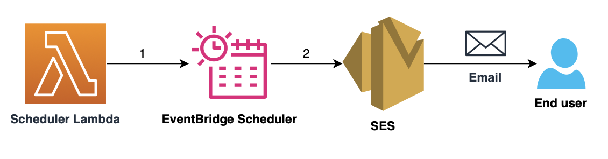

# Using EventBridge Scheduler to send scheduled reminder emails. 

This pattern demonstrates how to create an EventBridge scheduler that would send scheduled reminder email and would then be deleted. The pattern uses a Lambda function to create EventBridge scheduler.  

Learn more about this pattern at Serverless Land Patterns: << Add the live URL here >>

Important: this application uses various AWS services and there are costs associated with these services after the Free Tier usage - please see the [AWS Pricing page](https://aws.amazon.com/pricing/) for details. You are responsible for any AWS costs incurred. No warranty is implied in this example.

## Requirements

* [Create an AWS account](https://portal.aws.amazon.com/gp/aws/developer/registration/index.html) if you do not already have one and log in. The IAM user that you use must have sufficient permissions to make necessary AWS service calls and manage AWS resources.
* [AWS CLI](https://docs.aws.amazon.com/cli/latest/userguide/install-cliv2.html) installed and configured
* [AWS Cloud Development Kit](https://docs.aws.amazon.com/cdk/v2/guide/cli.html)


## Deployment Instructions

1. Create a new directory, navigate to that directory in a terminal and clone the GitHub repository:
    ``` 
    git clone https://github.com/aws-samples/serverless-patterns
    ```
2. Change directory to the pattern directory:
    ```
    cd cdk-lambda-scheduler-ses
    ```
3. Install dependencies
    ```
    npm install
    ```
4. From the command line, configure AWS CDK:
    ```
    cdk bootstrap aws://ACCOUNT-NUMBER/REGION

    eg: cdk bootstrap aws://123456789012/us-east-1
    ```

5. Synthesize CloudFormation template from the AWS CDK app:
    ```
    cdk synth
    ```
6. To deploy your stack, run the following the command line : 
    ```
    cdk deploy --all --parameters SenderEmail={source-email-address} 
    ```
    Here, 

    * Replace {source-email-address} with the email address that should be sending reminder email address. The email address should be verified identity from Amazon SES.

## Architecture 



## How it works

Let us now dive deeper into the architecture : 

1. Scheduler Lambda Invocation:

    When the Scheduler Lambda is invoked. It extracts the following details from event:
    * Message to be sent. 
    * Date and time when the message should be sent.
    * Email ID to whom the message should be sent. 

    The lambda function then creates the EventBridge schedule and passes the details extracted as a payload to the scheduler.

2. EventBridge Scheduler Activation:

    The EventBridge Scheduler sends email using SES. After the scheduler has sent email, it is deleted automatically.

## Testing

Once the whole setup is deployed using CDK, you can carry out testing by creating a [Test event](https://docs.aws.amazon.com/lambda/latest/dg/testing-functions.html#creating-private-events) for the Lambda function created and invoking the lambda function with the Test event. Expected input for the event: 

```
     {
         "message": "Hello, this is a simple test",
         "datetime": "2023-12-22T10:02:00Z",
         "email": "{email-address-to-whom-email-should-be-sent}"
     }
```
These three fields are required and are case-sensitive. Also note that "{email-address-to-whom-email-should-be-sent}" should be a verified identity from Amazon SES

## Cleanup

1. Delete the stack

    ```
    cdk destroy --all
    ```

----
Copyright 2023 Amazon.com, Inc. or its affiliates. All Rights Reserved.

SPDX-License-Identifier: MIT-0