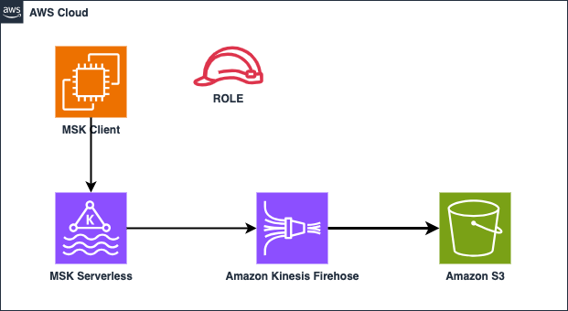
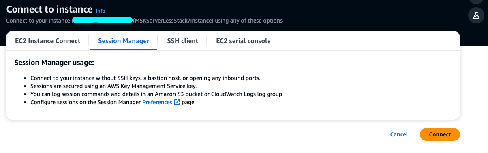
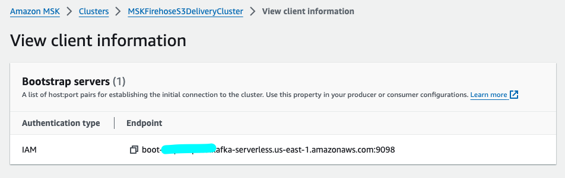
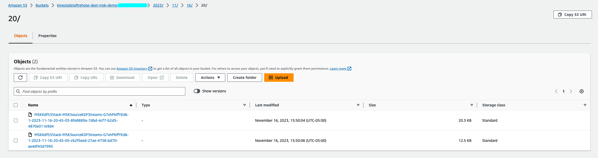

# Amazon MSK to Amazon S3 delivery using Amazon Kinesis Data Firehose

This demonstrates a CDK app with an instance of a stack (`CdkMSKServerlessVpcStack`) which contains an Amazon MSK Serverless cluster and stack (`CdkMSKKdfS3Stack`) which contains Amazon Kinesis Data FireHose with configurations for MSK as source and S3 as target.



## Requirements

* [Create an AWS account](https://portal.aws.amazon.com/gp/aws/developer/registration/index.html) if you do not already have one and log in. The IAM user that you use must have sufficient permissions to make necessary AWS service calls and manage AWS resources.
* [AWS CLI](https://docs.aws.amazon.com/cli/latest/userguide/install-cliv2.html) installed and configured
* [Git Installed](https://git-scm.com/book/en/v2/Getting-Started-Installing-Git)
* [AWS CDK Toolkit](https://docs.aws.amazon.com/cdk/latest/guide/cli.html) installed and configured
* [Python 3](https://www.python.org/download/releases/3.0/) installed and configured
* This stack makes use of AWS components which could incur cost in your account. 

## Deployment Instructions

1. Create a new directory, navigate to that directory in a terminal and clone the GitHub repository:
    ```
    git clone https://github.com/aws-samples/serverless-patterns
    ```
2. Change directory to the pattern directory:
    ```
    cd serverless-patterns/cdk-msk-firehose-s3-python
    ```
3. open the file cdk-msk-firehose-s3-python/app.py to update the <ACCOUNT_ID> with account id and <REGION> with AWS region in whihc the solution needs to be deployed  variables with the details.
    
4. From the command line, use AWS CDK to deploy the AWS resources for the serverless application. Deployment shell script file is used to execute the sequence of steps.
    ```bash
    ./deploy.sh
    ```
5. Follow the bellow  instructions to create the topics in the MSK Cluster before proceeding with the KDF deployment as given in the shell instructions

6. Login to the EC2 instance via Session Manager as shown below
7. 
   

6. Check whether the Java and Kafka installation are completed in the EC3 instance which got created by executing the following command
    ```bash
    sudo tail -f /var/log/cloud-init-output.log
    ```
7. Copy the MSK Endpoint from cluster View Client Information as shown below, and In the following export command, replace BOOTSTRAP_ENDPOINT with the bootstrap-server string you that you saved.
8. 
   
    ```bash
    export bs=<BOOTSTRAP_ENDPOINT>
    ```
8. Run the following command to create a topic called
   ```bash
    ./bin/kafka-topics.sh --bootstrap-server <MSK_BOOTSTRAP_URL> --command-config client.properties --create --topic msk-kdf-s3-topic --partitions 2
    ```
9. Continue with the KDF Deployment on the SHELL Prompt.Deployment of KDF takes few minutes.

10. After deployment is completed, produce messages in KAFKA TOPIC msk-kdf-s3-topic Created in step 8. 
   ```bash
    ./bin/kafka-console-producer.sh --broker-list $bs --producer.config ./bin/client.properties --topic msk-kdf-s3-topic
   ```
11. Check S3 bucket to validate the data S3 delivery pipeline.  
12. 
    

12. Once the testing and validation is completed empty the S3 bucket and execute the following command to clean up the stack.
    ```bash
    ./destroy.sh
    ```