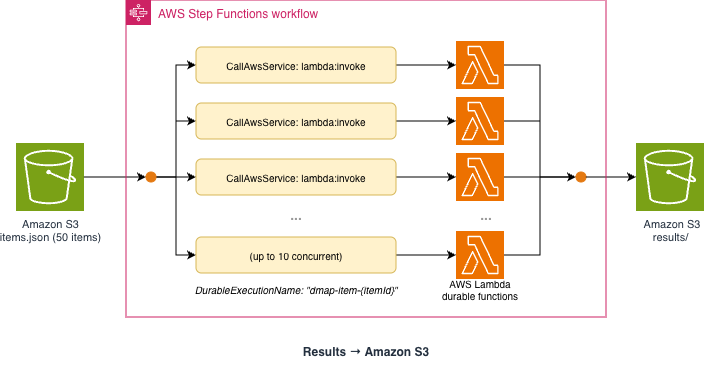

# AWS Step Functions Distributed Map with Lambda durable functions

This pattern demonstrates how to use AWS Step Functions Distributed Map with an Amazon S3 JSON input to fan out across 50 product catalog items, invoking a Lambda durable function for each item. The key technique is using the AWS Step Functions AWS SDK service integration (`CallAwsService` targeting `lambda:invoke`) instead of the optimized Lambda integration. This is necessary because only the raw SDK integration exposes the `DurableExecutionName` parameter, which enables per-item idempotency derived from each product's `itemId`.

Learn more about this pattern at Serverless Land Patterns: [https://serverlessland.com/patterns/cdk-sfn-dmap-df](https://serverlessland.com/patterns/cdk-sfn-dmap-df)

Important: this application uses various AWS services and there are costs associated with these services after the Free Tier usage - please see the [AWS Pricing page](https://aws.amazon.com/pricing/) for details. You are responsible for any AWS costs incurred. No warranty is implied in this example.

## Requirements

* [Create an AWS account](https://portal.aws.amazon.com/gp/aws/developer/registration/index.html) if you do not already have one and log in. The IAM user that you use must have sufficient permissions to make necessary AWS service calls and manage AWS resources.
* [AWS CLI](https://docs.aws.amazon.com/cli/latest/userguide/install-cliv2.html) installed and configured
* [Git Installed](https://git-scm.com/book/en/v2/Getting-Started-Installing-Git)
* [Node.js and npm](https://nodejs.org/) installed (Node.js 22+)
* [AWS CDK](https://docs.aws.amazon.com/cdk/latest/guide/getting_started.html) installed
* CDK bootstrapped in your target account/region

## Deployment Instructions

1. Create a new directory, navigate to that directory in a terminal and clone the GitHub repository:

    ```bash
    git clone https://github.com/aws-samples/serverless-patterns
    ```

2. Change directory to the pattern directory:

    ```bash
    cd cdk-sfn-dmap-df
    ```

3. Install dependencies:

    ```bash
    npm install
    ```

4. Deploy the CDK stack to your default AWS account and region:

    ```bash
    cdk deploy
    ```

5. Note the outputs from the CDK deployment process. These contain the resource names and ARNs used for testing.

## How it works



Architecture flow:
1. AWS Step Functions Distributed Map reads 50 product items from an Amazon S3 JSON file
2. For each item, the map invokes a Lambda durable function via the AWS SDK service integration (`lambda:invoke`)
3. The `DurableExecutionName` is derived from each item's `itemId` using `States.Format`, providing per-item idempotency
4. Each durable function executes a three-operation workflow:
   - **`validate-item`** (step) — Validates required fields, checks price > 0, computes a pricing tier (budget / standard / premium)
   - **`rate-limit-delay`** (wait) — Pauses 5 seconds to simulate downstream rate limiting. No compute charges during this wait
   - **`update-catalog`** (step) — Writes the enriched catalog entry with processing timestamps and a `completed` status
5. Results are written back to Amazon S3 under the `results/` prefix

### Why the AWS SDK Service Integration?

AWS Step Functions offers two ways to invoke AWS Lambda:

| Integration | ARN Pattern | `DurableExecutionName` Support |
|---|---|---|
| Optimized Lambda | `arn:aws:states:::lambda:invoke` | No |
| AWS SDK | `arn:aws:states:::aws-sdk:lambda:invoke` | Yes |

The optimized integration is simpler but only exposes a subset of the `Lambda.Invoke` API parameters. The AWS SDK integration maps directly to the full `Lambda.Invoke` API, giving access to `DurableExecutionName`. In CDK, this is expressed with `CallAwsService`:

```typescript
new tasks.CallAwsService(this, 'InvokeDurableFunction', {
  service: 'lambda',
  action: 'invoke',
  parameters: {
    'FunctionName': `${itemProcessor.functionArn}:$LATEST`,
    'InvocationType': 'RequestResponse',
    'DurableExecutionName.$': "States.Format('dmap-item-{}', $.itemId)",
    'Payload.$': '$',
  },
  iamResources: [
    `${itemProcessor.functionArn}:$LATEST`,
    itemProcessor.functionArn,
  ],
});
```

The `DurableExecutionName` is derived from each item's `itemId` using `States.Format`, so re-running the state machine with the same input file produces the same execution names. This means the durable functions return their previously checkpointed results instead of re-executing, providing end-to-end idempotency from AWS Step Functions through to durable function state.

## Testing

### Start the State Machine

```bash
aws stepfunctions start-execution \
  --state-machine-arn <StateMachineArn from stack output> \
  --name "catalog-update-$(date +%s)"
```

### Monitor Execution

Monitor the execution in the AWS Step Functions console. The Distributed Map view shows all 50 child executions and their status. Each child invokes the durable function synchronously with a unique `DurableExecutionName`. Results are written back to the Amazon S3 bucket under the `results/` prefix.

### Verify Deployment

```bash
# Confirm items.json was deployed to S3
aws s3 ls s3://<DataBucketName from stack output>/items.json

# Confirm the state machine exists
aws stepfunctions describe-state-machine \
  --state-machine-arn <StateMachineArn from stack output>
```

### Re-running for Idempotency

To demonstrate idempotency, start another execution with the same input:

```bash
aws stepfunctions start-execution \
  --state-machine-arn <StateMachineArn from stack output> \
  --name "catalog-update-rerun-$(date +%s)"
```

Since the `DurableExecutionName` values are derived from the `itemId` (which does not change between runs), the durable functions detect that executions with those names already completed and return the previously checkpointed results without re-executing any steps.

## Cleanup

1. Delete the stack:

    ```bash
    cdk destroy
    ```

2. Confirm the deletion when prompted. This removes all resources including the Amazon S3 bucket (configured with `autoDeleteObjects` and `RemovalPolicy.DESTROY`) and Amazon CloudWatch log groups.

---

Copyright 2026 Amazon.com, Inc. or its affiliates. All Rights Reserved.

SPDX-License-Identifier: MIT-0
