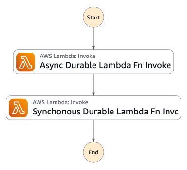
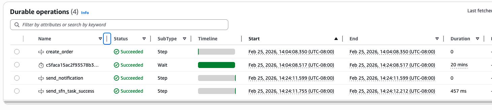

# AWS Step Functions to AWS Lambda durable functions 

This pattern demonstrates how to integrate AWS Lambda durable functions into an AWS Step Functions workflow. This pattern covers both the synchronous invocation (using default Request Response pattern) and asynchronous invocation (using the Step Function Wait for Callback with Task Token integration pattern) of the durable Lambda function. It addresses the challenge of running long-running Lambda functions (beyond 15 minutes) within a Step Functions orchestration, using asynchronous invocation and durable checkpointing.

Announced at re:Invent 2025, [Lambda durable functions](https://docs.aws.amazon.com/lambda/latest/dg/durable-functions.html) introduce a checkpoint/replay mechanism that allows Lambda executions to run for up to one year, automatically recovering from interruptions. This pattern shows how to combine durable functions with Step Functions in a hybrid architecture: durable functions handle application-level logic within Lambda, while Step Functions coordinates the high-level workflow across multiple AWS services.

Learn more about this pattern at Serverless Land Patterns: << Add the live URL here >>

Important: this application uses various AWS services and there are costs associated with these services after the Free Tier usage - please see the [AWS Pricing page](https://aws.amazon.com/pricing/) for details. You are responsible for any AWS costs incurred. No warranty is implied in this example.

## When to Use This Pattern
Use this pattern when:
- Your Lambda function execution time exceeds 15 minutes and must be orchestrated by Step Functions
- You want to keep complex business logic within a Lambda function rather than splitting into a fanout architecture
- Your team prefers standard programming languages and IDE-based development over visual/JSON workflow designers
- You need fine-grained control over execution state in code

Use Step Functions alone when:
- You are orchestrating multiple AWS services with native integrations
- Non-technical stakeholders need to understand and validate workflow logic
- You require zero-maintenance, fully managed infrastructure

Many applications benefit from using both services. A common pattern is using durable functions for application-level logic within Lambda, while Step Functions coordinates high-level workflows across multiple AWS services beyond Lambda functions.


## Requirements

* [Create an AWS account](https://portal.aws.amazon.com/gp/aws/developer/registration/index.html) if you do not already have one and log in. The IAM user that you use must have sufficient permissions to make necessary AWS service calls and manage AWS resources.
* [AWS CLI](https://docs.aws.amazon.com/cli/latest/userguide/install-cliv2.html) installed and configured
* [Git Installed](https://git-scm.com/book/en/v2/Getting-Started-Installing-Git)
* [AWS Cloud Development Kit](https://docs.aws.amazon.com/cdk/v2/guide/getting_started.html) (AWS CDK >= 2.240.0) Installed

## Deployment Instructions

1. Create a new directory, navigate to that directory in a terminal and clone the GitHub repository:
    ``` 
    git clone https://github.com/aws-samples/serverless-patterns
    ```
1. Change directory to the pattern directory:
    ```
    cd cdk-stepfunction-durable-lambda-function
    ```
1. Create a virtual environment for python:
    ```bash
    python3 -m venv .venv
    ```
1. Activate the virtual environment:
    ```bash
    source .venv/bin/activate
    ```

    If you are in Windows platform, you would activate the virtualenv like this:

    ```
    % .venv\Scripts\activate.bat
    ```

1. Install python modules:
    ```bash
    python3 -m pip install -r requirements.txt
    ```
1. From the command line, use CDK to synthesize the CloudFormation template and check for errors:

    ```bash
    cdk synth
    ```
    NOTE: You may need to perform a one time cdk bootstrapping using the following command. See [CDK Bootstrapping](https://docs.aws.amazon.com/cdk/v2/guide/bootstrapping.html) for more details.
    ```bash
    cdk bootstrap aws://<ACCOUNT-NUMBER-1>/<REGION-1>
    ```

1. From the command line, use CDK to deploy the stack:

    ```bash
    cdk deploy
    ```

    Expected result:

    ```bash
     ✅  CdkStepfunctionDurableLambdaFunctionStack

    Outputs:
    CdkStepfunctionDurableLambdaFunctionStack.AsyncDurableFunctionName = sfn-dfn-async-durable-fn
    CdkStepfunctionDurableLambdaFunctionStack.StepFunctionDFArn = arn:aws:states:us-east-1:XXXXXXXXXXXX:stateMachine:sfn-dfn-integration-pattern-cdk
    CdkStepfunctionDurableLambdaFunctionStack.SyncDurableFunctionName = sfn-dfn-sync-durable-fn
    Stack ARN:
    arn:aws:cloudformation:us-east-1:XXXXXXXXXXXX:stack/CdkStepfunctionDurableLambdaFunctionStack/e4d30000-0000-0000-0000-000000007503

    ```

1. Note the outputs from the CDK deployment process. These contain the resource names and/or ARNs which are used for testing.


## How it works

Once the CDK stack is deployed successfully, a Step Function workflow is created along with two durable Lambda functions in the account & region provided during the bootstrap step. Go to AWS Step Function Console to understand the basic state machine created. 

- The `sfn-dfn-async-durable-fn` durable Lambda function simulates a long running task that takes more than 15 mins (using a Wait condition). To avoid hitting Lambda function's 15 mins timeout, the function is configured with a durable execution timeout of 1 hr. As a result, this Lambda function can only be invoked asynchronously by setting the [InvocationType](https://docs.aws.amazon.com/lambda/latest/api/API_Invoke.html#lambda-Invoke-request-InvocationType) parameter to `Event`. 
- The `sfn-dfn-sync-durable-fn` durable Lambda function simulates a short running task that completes within the 15 mins timeout. It is configured with a durable execution timeout of 15 mins which matches the standard Lambda function timeout. This Lambda function can be invoked synchronously without specifying any InvocationType parameter (or using `RequestResponse` value, which is also the default).

See AWS documentation for more details on [Invoking durable Lambda functions](https://docs.aws.amazon.com/lambda/latest/dg/durable-invoking.html).

#### Step Functions State Machine


The state machine invokes these 2 durable Lambda functions in the following pattern:
1. When the state machine starts, it first executes the 'Async Durable Lambda Fn Invoke' task, which invokes the `sfn-dfn-async-durable-fn` Lambda function. Since Step Functions' default `LambdaInvoke` uses synchronous invocation, we need to change to the '[Wait for Callback with Task Token](https://docs.aws.amazon.com/step-functions/latest/dg/connect-to-resource.html#connect-wait-token)' integtation pattern with asynchronous invocation, otherwise Step Function task will throw an error - 
```
Lambda.InvalidParameterValueException: You cannot synchronously invoke a durable function with an executionTimeout greater than 15 minutes.
```
The below state machine ASL snippet shows this configuration: 
```bash
    "Async Durable Lambda Fn Invoke": {
      "Type": "Task",
      "Resource": "arn:aws:states:::lambda:invoke.waitForTaskToken",  # wait for callback integration pattern
      "InvocationType": "Event",                                      # set InvocationType = 'Event' for async Lambda invocation
      "Arguments": {
        "FunctionName": "arn:aws:lambda:us-east-1:XXXXXXXXXXXX:function:sfn-dfn-async-durable-fn:1",    # durable Lambda functions must be invoked with a qualified ARN (version or alias)
        "Payload": {
          "TaskToken": "",            # pass the task-token to Lambda for a callback later. 
          "minutes_to_wait": ""
        },
      "HeartbeatSeconds": 3600,                                       # set a heartbeat timeout of 1 hr before task is considered failed
      },
      "Output": ""      
    }
```
> Note: Durable functions require qualified identifiers for invocation. You must invoke durable functions using a version number, alias, or $LATEST. You can use either a full qualified ARN or a function name with version/alias suffix. You cannot use an unqualified identifier (without a version or alias suffix). See AWS Documentation for more details on [Qualified ARNs requirement](https://docs.aws.amazon.com/lambda/latest/dg/durable-invoking.html#durable-invoking-qualified-arns).

Since this durable Lambda function has an artificial wait time of X mins (specified as a Step Function input), both the Step Functions execution and durable Lambda function execution will pause, without consuming any CPU. Once the wait timer expires, durable Lambda function will resume execution from this point, having checkpointed the previous steps. Since this Lambda was invoked asynchronously, we need to call Step Functions' `send_task_success` or `send_task_failure` API and pass the task-token that was sent as an event parameter to the Lambda from Step Function. This will enable the Step Functions to resume its state machine. 

IMPORTANT: When using Step Function WAIT_FOR_TASK_TOKEN pattern, wrap SendTaskSuccess in context.step() in your Lambda code to make it durable. If placed outside context.step(), it will execute on every replay causing duplicate callbacks, or may never execute if Lambda is interrupted, leaving Step Functions waiting indefinitely. Also, send callback as the FINAL durable step.
    
2. The state machine then executes the 'synchronous Durable Lambda Fn Invoke' task which invokes the `sfn-dfn-sync-durable-fn` Lambda function. Since this function can be invoked synchronously, we use the default Step Function task configuration, as shown below - 
```bash
"Synchronous Durable Lambda Fn Invoke": {
      "Type": "Task",
      "Resource": "arn:aws:states:::lambda:invoke",         # default request-response pattern to invoke Lambda synchronously
      "Arguments": {
        "FunctionName": "arn:aws:lambda:us-east-1:XXXXXXXXXXXX:function:sfn-dfn-sync-durable-fn:1", # durable Lambda functions must be invoked with a qualified ARN (version or alias)
        "Payload": ""
      },
      "Output": "",
      "End": true
    }
  },
```
Once the Lambda function completes its execution and returns a response, Step Functions completes the task execution and end the state machine flow. 

## Testing

Go to the AWS Step Functions Console and select the Step Function created by CDK (look for a name starting with `sfn-dfn-integration-pattern-cdk`). Execute the step function workflow and provide the input parameters as described below - this makes the Lambda durable function wait for 20 mins, which is more than the standard Lambda execution timeout. Since the durable execution configuration is set at 1 hr, Lambda will pause and resume execution after 20 mins, instead of timing out.   
```bash
{
    "minutes_to_wait": 20
}
```

Wait for the Step Function workflow to complete. You can check the progress of the execution steps under the Executions section. 

> NOTE: Since we have artificially added a wait condition in the `sfn-dfn-async-durable-fn` durable Lambda function which will wait for the duration specified in the state machine execution input parameters, the function will pause until the timer expires. For testing purposes, change the timeout to a smaller value

You can check the Durable executions section on the AWS Lambda service console for the `sfn-dfn-async-durable-fn` durable Lambda function to see how the various steps are checkpointed. 

#### Durable execution in the Lambda console


## Best practices for Lambda durable functions and Step Functions integration
Durable functions use a replay-based execution model that requires different patterns than traditional Lambda functions. Follow these best practices to build reliable, cost-effective workflows. Please see AWS documentation for more details on [Best practices for Lambda durable functions](https://docs.aws.amazon.com/lambda/latest/dg/durable-best-practices.html). 

- Synchronous invocation is not supported for durable functions with execution_timeout > 15 minutes. Always use WAIT_FOR_TASK_TOKEN + invocation_type=EVENT.
- `SendTaskSuccess` must be a durable step. Placing it outside context.step() risks duplicate callbacks on replay or missed callbacks on interruption.
- Durable and standard Lambdas can coexist in the same workflow. 


## Cleanup
1. Delete the stack
    ```bash
    cdk destroy
    ```

## Tutorial

See [this useful workshop](https://cdkworkshop.com/30-python.html) on working with the AWS CDK for Python projects.

## Useful commands

 * `cdk ls`          list all stacks in the app
 * `cdk synth`       emits the synthesized CloudFormation template
 * `cdk deploy`      deploy this stack to your default AWS account/region
 * `cdk diff`        compare deployed stack with current state
 * `cdk docs`        open CDK documentation

----
Copyright 2025 Amazon.com, Inc. or its affiliates. All Rights Reserved.

SPDX-License-Identifier: MIT-0
