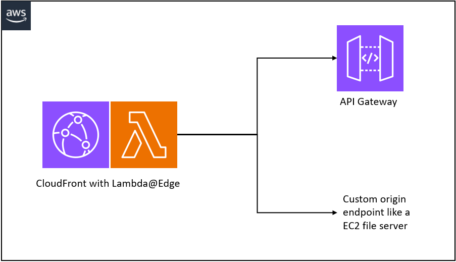

# Route large API payloads to alternate origin
Amazon API Gateway has a [payload limit of 10mb](https://docs.aws.amazon.com/apigateway/latest/developerguide/limits.html#http-api-quotas). This pattern shows how to use Lambda@Edge to route client POST request to an alternative origin based on payload size of the POST request.

Learn more about this pattern at Serverless Land Patterns: https://serverlessland.com/patterns/cloudfront-apigw-large-uploads

Important: this application uses various AWS services and there are costs associated with these services after the Free Tier usage - please see the [AWS Pricing page](https://aws.amazon.com/pricing/) for details. You are responsible for any AWS costs incurred. No warranty is implied in this example.

## Requirements

* [Create an AWS account](https://portal.aws.amazon.com/gp/aws/developer/registration/index.html) if you do not already have one and log in. The IAM user that you use must have sufficient permissions to make necessary AWS service calls and manage AWS resources.
* [AWS CLI](https://docs.aws.amazon.com/cli/latest/userguide/install-cliv2.html) installed and configured
* [Git Installed](https://git-scm.com/book/en/v2/Getting-Started-Installing-Git)
* [AWS Cloud Development Kit](https://docs.aws.amazon.com/cdk/v2/guide/getting_started.html) (AWS CDK) installed

## Deployment Instructions

1. Create a new directory, navigate to that directory in a terminal and clone the GitHub repository:
    ``` 
    git clone https://github.com/aws-samples/serverless-patterns
    ```
1. Change directory to the pattern directory:
    ```
    cd cloudfront-apigw-large-uploads
    ```
1. Set region to us-east-1 for your CDK environment, this is because Lambda@edge functions need to exist us-east-1 region.
1. Bootstrap CDK:
    ```
    cdk bootstrap
    ```
1. From the command line, use AWS CDK to deploy the AWS resources for the pattern as specified in the `large_uploads_test/test_stack.py` file:
    ```
    python3 -m pip install -r requirements.txt
    cdk synth
    cdk deploy
    ```

## How it works
An Amazon Cloudfront distribution is created with 2 origins:
* Default Origin - Amazon API Gateway with an AWS Lambda Integration returning stub responses based on HTTP request method.  
* Custom Origin - A mock HTTP endpoint which sends a response with information from the request. We are using echo.free.beeceptor.com but you can use any other endpoint.

When a HTTP POST request is handled by CloudFront, a Lambda@Edge function is invoked as an Origin Request. This Lambda@Edge function uses the method and `content-length` HTTP headers from the client request to determine whether the request should go to a custom origin. 

To demonstrate this behaviour, we used a filesize limit of 300 bytes. In real world applications, you would set this higher by modifying the `MAX_FILE_SIZE` variable in `lambda.mjs`.



## Testing

1. Once deployed, find the CloudFront distribution URL and use it in the following `curl` commands

#### Test 1: 
A GET request that CloudFront will route to API gateway

```
curl https://<CloudFront distribution URL> -i
```

Example output:
```
    HTTP/2 200
    content-type: application/json
    ...more headers...

    {"message": "GET request processed by API Gateway!"}
```

#### Test 2: 
A POST request that CloudFront will route to API gateway as the payload size is smaller than `MAX_FILE_SIZE` defined in `lambda.mjs`. You will need to replace the `smallFile.example` filename in the following command with your file.

```
curl https://<CloudFront distribution URL> -i -X POST -F 'data=@smallFile.example' -H 'content-type: application/json'
```

Example output:
```
    HTTP/2 201
    content-type: application/json
    ...more headers...

    {"message": "POST request processed by API Gateway!"}
```

#### Test 3: 
A POST request that CloudFront will route to a custom origin as the payload size is larger than `MAX_FILE_SIZE` defined in `lambda.mjs`. You will need to replace the `largeFile.example` filename in the following command with your file.

```
curl https://<CloudFront distribution URL> -i -X POST -F 'data=@largeFile.example'
```

Example output:
```
    HTTP/2 200
    content-type: application/json
    ...more headers...

    {
        "method": "POST",
        "protocol": "https",
        "host": "echo.free.beeceptor.com",
    ...more response body
```


#### Test 4: 
A POST request to a specific URL that CloudFront will route to a custom origin based on the Behaviour defined in `app.py`. You will need to replace the `smallFile.example` filename in the following command with your file.

```
curl https://<CloudFront distribution URL>/upload/ -i -X POST -F 'data=@smallFile.example'
```

Example output:
```
    HTTP/2 200
    content-type: application/json
    ...more headers...

    {
        "method": "POST",
        "protocol": "https",
        "host": "echo.free.beeceptor.com",
    ...more response body
```


## Cleanup
 
1. Delete the stack
    ```
    cdk destroy
    ```


## Notes
There are restrictions to what the Lambda function can modify as part of the Origin Request. For example, CloudFront will not allow you to change the protocol from HTTPS to HTTP. Doing so will result in an origin configuration error from CloudFront.


----
Copyright 2025 Amazon.com, Inc. or its affiliates. All Rights Reserved.

SPDX-License-Identifier: MIT-0
