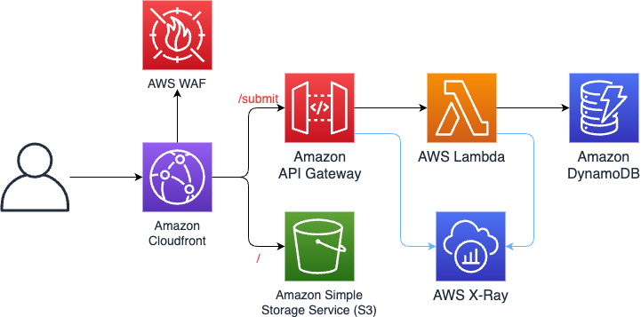

# Amazon Cloudfront distribution in front of Amazon S3 and an Amazon API Gateway REST API to AWS Lambda to Amazon DynamoDB

This pattern demonstrates a simple webform application sitting in Cloudfront and S3.  The application stores data in DynamoDB via a ```POST``` request to an API Gateway which triggers a simple Lambda function.

Important: this application uses various AWS services and there are costs associated with these services after the Free Tier usage - please see the [AWS Pricing page](https://aws.amazon.com/pricing/) for details. You are responsible for any AWS costs incurred. No warranty is implied in this example.

## Requirements

* [Create an AWS account](https://portal.aws.amazon.com/gp/aws/developer/registration/index.html) if you do not already have one and log in. The IAM user that you use must have sufficient permissions to make necessary AWS service calls and manage AWS resources.
* [AWS CLI](https://docs.aws.amazon.com/cli/latest/userguide/install-cliv2.html) installed and configured
* [Git Installed](https://git-scm.com/book/en/v2/Getting-Started-Installing-Git)
* [AWS Serverless Application Model](https://docs.aws.amazon.com/serverless-application-model/latest/developerguide/serverless-sam-cli-install.html) (AWS SAM) installed

## Deployment Instructions

1. Create a new directory, navigate to that directory in a terminal and clone the GitHub repository:
    ``` 
    git clone https://gitlab.aws.dev/jrdwyer/aws-serverless-webform-sample.git
    ```
1. Change directory to the pattern directory:
    ```
    cd serverless-webform-sample
    ```
1. From the command line, use AWS SAM to deploy the AWS resources for the workflow as specified in the template.yaml file:
    ```
    sam deploy --guided
    ```
1. During the prompts:
    * Enter a stack name
    * Enter the desired AWS Region
    * Allow SAM CLI to create IAM roles with the required permissions.
    * Respond 'y' to all prompts
    * Accept all other defaults

    Once you have run `sam deploy --guided` mode once and saved arguments to a configuration file (samconfig.toml), you can use `sam deploy` in future to use these defaults.
    ```
    Stack Name [sam-app]: serverless-webform-sample
    AWS Region [us-east-1]: 
    Parameter HTTPGetFloodRateParam [10000]: 
    Parameter HTTPPostFloodRateParam [1000]: 
    #Shows you resources changes to be deployed and require a 'Y' to initiate deploy
    Confirm changes before deploy [y/N]: 
    #SAM needs permission to be able to create roles to connect to the resources in your template
    Allow SAM CLI IAM role creation [Y/n]: 
    SubmitFunction may not have authorization defined, Is this okay? [y/N]: y
    Save arguments to configuration file [Y/n]: 
    SAM configuration file [samconfig.toml]: 
    SAM configuration environment [default]: 
    ```

1. Note the outputs from the SAM deployment process. These contain the resource names and/or ARNs which are used for testing.

1. Deploy the frontend web interface via the provided ```deploy_frontend.sh``` script.
    ```
    ./deploy_frontend.sh
    ```

## How it works

The web interface allows an end user to enter their personal details and click ```Submit```.  The submit button generates a POST request to the ```/submit``` resource API Gateway with a JSON message containing the information entered by the user.  The POST method of the ```/submit``` resource passes the request to a Lambda which parses the JSON message and stores the data in a DynamoDB table. 

## Architecture



## Testing

Open the Cloudfront URL in a browser on your local machine.  Fill out the form with data and click ```Submit```.  Upon submitting, your browser will send a ```POST``` request to the API Gateway and trigger the Lambda to store the data in DynamoDB.

To view the data in DynamoDB, navigate to the DynamoDB service in the AWS console, select ```Tables``` from the left navigation pane and click on the ```serverless-webform-sample-table``` table. In the ```View Table``` page click on ```Explore Table Items``` button and scroll down to ```Items Returned``` to view the data stored in the table.  This data should match the data entered in the previous step.

## Cleanup
 
1. Delete the stack
    ```bash
    sam delete
    ```
1. During the prompts:
    ```bash
        Are you sure you want to delete the stack batch-sample in the region us-east-1 ? [y/N]: y
        Are you sure you want to delete the folder batch-sample in S3 which contains the artifacts? [y/N]: y
    ```
----
Copyright 2023 Amazon.com, Inc. or its affiliates. All Rights Reserved.

SPDX-License-Identifier: MIT-0
