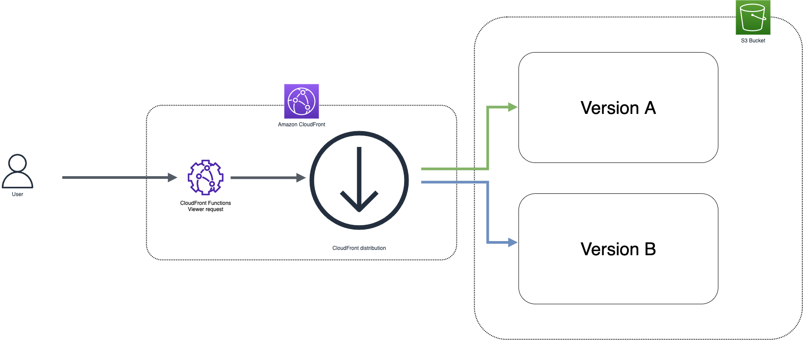

# Random A/B testing at the edge using Amazon CloudFront and Amazon CloudFront Functions

This pattern deploys an Amazon Cloudfront distribution, an Amazon Cloudfront Function and a Amazon S3 Bucket and demonstrates how to implement an A/B testing solution.

Using Cloudfront Function we are changing dynamically the uri to display randomly either the old home page either the new home page.



The CDK application contains the minimum IAM resources required to run the application.

Learn more about this pattern at: https://serverlessland.com/patterns/cloudfront-functions-s3

Important: this application uses various AWS services and there are costs associated with these services after the Free Tier usage - please see the AWS Pricing page for details. You are responsible for any AWS costs incurred. No warranty is implied in this example.

## Requirements

* [Create an AWS account](https://portal.aws.amazon.com/gp/aws/developer/registration/index.html) if you do not already have one and log in. The IAM user that you use must have sufficient permissions to make necessary AWS service calls and manage AWS resources.
* [AWS CLI](https://docs.aws.amazon.com/cli/latest/userguide/install-cliv2.html) installed and configured
* [Git Installed](https://git-scm.com/book/en/v2/Getting-Started-Installing-Git)
* [AWS Cloud Development Kit](https://docs.aws.amazon.com/cdk/v2/guide/getting_started.html) (AWS CDK >= 2.2.0) Installed

## Language

Python

## Framework

CDK

## Services From/To

Amazon Cloudfront to Amazon Cloudfront Functions to Amazon S3

## Deployment Instructions


> **WARNING**: The resources should be deployed in N. Virginia Region (us-east-1). You must be in this region to create Lambda@Edge functions.


1. Create a new directory, navigate to that directory in a terminal and clone the GitHub repository:
    ```bash
    git clone https://github.com/aws-samples/serverless-patterns
    ```
1. Change directory to the pattern directory:
    ```bash
    cd cloudfront-cff-s3-cdk-python
    ```
1. Create a virtual environment for python:
    ```bash
    python3 -m venv .venv
    ```
1. Activate the virtual environment:
    ```bash
    source .venv/bin/activate
    ```

    If you are in Windows platform, you would activate the virtualenv like this:

    ```
    % .venv\Scripts\activate.bat
    ```

1. Install python modules:

    ```bash
    python3 -m pip install -r requirements.txt
    ```

1. From the command line, use CDK to synthesize the CloudFormation template and check for errors:

    ```bash
    cdk synth
    ```

1. From the command line, use CDK to deploy the stack:

    ```bash
    cdk deploy
    ```

    Expected result:

    ```bash
    CloudfrontCffS3CdkPythonStack

    Outputs:
    CloudfrontCffS3CdkPythonStack.DomainName = xxxxxxxxxxxx.cloudfront.net
    ```

1. Note the DomainName output from the CDK deployment process.

### Testing

1. Execute the following command several times and observe the result.

    ```bash
    curl -s -L ENTER_YOUR_DOMAIN_NAME | grep '<title>';
    ```

    Expected result:

    ```bash
    <title>B Version</title>
    <title>A Version</title>
    <title>A Version</title>
    <title>A Version</title>
    <title>A Version</title>
    <title>B Version</title>
    ```

## Cleanup

1. Delete the stack

    ```bash
    cdk destroy
    ```

## Tutorial

See [this useful workshop](https://cdkworkshop.com/30-python.html) on working with the AWS CDK for Python projects.

See [this workshop](https://catalog.us-east-1.prod.workshops.aws/v2/workshops/e507820e-bd46-421f-b417-107cd608a3b2/en-US/) on A/B testing at edge for e-commerce with 3 scenarios.

See [more Amazon Cloudfront Functions](https://github.com/aws-samples/amazon-cloudfront-functions)

## Useful commands

 * `cdk ls`          list all stacks in the app
 * `cdk synth`       emits the synthesized CloudFormation template
 * `cdk deploy`      deploy this stack to your default AWS account/region
 * `cdk diff`        compare deployed stack with current state
 * `cdk docs`        open CDK documentation

Enjoy!
