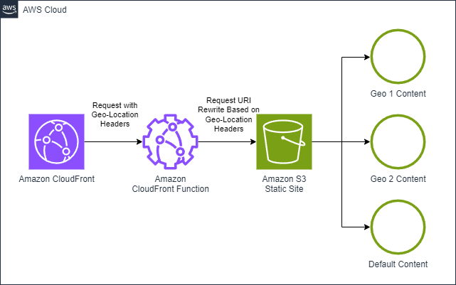

# Amazon CloudFront Distribution and Function with URI Rewrite to S3

This pattern shows how to create an Amazon CloudFront distribution with a CloudFront Function for routing to different geo-localized content in an S3 statically hosted website. Implemented in AWS CDK .NET.

Learn more about this pattern at Serverless Land Patterns: https://serverlessland.com/patterns/cloudfront-cff-s3-geo-uri-rewrite-cdk-dotnet

Important: this application uses various AWS services and there are costs associated with these services after the Free Tier usage - please see the [AWS Pricing page](https://aws.amazon.com/pricing/) for details. You are responsible for any AWS costs incurred. No warranty is implied in this example.

## Architecture


## Requirements

* [Create an AWS account](https://portal.aws.amazon.com/gp/aws/developer/registration/index.html) if you do not already have one and log in. The IAM user that you use must have sufficient permissions to make necessary AWS service calls and manage AWS resources.
* [AWS CLI](https://docs.aws.amazon.com/cli/latest/userguide/install-cliv2.html) installed and configured
* [Git Installed](https://git-scm.com/book/en/v2/Getting-Started-Installing-Git)
* [Node and NPM](https://nodejs.org/en/download/) installed
* [AWS Cloud Development Kit](https://docs.aws.amazon.com/cdk/latest/guide/cli.html) (AWS CDK) installed
* [.NET](https://dotnet.microsoft.com/en-us/download/dotnet/6.0) (.NET 6) installed

## Deployment Instructions

1. Create a new directory, navigate to that directory in a terminal and clone the GitHub repository:
    ``` 
    git clone https://github.com/aws-samples/serverless-patterns
    ```
1. Change the working directory to this pattern's directory:
    ```
    cd cloudfront-cff-s3-geo-uri-rewrite-cdk-dotnet
    ```
1. Build the .NET CDK project:
    ```
    dotnet build src
    ```
1. Deploy the stack to your default AWS account and region. The output of this command should give you output as DistributionDomainName:
    ```
    cdk deploy
    ```
1. Other useful commands:
    ```
    cdk diff         compare deployed stack with current state    
    cdk synth        emits the synthesized CloudFormation template
    ```

## How it works

CloudFront Distributions can be configured to forward the "CloudFront-Viewer-Country" header. CloudFront Functions allow for Javascript code to execute at CloudFront edge locations, and allow you to create URL routing and rewrite rules based on request headers.  In this pattern we use the "CloudFront-Viewer-Country" header to determine the location of the request and rewrite the URI to point to different content based on the location of the request.  Specifically in this example that means pointing to an index.html in a prefix that is applied based on the location.

Read more about CloudFront Functions [here](https://docs.aws.amazon.com/AmazonCloudFront/latest/DeveloperGuide/cloudfront-functions.html).
And about CloudFront Function Redirection Examples [here](https://docs.aws.amazon.com/AmazonCloudFront/latest/DeveloperGuide/example-function-redirect-url.html).

## Testing

In the  output, you can see `StaticSiteStack.DistributionDomainName`. When you access the URL, you should see a webpage that says "Welcome to Our Site"  Depending on your geo-location you will see 1 of 3 options:
    - If you are in the US, you will see "Welcome to Our Site (US)"
    - If you are in Poland, you will see "Witamy na Naszej Stronie (PL)"
    - If you are in the rest of the world, you will see "Welcome to Our Site (International)"

You can test this by using a VPN and changing your location to US, PL and other locations to see the different messages based on your location

## Cleanup
 
1. Run the given command to delete the resources that were created. It might take some time for the CloudFormation stack to get deleted.
    ```
    cdk destroy
    ```

----
Copyright 2024 Amazon.com, Inc. or its affiliates. All Rights Reserved.

SPDX-License-Identifier: MIT-0
