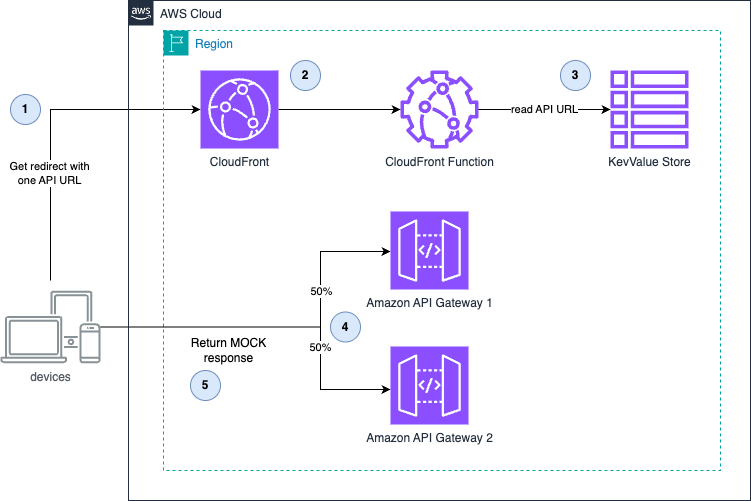

# CloudFront with API Gateway Routing using Key Value Store

This pattern demonstrates how to use Amazon CloudFront with CloudFront Functions to dynamically route traffic between multiple Amazon API Gateway endpoints. The routing decisions are based on values stored in CloudFront Key Value Store, allowing for flexible, configuration-driven request routing without redeploying your infrastructure.
This example uses an equal (50:50 distribution) between both API Gateways. For more informations on "cell partitioning" you can read the [AWS Well-Architected Guide - Cell Partition](https://docs.aws.amazon.com/wellarchitected/latest/reducing-scope-of-impact-with-cell-based-architecture/cell-partition.html)

Learn more about this pattern at Serverless Land Patterns: [https://serverlessland.com/patterns/cloudfront-keyvaluestore-apigw-routing-cdk](https://serverlessland.com/patterns/cloudfront-keyvaluestore-apigw-routing-cdk)


Important: this application uses various AWS services and there are costs associated with these services after the Free Tier usage - please see the [AWS Pricing page](https://aws.amazon.com/pricing/) for details. You are responsible for any AWS costs incurred. No warranty is implied in this example.

## Requirements

* [Create an AWS account](https://portal.aws.amazon.com/gp/aws/developer/registration/index.html) if you do not already have one and log in. The IAM user that you use must have sufficient permissions to make necessary AWS service calls and manage AWS resources.
* [AWS CLI](https://docs.aws.amazon.com/cli/latest/userguide/install-cliv2.html) installed and configured
* [Git Installed](https://git-scm.com/book/en/v2/Getting-Started-Installing-Git)
* [Node.js and npm](https://nodejs.org/) installed
* [AWS CDK](https://docs.aws.amazon.com/cdk/latest/guide/getting_started.html) installed

## Deployment Instructions

1. Create a new directory, navigate to that directory in a terminal and clone the GitHub repository:

    ```
    git clone https://github.com/aws-samples/serverless-patterns
    ```

1. Change directory to the pattern directory:

    ```
    cd cloudfront-keyvaluestore-apigw-routing-cdk
    ```

1. Install dependencies:

    ```
    npm install
    ```

1. Deploy the CDK stack to your default AWS account and region:

    ```
    cdk deploy
    ```
    **The deployment will take a couple of minutes**

1. Note the outputs from the CDK deployment process. These contain the resource URLs and ARNs which are used for testing.


## How it works



1. The client makes a request to the CloudFront distribution
1. The CloudFront Function executes on viewer request events
1. The function retrieves routing information from CloudFront Key Value Store
1. Based on the retrieved value, the function redirects the request to one of the two API Gateway endpoints
1. The selected API Gateway returns its response to the client

In a real-world scenario:

* The available targets would be maintained in the Key Value Store
* More complex routing logic would be implemented in the CloudFront function (e.g., routing based on user attributes, geographic location, A/B testing scenarios)

## Testing

1. Get Key Value Store `ETAG` and note it down.

    ```
    aws cloudfront-keyvaluestore describe-key-value-store \
    --kvs-arn=[KVSTOREARN]
    ```

1. Add entries to the Key Value Storereplace. Replace `[KVSTOREARN]`, `[APIGATEWAY1URL]`, and `[APIGATEWAY2URL]` with the noted outputs.

    ```
    aws cloudfront-keyvaluestore update-keys \
        --kvs-arn[KVSTOREARN] \
        --if-match=[ETAG] \
        --puts '[
                {
                    "Key": "APIGW1URL",
                    "Value": "[APIGATEWAY1URL] "
                },
                {
                    "Key": "APIGW2URL",
                    "Value": "[APIGATEWAY2URL]"
                }
            ]'
    ```

    If you receive something similar to, it worked
    ```json
    {
        "ETag": "KV3UN6WX5RRO2AG",
        "ItemCount": 2,
        "TotalSizeInBytes": 145
    }
    ```

1. Access the CloudFront URL in a browser or via curl, replace `[CLOUDFRONTDOMAINNAME]`:

    ```
    curl -i -L [CLOUDFRONTDOMAINNAME]
    ```

1. The request should be redirected to either API Gateway 1 or API Gateway 2, and you should see a response like:

    ```
    {"message": "Hello from API 1"}
    ```

    or

    ```
    {"message": "Hello from API 2"}
    ```

1. Make multiple requests to observe the random routing between the two API Gateway endpoints.


## Cleanup

1. Delete the stack
    ```bash
    cdk destroy
    ```
----
Copyright 2025 Amazon.com, Inc. or its affiliates. All Rights Reserved.

SPDX-License-Identifier: MIT-0
