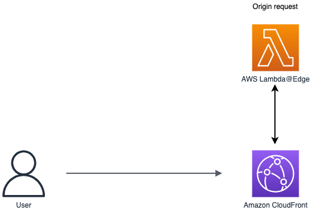

# Dynamic content generated at edge using AWS Lambda@Edge

This pattern deploys an Amazon Cloudfront distribution, a Lambda@Edge function and a Amazon S3 Bucket and demonstrates how to generate content at edge.

You can modify the code to fetch data from an external endpoint by making a network call.

When you choose to make external network calls, you can improve latency by bringing data geographically closer to Lambda@Edge:

- get data from a [DynamoDB Global table](https://aws.amazon.com/dynamodb/global-tables/?nc1=h_ls).
- get data from a S3 Bucket created in the region where the Lambda@Edge is executed.
- get data from a third-party endpoint deployed in the same region as the region where the Lambda@Edge is executed.

When making external calls the approach is to replicate your endpoint to multiple geographies, and then make a network call from Lambda@Edge to the nearest endpoint.



The CDK application contains the minimum IAM resources required to run the application.

Learn more about this pattern at: https://serverlessland.com/patterns/cloudfront-lambda-edge

Important: this application uses various AWS services and there are costs associated with these services after the Free Tier usage - please see the AWS Pricing page for details. You are responsible for any AWS costs incurred. No warranty is implied in this example.

## Requirements

* [Create an AWS account](https://portal.aws.amazon.com/gp/aws/developer/registration/index.html) if you do not already have one and log in. The IAM user that you use must have sufficient permissions to make necessary AWS service calls and manage AWS resources.
* [AWS CLI](https://docs.aws.amazon.com/cli/latest/userguide/install-cliv2.html) installed and configured
* [Git Installed](https://git-scm.com/book/en/v2/Getting-Started-Installing-Git)
* [AWS Cloud Development Kit](https://docs.aws.amazon.com/cdk/v2/guide/getting_started.html) (AWS CDK >= 2.2.0) Installed

## Language

Python

## Framework

CDK

## Services From/To

Amazon Cloudfront to AWS Lambda@Edge

## Deployment Instructions

> **WARNING**: The resources should be deployed in N. Virginia Region (us-east-1). You must be in this region to create Lambda@Edge functions.

1. Create a new directory, navigate to that directory in a terminal and clone the GitHub repository:
    ```bash
    git clone https://github.com/aws-samples/serverless-patterns
    ```
1. Change directory to the pattern directory:
    ```bash
    cd cloudfront-lambda-edge-cdk-python
    ```
1. Create a virtual environment for python:
    ```bash
    python3 -m venv .venv
    ```
1. Activate the virtual environment:
    ```bash
    source .venv/bin/activate
    ```

    If you are in Windows platform, you would activate the virtualenv like this:

    ```
    % .venv\Scripts\activate.bat
    ```

1. Install python modules:

    ```bash
    python3 -m pip install -r requirements.txt
    ```

1. From the command line, use CDK to synthesize the CloudFormation template and check for errors:

    ```bash
    cdk synth
    ```

1. From the command line, use CDK to deploy the stack:

    ```bash
    cdk deploy
    ```

    Expected result:

    ```bash
    CloudfrontCffS3CdkPythonStack

    Outputs:
    CloudfrontCffS3CdkPythonStack.DomainName = xxxxxxxxxxxx.cloudfront.net
    ```

1. Note the DomainName output from the CDK deployment process.

### Testing

1. Execute the following command several times and observe the result.

    ```bash
    curl -s -L ENTER_YOUR_DOMAIN_NAME;
    ```

    Expected result:

    ```bash
    <html><title>Content generated by Lambda@Edge</title><body><h1>This content is generated by Lambda@Edge.</h1> <h3>Content generated at 01/05/2022, 09:25:41</h3></body></html>

    <html><title>Content generated by Lambda@Edge</title><body><h1>This content is generated by Lambda@Edge.</h1> <h3>Content generated at 01/05/2022, 09:25:41</h3></body></html>

    <html><title>Content generated by Lambda@Edge</title><body><h1>This content is generated by Lambda@Edge.</h1> <h3>Content generated at 01/05/2022, 09:26:33</h3></body></html>

    <html><title>Content generated by Lambda@Edge</title><body><h1>This content is generated by Lambda@Edge.</h1> <h3>Content generated at 01/05/2022, 09:26:33</h3></body></html>

    <html><title>Content generated by Lambda@Edge</title><body><h1>This content is generated by Lambda@Edge.</h1> <h3>Content generated at 01/05/2022, 09:26:37</h3></body></html>

    ```

1. Note the time when the content is generated. Since we set a 3 seconds `max-age` value for `Cache-Control` we notice a short caching period and then the content is changing.

## Cleanup

1. Delete the stack

    ```bash
    cdk destroy
    ```

## Tutorial

See [this useful workshop](https://cdkworkshop.com/30-python.html) on working with the AWS CDK for Python projects.

See [this blog post](https://aws.amazon.com/blogs/networking-and-content-delivery/leveraging-external-data-in-lambdaedge/) about Leveraging external data in Lambda@Edge

See [this blog post](https://aws.amazon.com/blogs/networking-and-content-delivery/lambdaedge-design-best-practices/) about Lambda@Edge Design Best Practices

## Useful commands

 * `cdk ls`          list all stacks in the app
 * `cdk synth`       emits the synthesized CloudFormation template
 * `cdk deploy`      deploy this stack to your default AWS account/region
 * `cdk diff`        compare deployed stack with current state
 * `cdk docs`        open CDK documentation

Enjoy!
