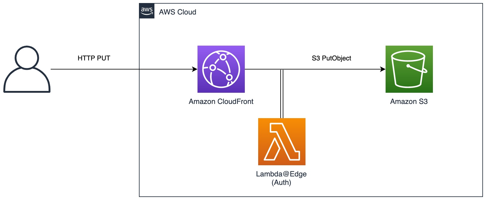

# Upload a File to Amazon S3 Using Amazon CloudFront and Lambda@Edge

This pattern creates an [Amazon CloudFront](https://docs.aws.amazon.com/AmazonCloudFront/latest/DeveloperGuide/Introduction.html) distribution that can be used to upload files to an [Amazon S3](https://docs.aws.amazon.com/AmazonS3/latest/userguide/Welcome.html) bucket. It uses a [Lambda@Edge](https://docs.aws.amazon.com/lambda/latest/dg/lambda-edge.html) function to verify a JSON Web Token (JWT) issued by [Amazon Cognito](https://docs.aws.amazon.com/cognito/latest/developerguide/what-is-amazon-cognito.html). This allows authorized uploads of large objects to S3 via CloudFront without providing public access to the S3 bucket.



Learn more about this pattern at Serverless Land Patterns: << Add the live URL here >>

Important: this application uses various AWS services and there are costs associated with these services after the Free Tier usage - please see the [AWS Pricing page](https://aws.amazon.com/pricing/) for details. You are responsible for any AWS costs incurred. No warranty is implied in this example.

## Requirements

* [Create an AWS account](https://portal.aws.amazon.com/gp/aws/developer/registration/index.html) if you do not already have one and log in. The IAM user that you use must have sufficient permissions to make necessary AWS service calls and manage AWS resources.
* [AWS CLI](https://docs.aws.amazon.com/cli/latest/userguide/install-cliv2.html) installed and configured
* [Git Installed](https://git-scm.com/book/en/v2/Getting-Started-Installing-Git)
* [AWS CDK](https://docs.aws.amazon.com/cdk/latest/guide/cli.html) installed and configured


## Deployment Instructions

*NOTE: Lambda@Edge functions are deployed in the us-east-1 region. For ease this sample is hard coded to use the us-east-1 region for all resources.*

1. Create a new directory, navigate to that directory in a terminal and clone the GitHub repository:
    ``` 
    git clone https://github.com/aws-samples/serverless-patterns
    ```
1. Change directory to the pattern directory:
    ```
    cd cloudfront-lambda-edge-s3-cdk/cdk
    ```

1. From the command line, use npm to install the development dependencies:
    ```
    npm install
    ```

1. Use the CDK CLI to bootstrap and deploy the application:
    ```
    cdk bootstrap
    cdk deploy
    ```

## How it works

In this example a CloudFront distribution is used to front an S3 bucket, allowing clients to upload files directly to S3 using HTTPS and apply custom authentication logic using Lambda@Edge. 

When submitting a HTTP PUT request to the CloudFront URL with the file to upload the Lambda function will check a valid JWT token has been passed in the Authorization HTTP header. If the JWT is missing or invalid access will be denied. JWT tokens are validated using the `aws-jwt-verify` package available on [GitHub](https://github.com/awslabs/aws-jwt-verify).

Direct access to the S3 bucket is denied using a S3 bucket policy and an [Origin Access Identity (OAI)](https://docs.aws.amazon.com/AmazonCloudFront/latest/DeveloperGuide/private-content-restricting-access-to-s3.html) with CloudFront. Only the OAI has PutObject rights in the bucket policy.

This example uses a Cognito User Pool and JWT tokens for auth, however any custom logic can be applied in the Lambda function including using an external IdP (e.g. Okta, Auth0, AzureAD etc.) or using simple API keys.

## Testing

1. Set the Cognito User Pool Id as an environment variable:
    ```bash
    export USERPOOL="$(aws cloudformation describe-stacks --stack-name AmazonS3UploadApiPatternsStack --query "Stacks[0].Outputs[?OutputKey=='CognitoUserPoolId'].OutputValue" --output text --region us-east-1)"

    ```

1. Next, do the same for the Cognito App Client Id:
    ```bash
    export APPCLIENT="$(aws cloudformation describe-stacks --stack-name AmazonS3UploadApiPatternsStack --query "Stacks[0].Outputs[?OutputKey=='CognitoAppClientId'].OutputValue" --output text --region us-east-1)"
    ```

1. Next, do the same for the S3 bucket:
    ```bash
    export S3BUCKET="$(aws cloudformation describe-stacks --stack-name AmazonS3UploadApiPatternsStack --query "Stacks[0].Outputs[?OutputKey=='S3BucketName'].OutputValue" --output text --region us-east-1)"
    ```

1. Finally, set the CloudFront distribution variable:
    ```bash
    export CFURL="$(aws cloudformation describe-stacks --stack-name AmazonS3UploadApiPatternsStack --query "Stacks[0].Outputs[?OutputKey=='CloudFrontDistributionUrl'].OutputValue" --output text --region us-east-1)"
    ```

    Check the values look correct:
    ```bash
    echo $USERPOOL
    echo $APPCLIENT
    echo $S3BUCKET
    echo $CFURL
    ```

1. To test using a Cognito issued JWT first create a new user in the Cognito user pool created by the CDK deployment:

    ```bash
    aws cognito-idp admin-create-user \
        --user-pool-id $USERPOOL \
        --username demo \
        --user-attributes Name=email,Value=demo@example.com Name=email_verified,Value=True \
        --temporary-password 'MySecretPassword123!' \
        --region us-east-1
    ```

1. Next, get the session token in order to change the users temporary password:

    ```bash
    aws cognito-idp admin-initiate-auth \
    --user-pool-id $USERPOOL \
    --client-id $APPCLIENT \
    --auth-flow ADMIN_NO_SRP_AUTH \
    --auth-parameters USERNAME=demo,'PASSWORD=MySecretPassword123!' \
    --region us-east-1
    ```

1. Run the following command, changing the parameters to match the username and password for your environment. Pass in the `Session` parameter from the previous command:

    ```bash
    aws cognito-idp admin-respond-to-auth-challenge \
    --user-pool-id $USERPOOL \
    --client-id $APPCLIENT \
    --challenge-name NEW_PASSWORD_REQUIRED \
    --challenge-responses NEW_PASSWORD='MySecretPassword123!',USERNAME=demo \
    --region us-east-1 \
    --session '<session-token-from-previous-command-output>'
    ```

    The response will contain both an access and an id token. The access token is the one we are using. It looks something like this:

    ```
    eyJraWQiOiJYeEhEaGFZZkJMdTJLME5mSzdnS0sraTJcLytXU25TRnBvVnJGeUs2dEF6dz0iLCJhbGciOiJSUzI1NiJ9.eyJzdWIiOiJhNmU4YTQ2ZC0zMjRkLTQyNjUtOTQwYy0xZmM5NTZkZGVhZTkiLCJpc3MiOiJodHRwczpcL1wvY29nbml0by1pZHAudXMtZWFzdC0xLmFtYXpvbmF3cy5jb21cL3VzLWVhc3QtMV93QUp2Z3V4ZWsiLCJjbGllbnRfaWQiOiI2NnFmdXA0cnJ1aDlvaXNvZm0zNGV0a2YwbyIsIm9yaWdpbl9qdGkiOiJlYTU3MWQ2YS1hNGY2LTRkMTYtYTFiZS1iMmU5ZjAzMTRlNGYiLCJldmVudF9pZCI6ImY2ZmEyMjViLTgyN2EtNDMzYS1hMzBiLWU5YWI1OTRjYjgyZCIsInRva2VuX3VzZSI6ImFjY2VzcyIsInNjb3BlIjoiYXdzLmNvZ25pdG8uc2lnbmluLnVzZXIuYWRtaW4iLCJhdXRoX3RpbWUiOjE2NzI5MTYyNjIsImV4cCI6MTY3MjkxOTg2MiwiaWF0IjoxNjcyOTE2MjYyLCJqdGkiOiIzYzEwZWNjNy1lOTE1LTRmYjctYjVlYS0yZGJlOTAzMWZkNDIiLCJ1c2VybmFtZSI6ImRlbW8ifQ.d7ZtgrTZMOyGAJbDgEP-nGXPU-5vWOrXnulbLRCQBeyAPIvTSSnSEX2xaLfdxId2X0GKGz1nPN6MoxHHgzmBx2dYv4Oglgv2ZJfM-qJUwx0fVhhe0A0XlEfJuaBO2bxsWu7aC5Dg3hHu-OANbBalTgJmDpC8nOhZmdsYLB1pAajJEQVmMPGiMHRAV6yQM9x6hWBX2PZCaaO-caKN7VVNCpk0yQ95j71eDgZTVt3QcW1RUth-cawOBWju9LjQn_0nhBnEIUmP_eFzdb-Kj-Rs0CbiOMtrb3sVmpTP1NVsNQGn6XT1FUsloeoNKD62q6e4ISTJ_EeyIzuUBOMrhZu72A
    ```

1. First, test the unauthorized case by by submitting a request with an invalid JWT header:

    ```bash
    curl --location --request PUT "https://${CFURL}/image.jpg" \
    --header 'authorization: my-invalid-token' \
    --header 'Content-Type: image/jpeg' \
    --data-binary '@./image.jpg'
    ```

    Check the S3 bucket does not contain the uploaded image:
    ```bash
    aws s3 ls $S3BUCKET
    ```


1. Use the access token as the authorization header in a cURL request to upload a file to S3:

    ```bash
    curl --location --request PUT "https://${CFURL}/image.jpg" \
    --header 'authorization: <your-access-token>' \
    --header 'Content-Type: image/jpeg' \
    --data-binary '@./image.jpg'
    ```

    Check that we can now see the uploaded file in the bucket:
    ```bash
    aws s3 ls $S3BUCKET
    ```


## Cleanup

1. Delete the `image.jpg` file from the S3 bucket. This is because the bucket must be empty before it can be deleted.
    ```bash
    aws s3 rm "s3://${S3BUCKET}/image.jpg"
    ```

1. Delete the `AmazonS3UploadApiPatternsStack` CDK stack:
   ```
   cdk destroy AmazonS3UploadApiPatternsStack
   ```

    *NOTE: if you get an error from CloudFormation deleting the Lambda@Edge function, then you should wait a while and then retry `cdk destroy`. [Reference documentation](https://docs.aws.amazon.com/AmazonCloudFront/latest/DeveloperGuide/lambda-edge-delete-replicas.html).*


----
Copyright 2023 Amazon.com, Inc. or its affiliates. All Rights Reserved.

SPDX-License-Identifier: MIT-0