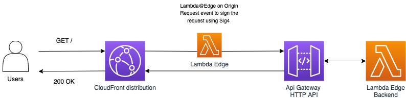

# Secure AWS Api Gateway Requests with Signature Version 4 by using Lambda@Edge

This CDK application deploys a CloudFront distribution, a Lambda@Edge function, an API Gateway HTTP API and a Lambda function as backend.

This pattern demonstrates how to secure an API by blocking any direct access and allowing only the access through the CloudFront distribution deployed in front of the API.

## How it works

* When accessing the CloudFront distribution domain name the Lambda@Edge is triggered and signs the request with AWS Signature Version 4.
* The HTTP API is secured by using IAM authorization.
* The role attached to the Lambda@Edge has the permission to invoke the API, so by signing the request
an unauthenticated user is able to get the response from the backend Lambda through the HTTP API.
* This pattern demonstrates how to secure an HTTP API but with small changes in Lambda@Edge it can be adapted to secure other AWS services.




Learn more about this pattern at Serverless Land Patterns: [here](https://serverlessland.com/patterns/cloudfront-le-apigw-cdk)

## Requirements

* [Create an AWS account](https://portal.aws.amazon.com/gp/aws/developer/registration/index.html) if you do not already have one and log in. The IAM user that you use must have sufficient permissions to make necessary AWS service calls and manage AWS resources.
* [AWS CLI](https://docs.aws.amazon.com/cli/latest/userguide/install-cliv2.html) installed and configured
* [Git Installed](https://git-scm.com/book/en/v2/Getting-Started-Installing-Git)
* [Node and NPM](https://nodejs.org/en/download/) installed
* [AWS Cloud Development Kit](https://docs.aws.amazon.com/cdk/latest/guide/cli.html) (AWS CDK) installed

## Deployment Instructions

1. Create a new directory, navigate to that directory in a terminal and clone the GitHub repository:

    ```bash
    git clone https://github.com/aws-samples/serverless-patterns
    ```

2. Change directory to the pattern directory its source code folder:

    ```bash
    cd cloudfront-le-apigw-cdk
    ```

3. From the command line, use npm to install the development dependencies:

    ```bash
    npm install
    ```

4. To deploy from the command line use the following:

    ```bash
    npx cdk bootstrap
    npx cdk deploy
    ```

    Expected result:

    ```bash
    Outputs:

    CloudfrontLeApigwCdkStack.ApiEndpoint = https://xxxyyyy.execute-api.us-east-1.amazonaws.com
    CloudfrontLeApigwCdkStack.DistributionDomainName = https://aaabbbcccddd.cloudfront.net
    ```

5. Note the outputs from the CDK deployment process. These contain the resource names and/or ARNs which are used for testing.

### Testing

1. Execute the following command several times and observe the result.

    ```bash
    curl -i Enter_Your_ApiEndpoint;
    ```

    Expected result:

    ```bash
    HTTP/2 403
    date: Thu, 12 May 2022 15:08:40 GMT
    content-type: application/json
    content-length: 23
    apigw-requestid: SBJm4hfYoAMEJaQ=

    {"message":"Forbidden"}
    ```

    ```bash
    curl -i Enter_Your_DistributionDomainName;
    ```

     Expected result:

    ```bash
    HTTP/2 200
    content-type: text/plain; charset=utf-8
    content-length: 25
    date: Thu, 12 May 2022 15:07:53 GMT
    apigw-requestid: SBJflhFcIAMEJhQ=
    x-cache: Miss from cloudfront
    via: 1.1 35fb5634bb95f448906ffae36e04b158.cloudfront.net (CloudFront)
    x-amz-cf-pop: CDG50-C2
    x-amz-cf-id: DkgSZ2pqoTUDjmGml95zkDQ8PQU4hvfhu4S4aaG4YoFT1iDorhE84A==

    "Hello world from Lambda"
    ```
## Cleanup

1. Delete the stack

    ```bash
    cdk destroy
    ```

## Useful commands

 * `cdk ls`          list all stacks in the app
 * `cdk synth`       emits the synthesized CloudFormation template
 * `cdk deploy`      deploy this stack to your default AWS account/region
 * `cdk diff`        compare deployed stack with current state
 * `cdk docs`        open CDK documentation

## Tutorial

See [this useful workshop](https://cdkworkshop.com/20-typescript.html) on working with the AWS CDK for Python projects.

See [this blog post](https://aws.amazon.com/blogs/networking-and-content-delivery/serving-sse-kms-encrypted-content-from-s3-using-cloudfront/) about Serving SSE-KMS encrypted content from S3 using CloudFront

See [this blog post](https://aws.amazon.com/blogs/networking-and-content-delivery/authorizationedge-how-to-use-lambdaedge-and-json-web-tokens-to-enhance-web-application-security/) about How to Use Lambda@Edge and JSON Web Tokens to Enhance Web Application Security


Enjoy!
