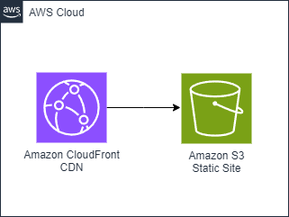

# S3 Static Website with a CloudFront Distribution in 

This pattern shows how to create an Amazon S3 Statically Hosted Website fronted by a CloudFront Distribution. Implemented in AWS CDK Go.

Learn more about this pattern at Serverless Land Patterns: https://serverlessland.com/patterns/cloudformation-s3-cdk-go

Important: this application uses various AWS services and there are costs associated with these services after the Free Tier usage - please see the [AWS Pricing page](https://aws.amazon.com/pricing/) for details. You are responsible for any AWS costs incurred. No warranty is implied in this example.

## Architecture


## Requirements

* [Create an AWS account](https://portal.aws.amazon.com/gp/aws/developer/registration/index.html) if you do not already have one and log in. The IAM user that you use must have sufficient permissions to make necessary AWS service calls and manage AWS resources.
* [AWS CLI](https://docs.aws.amazon.com/cli/latest/userguide/install-cliv2.html) installed and configured
* [Git Installed](https://git-scm.com/book/en/v2/Getting-Started-Installing-Git)
* [Go](https://go.dev/dl/) (`1.16` or above) installed
* [AWS Cloud Development Kit](https://docs.aws.amazon.com/cdk/latest/guide/cli.html) (AWS CDK) installed

## Deployment Instructions

1. Create a new directory, navigate to that directory in a terminal and clone the GitHub repository:
    ``` 
    git clone https://github.com/aws-samples/serverless-patterns
    ```
1. Change the working directory to this pattern's directory:
    ```
    cd cloudformation-s3-cdk-go
    ```
1. Deploy the stack to your default AWS account and region. The output of this command should give you output as Distribution URL:
    ```
    cdk deploy
    ```
1. Other useful commands:
    ```
    cdk diff                            compare deployed stack with current state    
    cdk synth                           emits the synthesized CloudFormation template
    go mod download                     download the dependencies
    go run cloudformation-s3-cdk-go.go  run the go program
    ```

## How it works

This pattern shows how to Create an Amazon S3 Static Website with a CloudFront Distribution in front of it. Implemented in AWS CDK using the Go programming language.

This pattern deploys one CloudFront Distribution and an S3 Static Website.

Read more about Hosting Static Websites on Amazon S3 [here](https://docs.aws.amazon.com/AmazonS3/latest/userguide/WebsiteHosting.html).
Read more about how to set up a secure static website with Amazon CloudFront [here](https://docs.aws.amazon.com/AmazonCloudFront/latest/DeveloperGuide/getting-started-secure-static-website-cloudformation-template.html).

## Testing

In the  output, you can see `CloudformationS3CdkGoStack.DistributionURL`. When you access the url, you should see a Webpage that says "Hello, World!  Welcome to my website!"

## Cleanup
 
1. Run the given command to delete the resources that were created. It might take some time for the CloudFormation stack to get deleted.
    ```
    cdk destroy
    ```

----
Copyright 2024 Amazon.com, Inc. or its affiliates. All Rights Reserved.

SPDX-License-Identifier: MIT-0
