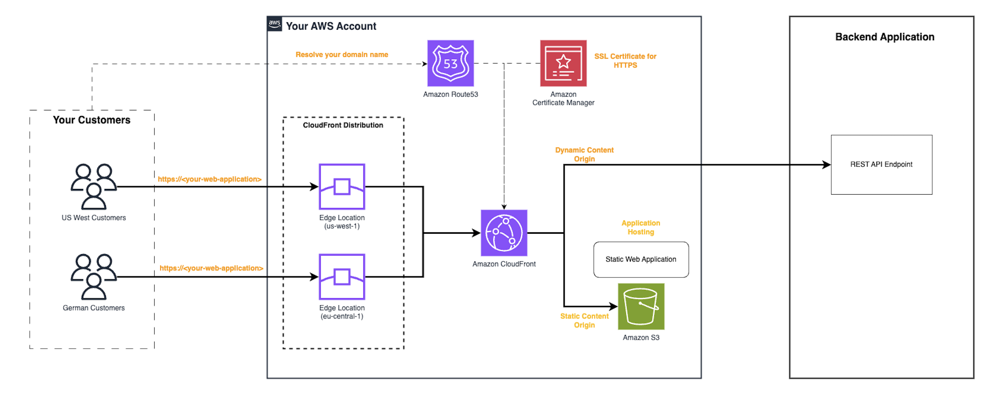

# Leverage Amazon CloudFront as Content Delivery Network for a web application with static (Amazon S3) and dynamic content (REST API)
This CDK application deploys a CloudFront distribution with two origins, one for static content stored in Amazon S3 and another for dynamic content available though a REST API. It deploys also a sample web page that loads data from a public rest API available though the Amazon CloudFront distribution.

This pattern demonstrates how to build a seamless integration of Amazon CloudFront as Content Delivery Network (CDN) with a web application that provides a static website (like a Progressive Web Application) and backend server. It provides an easy setup process based on configuration best practices.


## How it works
Amazon CloudFront is a highly scalable and secure content delivery network (CDN) service that helps improve the performance and availability of web applications by caching content at edge locations close to users, reducing latency and improving the user experience. 
In this scenario, the web application consist of a web page that loads data, though an AJAX call, from a REST API.



The Amazon CloudFront distribution is configured with two origins:

* The static content origin is the web page hosted in an Amazon S3 bucket. The S3 bucket is private and only accessible by the Amazon CloudFront distribution using Origin Access Control (OAC)
* The dynamic content origin is a backend application that exposes a REST API.

## Requirements

* [Create an AWS account](https://portal.aws.amazon.com/gp/aws/developer/registration/index.html) if you do not already have one and log in. The IAM user that you use must have sufficient permissions to make necessary AWS service calls and manage AWS resources.
* [AWS CLI](https://docs.aws.amazon.com/cli/latest/userguide/install-cliv2.html) installed and configured
* [Git Installed](https://git-scm.com/book/en/v2/Getting-Started-Installing-Git)
* [Node and NPM](https://nodejs.org/en/download/) installed
* [AWS Cloud Development Kit](https://docs.aws.amazon.com/cdk/latest/guide/cli.html) (AWS CDK) installed

## Deployment Instructions

1. Create a new directory, navigate to that directory in a terminal and clone the GitHub repository:

    ```bash
    git clone https://github.com/aws-samples/serverless-patterns
    ```

2. Change directory to the pattern directory its source code folder:

    ```bash
    cd cloudfront-s3-restapi-cdk
    ```

3. From the command line, use npm to install the development dependencies:

    ```bash
    npm install
    ```

4. To deploy from the command line use the following:

    ```bash
    npx cdk bootstrap
    npx cdk deploy --parameters hostedZoneIdParam=<HOSTED-ZONE-ID>  --parameters domainNameParam=<YOUR-ROOT-DOMAIN> --parameters websitePrefixParam=webappwithcloudfront --parameters websiteBucketNameParam=<THE-BUCKET-NAME> --all
    ```

    Expected result:

    ```bash
    Outputs:
    WebApplicationWithCloudfrontStack.CloudFrontDistributionDomainName = aaabbbcccddd.cloudfront.net
    WebApplicationWithCloudfrontStack.CloudFrontDistributionID = XXXXXXXXXXXXXX
    WebApplicationWithCloudfrontStack.WebApplicationDomainName = https://webappwithcloudfront.yourdomain.com
    ```

5. Note the outputs from the CDK deployment process. It contain the web application domain name that is used for testing.


## Testing

Open the browser to: https://webappwithcloudfront.yourdomain.com
You will get the page result though the Amazon CloudFront distribution.


## Cleanup

To cleanup you need to execute the following commands in the CDK project:  
```console
aws s3 rm —recursive s3://<THE-BUCKET-NAME>/website
npx cdk destroy 
```