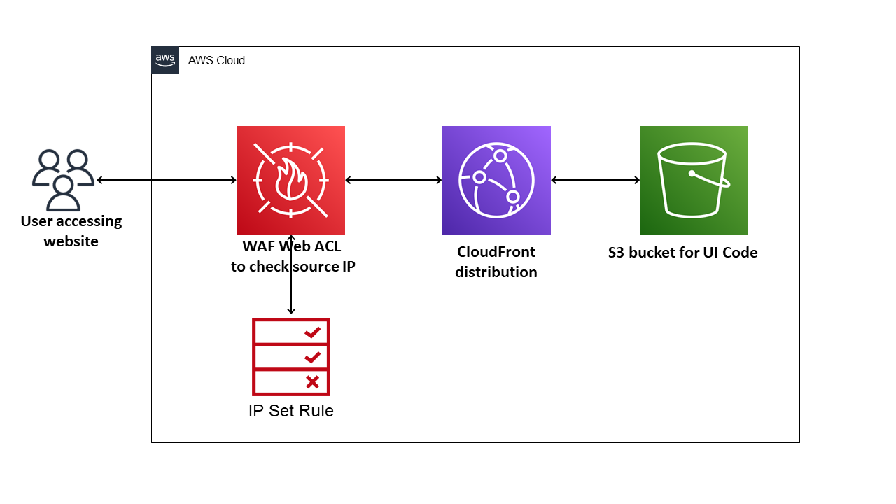

# Amazon CloudFront to AWS WAF to Amazon S3 using .Net CDK

This pattern creates CloudFront, WAF Web ACL, and S3 bucket for UI code. Then WAF Web ACL gets applied to CloudFront distribution to restrict Website access based on source IP address.



Learn more about this pattern at Serverless Land Patterns: https://serverlessland.com/patterns.

Important: this application uses various AWS services and there are costs associated with these services after the Free Tier usage - please see the [AWS Pricing page](https://aws.amazon.com/pricing/) for details. You are responsible for any AWS costs incurred. No warranty is implied in this example.

## Requirements

* [Create an AWS account](https://portal.aws.amazon.com/gp/aws/developer/registration/index.html) if you do not already have one and log in. The IAM user that you use must have sufficient permissions to make necessary AWS service calls and manage AWS resources.
* [AWS CLI](https://docs.aws.amazon.com/cli/latest/userguide/install-cliv2.html) installed and configured
* [AWS CDK](https://docs.aws.amazon.com/cdk/v2/guide/cli.html) installed and configured 
* [Git Installed](https://git-scm.com/book/en/v2/Getting-Started-Installing-Git)
* [.NET 6](https://dotnet.microsoft.com/en-us/download/dotnet/6.0) installed

## Deployment Instructions

1. Create a new directory, navigate to that directory in a terminal and clone the GitHub repository:
    ``` 
    git clone https://github.com/aws-samples/serverless-patterns
    ```
1. Change directory to the pattern directory:
    ```
    cd cloudfront-waf-s3-cdk
    ```
1. Build the application:
    ```
    dotnet build
    ```
1. From the command line, use AWS CDK to deploy the AWS resources for the pattern as specified in CdkStack.cs file:
    ```
    cdk deploy CloudFrontS3WafStack
    ```
1. Note the CloudFront URL in the deployment output. Use this url for the testing

## How it works

When user access the CloudFront distribution URL, user source IP address will get inspected by WAF Web ACL. If source IP address is in the IP set used by Web ACL then user will see the Html page which is served from S3 bucket. If source IP address is not in the IP set then user will get 403 http status code. 

## Testing

1. Get the CloudFrontURL from CloudFormation output 
1. Access the Url to confirm you can see the message - "Hello S3 static WebSite"
1. Use 'WAF & Shield' -> 'Ip Set' service on AWS console to remove your local machine IP address and access the CloudFrontURL again to confirm 403 http status code

## Cleanup
 
1. Delete the stack
    ```bash
    cdk destroy CloudFrontS3WafStack
    ```
1. Confirm the stack has been deleted
    ```bash
    aws cloudformation list-stacks --query "StackSummaries[?contains(StackName,'CloudFrontS3WafStack')].StackStatus"
    ```
----
Copyright 2021 Amazon.com, Inc. or its affiliates. All Rights Reserved.

SPDX-License-Identifier: MIT-0
