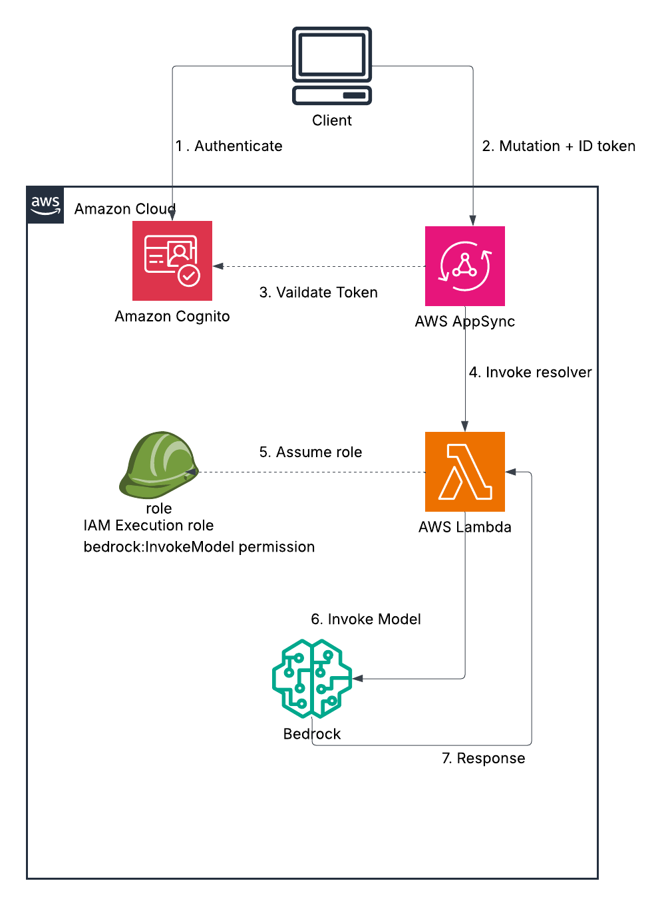

# AWS AppSync and Amazon Cognito to Amazon Bedrock via AWS Lambda

This pattern demonstrates how to invoke Amazon Bedrock models from AWS AppSync using an AWS Lambda resolver, with user authentication handled by Amazon Cognito.

> **Note**: This application uses various AWS services and there are costs associated with these services after the Free Tier usage - please see the [AWS Pricing page](https://aws.amazon.com/pricing/) for details. You are responsible for any AWS costs incurred. No warranty is implied in this example.

## Prerequisites

- [Create an AWS account](https://portal.aws.amazon.com/gp/aws/developer/registration/index.html) if you do not already have one and log in. The IAM user that you use must have sufficient permissions to make necessary AWS service calls and manage AWS resources.
- [AWS CLI](https://docs.aws.amazon.com/cli/latest/userguide/install-cliv2.html) installed and configured
- [Git Installed](https://git-scm.com/book/en/v2/Getting-Started-Installing-Git)
- [Node and NPM](https://nodejs.org/en/download/) installed (Node.js 20.x recommended as used by the Lambda function)
- [AWS Cloud Development Kit (AWS CDK)](https://docs.aws.amazon.com/cdk/v2/guide/cli.html) installed
- Deploy in an AWS Region that supports the selected model or inference profile. The default `global.amazon.nova-2-lite-v1:0` inference profile is available from `ap-south-1` and other [documented source Regions](https://docs.aws.amazon.com/bedrock/latest/userguide/model-card-amazon-nova-2-lite.html#model-card-amazon-nova-2-lite-regions).
- Access to Amazon Bedrock foundation models is enabled by default when the caller has the required AWS Marketplace and IAM permissions. Anthropic models additionally require a one-time use-case submission before first use.
- Make sure your AWS CLI credentials are already configured for the account and region where you want to deploy and test this pattern.

## Architecture

This pattern sets up an AWS AppSync GraphQL API configured with Amazon Cognito User Pools for authentication. Authenticated users can send a prompt through a GraphQL mutation (`invoke`).



### Flow

1. **Authentication**: Users are authenticated against an Amazon Cognito User Pool
2. **AppSync Mutation**: The client sends a GraphQL mutation including the prompt and a valid Cognito ID token
3. **Lambda resolver**: AppSync uses an AWS Lambda resolver to process the `invoke` mutation
4. **Bedrock Invocation**: The AWS Lambda function (`src/lambda/invokeBedrock/index.ts`) receives the prompt from AppSync. It then constructs a request and invokes the specified Amazon Bedrock model (defaulting to the global Amazon Nova 2 Lite inference profile). The Lambda function has the necessary IAM permissions to call the Bedrock `InvokeModel` API
5. **Response**: The Bedrock model processes the prompt and returns a response. The Lambda function forwards this response back to AppSync, which then relays it to the client

### Resources

The AWS CDK script (`lib/cdk-stack.ts`) provisions the following resources:

- An Amazon Cognito User Pool and User Pool Client
- An AWS AppSync GraphQL API (`schema.gql`) with Cognito User Pool as the default authorization mode
- An AWS Lambda function with permissions to invoke the specified Bedrock model
- An AppSync Lambda Data Source and a Resolver connecting the `invoke` mutation to the Lambda function
- CloudFormation outputs for easy access to API endpoints and Cognito identifiers

The Bedrock model ID and inference parameters can be configured via environment variables in the Lambda function, as defined in `lib/cdk-stack.ts` and used in `src/lambda/invokeBedrock/index.ts`. The Lambda implementation currently supports both Anthropic-style message payloads and Amazon Nova-style message payloads.

## Detailed Deployment Guide

1. Clone the repository and move into the CDK project:

   ```bash
   git clone https://github.com/aws-samples/serverless-patterns
   cd cognito-appsync-bedrock/cdk
   ```

2. Install dependencies:

   ```bash
   npm install
   ```

3. Verify the target AWS identity and region used by your AWS CLI:

   ```bash
   aws sts get-caller-identity
   aws configure get region
   ```

4. Bootstrap the target environment if needed:

   ```bash
   # Example account ID and AWS Region code; replace both values for your environment.
   ./node_modules/.bin/cdk bootstrap aws://123456789012/us-east-1
   ```

5. Build the CDK application:

   ```bash
   npm run build
   ```

6. Deploy the stack:

   ```bash
   npm run deploy
   ```
   This command uses the local AWS CDK CLI under `./node_modules/.bin/cdk` and writes stack outputs to `cdk-outputs.json`.

7. Verify the output file:

   ```bash
   cat cdk-outputs.json
   ```

8. Confirm these keys exist under `AppsyncBedrockCognitoStack`:

   - `GraphQLApiUrl`
   - `GraphQLApiId`
   - `AWSRegion`
   - `CognitoUserPoolId`
   - `CognitoUserPoolClientId`
   - `BedrockInvokeLambdaName`
   - `BedrockModelIdUsed`

9. Confirm the currently validated default model:

   ```text
   BedrockModelIdUsed = global.amazon.nova-2-lite-v1:0
   ```

10. If you change the model:

   - Update the `MODEL_ID` environment value in `lib/cdk-stack.ts`
   - Make sure `src/lambda/invokeBedrock/index.ts` matches the request and response schema for that model family
   - Redeploy the stack
   - Rerun the integration tests

## Using A Different Bedrock Model

This project is not locked to Nova. You can switch to another Bedrock model or inference profile if your account and region support it.

### What you must verify first

Before changing the model, confirm all of the following:

1. The model exists in the region where you deploy the stack
2. Your deployment role and Lambda execution role have the required IAM and AWS Marketplace permissions
3. The model uses a request and response shape that this Lambda handler supports
4. The Lambda execution role has permission for the right Bedrock resource ARNs

### How to discover available models

Use the Bedrock console or the AWS CLI.

List available foundation models:

```bash
aws bedrock list-foundation-models --region us-east-1
```

List available inference profiles:

```bash
aws bedrock list-inference-profiles --region us-east-1
```

For example, verify this pattern's default profile from `us-east-1` with:

```bash
aws bedrock get-inference-profile \
  --inference-profile-identifier global.amazon.nova-2-lite-v1:0 \
  --region us-east-1
```

### Where to change the configured model

Update `modelIdForLambda` in `lib/cdk-stack.ts`.

Examples:

- Current validated default:

  ```ts
  const modelIdForLambda = "global.amazon.nova-2-lite-v1:0";
  ```

- Anthropic foundation model:

  ```ts
  const modelIdForLambda = "anthropic.claude-3-sonnet-20240229-v1:0";
  ```

- US Anthropic inference profile:

  ```ts
  const modelIdForLambda = "us.anthropic.claude-3-5-sonnet-20240620-v1:0";
  ```

### How to verify permissions and regional availability

- Amazon Bedrock foundation-model access is enabled by default with the required AWS Marketplace permissions.
- Confirm that the deployment role and Lambda execution role have the required IAM and AWS Marketplace permissions.
- For an Anthropic model's first invocation, complete the one-time use-case submission if requested.
- Confirm that the exact model or inference-profile ID is supported from the deployment Region.

### Lambda payload compatibility

The Lambda handler in `src/lambda/invokeBedrock/index.ts` currently supports:

- Amazon Nova request and response format
- Anthropic Messages API request and response format

If you switch to another provider or another model family, review:

- The request body shape
- The inference parameter names
- The response body shape
- The text extraction logic

If the new model returns a different JSON structure, update the parsing logic before redeploying.

### IAM permission requirements

Different Bedrock targets need different IAM resources:

- A foundation model needs permission on `arn:aws:bedrock:REGION::foundation-model/MODEL_ID`
- An inference profile needs permission on `arn:aws:bedrock:REGION:ACCOUNT_ID:inference-profile/PROFILE_ID`
- If the inference profile routes to regional foundation models, the Lambda role may also need permission on those routed foundation-model ARNs

The current CDK stack handles `global.`, `us.`, `eu.`, `apac.`, `jp.`, and `au.` system-defined inference-profile IDs and grants access to the routed foundation-model ARNs.

### Redeploy after switching models

After changing the model:

```bash
npm run build
npm run deploy
cat cdk-outputs.json
npm test -- --runInBand --no-cache
```

Confirm that the `BedrockModelIdUsed` output matches your new model and that the integration test still passes.

## Testing

The project includes local tests in `test/appsyncRequest.test.ts`, `test/cdk-stack.test.ts`, and `test/invokeBedrock.test.ts`, plus a deployment-backed integration test in `test/cdk.test.ts`. The integration test will:

1. Read deployed stack outputs from `cdk-outputs.json`
2. Programmatically sign up a new user in the Cognito User Pool
3. Admin-confirm the new user
4. Log in with the new user to obtain an ID token
5. Use the ID token to make an authenticated `invoke` mutation to the AppSync API with a sample prompt
6. Verify that the response from Bedrock (via AppSync) is received and contains expected content

## Detailed Test Guide

1. Make sure the stack has already been deployed and `cdk-outputs.json` exists.

2. Run the full Jest suite:

```bash
npm run test
```

3. Understand what each test covers:

   - `test/appsyncRequest.test.ts` validates the AppSync HTTP transport locally
   - `test/cdk-stack.test.ts` validates the synthesized Lambda model and IAM configuration
   - `test/invokeBedrock.test.ts` validates the Lambda region-selection helper locally
   - `test/cdk.test.ts` validates the deployed AWS flow end to end

4. Understand the integration behavior:

   - If `cdk-outputs.json` is missing, the integration suite is skipped
   - If `cdk-outputs.json` exists, the integration suite signs up a user, confirms it, logs in, calls AppSync, validates the Bedrock response, and deletes the user
   - The integration test uses a custom timeout because the Bedrock invocation is a live AWS call
   - The Jest command includes `--experimental-vm-modules` because the AWS SDK credential provider requires that runtime flag in this setup

5. Run only the integration test if needed:

   ```bash
   npm test -- --runInBand --no-cache test/cdk.test.ts
   ```

6. Run only the transport unit test if needed:

   ```bash
   npm test -- --runInBand --no-cache test/appsyncRequest.test.ts
   ```

7. Validated successful outcome for this pattern:

   - `4` passing test suites
   - `7` passing tests

## Troubleshooting

### CDK bootstrap and deploy issues

- If deployment fails with `No bucket named cdk-hnb659fds-assets-ACCOUNT-REGION`, rerun:

  ```bash
  # Example account ID and AWS Region code; replace both values for your environment.
  ./node_modules/.bin/cdk bootstrap aws://123456789012/us-east-1
  ```

- If your environment already has a broken `CDKToolkit` stack from an older bootstrap, repair or rebootstrap it before retrying deployment.

### Bedrock issues

- If Bedrock reports an invalid model identifier, verify the exact model or inference-profile ID from the deployment Region with `aws bedrock get-inference-profile` or `aws bedrock list-inference-profiles`
- If Bedrock returns an authorization error, verify the Lambda role's IAM permissions, required AWS Marketplace permissions, and any applicable organization SCPs
- For an Anthropic model's first invocation, complete the one-time use-case submission if requested
- If you change to a different model family, update the request and response handling in `src/lambda/invokeBedrock/index.ts`

### Test issues

- If the integration suite is skipped unexpectedly, confirm `cdk-outputs.json` exists in this directory
- If Cognito authentication fails, verify the AWS account and region used for deployment match the ones used during testing
- If AppSync returns GraphQL errors, inspect the error output from the test and the corresponding Lambda logs

### Tooling note

- This pattern was validated with Node.js `20.x`
- AWS SDK v3 currently prints a forward-looking warning that future releases after early January 2027 will require Node.js `22+`; this warning does not block deployment or testing today

## Cleanup

To delete the stack and remove the resources created by this CDK application:

```bash
./node_modules/.bin/cdk destroy AppsyncBedrockCognitoStack
```

Recommended cleanup steps:

1. Stay in the `cognito-appsync-bedrock/cdk` directory
2. Verify that your AWS CLI is still configured for the same account and region used during deployment
3. Run the destroy command shown above
4. Approve the destroy when prompted by CDK
5. Confirm in CloudFormation that `AppsyncBedrockCognitoStack` is deleted

Resources removed by stack deletion:

- Cognito User Pool
- Cognito User Pool Client
- AppSync GraphQL API
- Lambda function
- Resolver and data source
- IAM roles and policies created by this stack

Resources not automatically removed:

- Local files such as `cdk-outputs.json`
- Shared CDK bootstrap resources such as the CDK asset bucket and toolkit stack
- Any manual resources you created outside this stack

---

Copyright 2026 Amazon.com, Inc. or its affiliates. All Rights Reserved.

SPDX-License-Identifier: MIT-0
