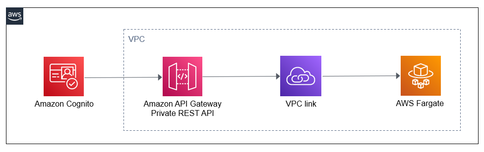

# API Gateway private REST API with private integration and Cognito authentication

This CDK template implements an Amazon API Gateway private REST API with private integration. It can be used if you have a private API inside a VPC which is currently open to unauthenticated clients and you want to protect it by adding an authentication and authorization layer without having to modify the API itself.

The template creates a private REST API in Amazon API Gateway which sits in front of the original backend API. Requests will go through the API Gateway endpoint and will be authorized using a Cognito authorizer. The integration with the backend resource is done via a VPC link to connect to private resources inside the VPC. The API Gateway API is configured with a greedy proxy ("{proxy+}") which means that everything in the URL path will be passed to the backend without any modification. The API has an "ANY" method to accept all methods such as GET or POST.

The backend API to be protected is simulated by an ECS Fargate cluster running an [echo service](https://github.com/mendhak/docker-http-https-echo).

Learn more about this pattern at Serverless Land Patterns: https://serverlessland.com/patterns/cognito-restapi-vpclink-cdk/

Important: this application uses various AWS services and there are costs associated with these services after the Free Tier usage - please see the [AWS Pricing page](https://aws.amazon.com/pricing/) for details. You are responsible for any AWS costs incurred. No warranty is implied in this example.

## Architecture



## Requirements

- [Create an AWS account](https://portal.aws.amazon.com/gp/aws/developer/registration/index.html) if you do not already have one and log in. The IAM user that you use must have sufficient permissions to make necessary AWS service calls and manage AWS resources.
- [AWS CLI](https://docs.aws.amazon.com/cli/latest/userguide/install-cliv2.html) installed and configured
- [Git Installed](https://git-scm.com/book/en/v2/Getting-Started-Installing-Git)
- [Node and NPM](https://nodejs.org/en/download/) installed
- [AWS Cloud Development Kit](https://docs.aws.amazon.com/cdk/latest/guide/cli.html) (AWS CDK) installed

## Deployment Instructions

1. Create a new directory, navigate to that directory in a terminal and clone the GitHub repository:
   ```bash
   git clone https://github.com/aws-samples/serverless-patterns
   ```
1. Change directory to the pattern directory:
   ```bash
   cd cognito-restapi-vpclink-cdk
   ```
1. From the command line, use npm to install the development dependencies:
   ```bash
   npm install
   ```
1. To deploy from the command line use the following:
   ```bash
   cdk deploy
   ```

## How it works

A Cognito [resource server](https://docs.aws.amazon.com/cognito/latest/developerguide/cognito-user-pools-define-resource-servers.html) is used to define scopes for an application. Clients are granted scopes and API method-path resources are mapped to scopes. This allows API Gateway to verify the JSON Web Tokens (JWT) are valid and the client is authorized to access a particular method-path.

## Testing

A test script has been provided in the `cdk/scripts/test_client.mjs` file. The script will connect to Cognito and using the `client_credentials` OAuth 2.0 grant type for a provided scope. Cognito will response with a JSON Web Token (JWT) access token that the client can use to make requests (and expires after 1 hour by default). The test script then passes the access token to API Gateway in an HTTP `Authorization` header. API Gateway will verify the token and authorize the request if the provided scope is allowed to access the particular method-path endpoint.

Note that you're connecting to the backend resource via the API Gateway endpoint. If you try to connect directly either to the NLB endpoint you'll be blocked by security groups. You will also get Unauthorized error messages if you don't provide a valid token.

For more information about Amazon API Gateway private APIs and how to invoke them using different endpoints, please refer to links below.

- How to invoke a private API
  https://docs.aws.amazon.com/apigateway/latest/developerguide/apigateway-private-api-test-invoke-url.html

- Creating a private API in Amazon API Gateway
  https://docs.aws.amazon.com/apigateway/latest/developerguide/apigateway-private-apis.html

## Cleanup

1. From the command line, use the following in the source folder
   ```bash
   cdk destroy
   ```
2. Confirm the removal and wait for the resource deletion to complete.

---

Copyright 2022 Amazon.com, Inc. or its affiliates. All Rights Reserved.

SPDX-License-Identifier: MIT-0
