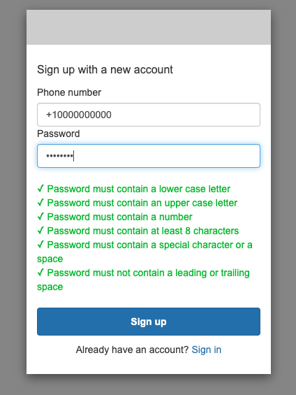

# Amazon Cognito - Amazon Pinpoint - Amazon SNS

Multi-factor authentication (MFA) increases security for your app. You can choose SMS text messages or time-based one-time passwords (TOTP) as second factors to sign in your users.

By default, Amazon Cognito uses a single Sender ID/Origination Identity to send SMS to all the users for MFA. However, in some countries, there might be regulations on the use of a certain type of Sender ID's, and the users from such countries are not able to receive SMS from Amazon Cognito due to this.

This pattern explains how to integrate Lambda functions with Amazon Cognito and dynamically select Sender ID based on country regulations and send SMS message using Amazon SNS SMS.

When you assign a custom SMS sender trigger to your user pool, Amazon Cognito invokes a Lambda function instead of its default behavior when a user event requires that it send an SMS message. With a custom sender trigger, your AWS Lambda function can send SMS notifications to your users through a method and provider that you choose. The custom code of your function must process and deliver all SMS messages from your user pool.

Important: this application uses various AWS services and there are costs associated with these services after the Free Tier usage - please see the [AWS Pricing page](https://aws.amazon.com/pricing/) for details. You are responsible for any AWS costs incurred. No warranty is implied in this example.

## Requirements

* [Create an AWS account](https://portal.aws.amazon.com/gp/aws/developer/registration/index.html) if you do not already have one and log in. The IAM user that you use must have sufficient permissions to make necessary AWS service calls and manage AWS resources.
* [AWS CLI](https://docs.aws.amazon.com/cli/latest/userguide/install-cliv2.html) installed and configured
* [Git Installed](https://git-scm.com/book/en/v2/Getting-Started-Installing-Git)
* [AWS Serverless Application Model](https://docs.aws.amazon.com/serverless-application-model/latest/developerguide/serverless-sam-cli-install.html) (AWS SAM) installed

## Getting Started
The entire solution is built on AWS SAM and the CustomSMSSender Lambda function in Node.js 18.x. The instructions below shows the prerequisities, deployment instructions and testing steps.

### Prerequisites
* Amazon SNS SMS account is moved out of [SMS Sandbox](https://aws.amazon.com/blogs/compute/introducing-the-sms-sandbox-for-amazon-sns/)
* Dedicated OriginationNumber or SenderID registered with [Amazon Pinpoint](https://docs.aws.amazon.com/pinpoint/latest/userguide/channels-sms-originating-identities.html)

## Deployment Instructions

1. Create a new directory, navigate to that directory in a terminal and clone the GitHub repository:
    ``` 
    git clone https://github.com/aws-samples/serverless-patterns
    ```
2. Change directory to the pattern directory:
    ```
    cd cognito-sns-sms-origination-id-sam
   
3. Change directory and run npm init command to initialize the project 

   ```
   cd dependencies/nodejs
   npm init -y
   
4. Install dependencies:

   ```
   npm install
   ```
5. Change directory to main directory cognito-sns-sms-origination-id-sam:

   ```aidl
   cd -
   ```
   
   1. Add the required countries for sending SMS messages to your users through Amazon Cognito:

      ```
       cd sns-cognito
       ```

      * Open app.js file and edit the below map to add required countries and their codes. 
      
       ```
         // Mapping object to map numeric country codes to ISO2 country codes
      const countryCodeMap = {
      '+1': 'US',
      '+91': 'IN',
      '+61': 'AU',
      '+56': 'CL',
      '+33': 'FR'
      // Add more country data as needed
      };

   **Note:** Origination identities, for e.g. short codes and long codes, for respective countries can be configured using Amazon Pinpoint. Refer this [guide](https://docs.aws.amazon.com/pinpoint/latest/userguide/channels-sms-awssupport.html).


6. Run below command to build the sam project:
   ```aidl
   sam build
   ```
   
8. Run below command to deploy the AWS resources for the pattern as specified in the template.yaml file:
   **Note:** Ensure that the default values for all the `Parameters` in the CloudFormation template `template.yaml` are filled out with correct values.
    ```
    sam deploy -g --capabilities CAPABILITY_NAMED_IAM
    ```
   
## How it works

You can create a Lambda function and then activate that function during Cognito user pool operations such as user sign-up, confirmation, and sign-in (authentication) with a Lambda trigger. You can add authentication challenges, migrate users, and customize verification messages. 

This solution uses the [custom SMS sender Lambda trigger](https://docs.aws.amazon.com/cognito/latest/developerguide/user-pool-lambda-custom-sms-sender.html) to dynamically identify the country code from the user's phone number and fetch the corresponding Origination ID from Amazon Pinpoint to send SMS message.

## Testing

1. Copy the 'LoginUI' URL value from CloudFormation stack outputs. The URL should look like below:
   ```
   https://<your-userpool-domain-name>.auth.<aws-region>.amazoncognito.com/login?response_type=token&client_id=<your-app-client-id>>&redirect_uri=https://www.amazon.com/
   ```

2. Paste the copied URL in a new browser window and access the Hosted UI of Amazon Cognito.

   

3. Sign up with a new account by providing your phone number and password. 

   

4. After you hit `Sign up` button, you should receive a verification code on the provided phone number by Amazon Cognito.

   

5. Once you enter the verification code, you should be able to confirm the account and Amazon Cognito will redirect you to the callback URL after confirmation.

   

   Notice the `access-token` in the Callback URL.


6. You can verify the CustomSMSSender Lambda function CloudWatch logs to check origination identity used to send the SMS message.

   * **Sample log with origination identity set by Lambda trigger**
   
     


## Cleanup
 
1. Delete the SAM template
    ```bash
    sam delete
    ```
----
Copyright 2023 Amazon.com, Inc. or its affiliates. All Rights Reserved.

SPDX-License-Identifier: MIT-0