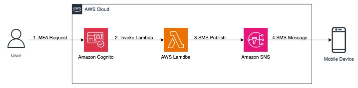
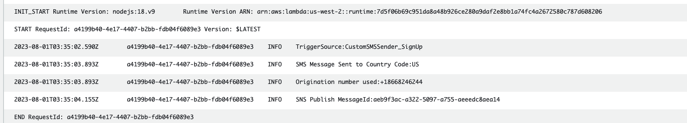
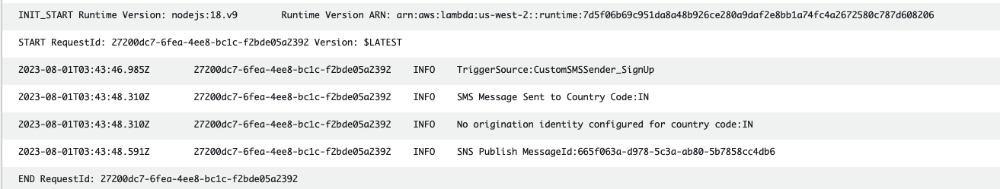

# Amazon Cognito - SNS SMS Originating Identity
This pattern will provide guidance on how to use Amazon Cognito’s lambda triggers to select origination IDs to suit your needs and send sms message using Amazon SNS SMS

Amazon Cognito sends SMS on your behalf by publishing the request to send SMS for MFA and “other” use cases. Cognito uses the default settings when choosing origination IDs. If you cannot secure the same origination ID, or if you operate with multiple origination IDs with your account, you will need to select the correct origination ID for your Cognito use cases. This pattern will provide guidance on how to use Cognito’s lambda triggers to select origination IDs to suit your needs.

Learn more about this pattern at Serverless Land Patterns: https://serverlessland.com/patterns/cognito-sns-sms-origination-id

Important: this application uses various AWS services and there are costs associated with these services after the Free Tier usage - please see the [AWS Pricing page](https://aws.amazon.com/pricing/) for details. You are responsible for any AWS costs incurred. No warranty is implied in this example.

## Requirements

* [Create an AWS account](https://portal.aws.amazon.com/gp/aws/developer/registration/index.html) if you do not already have one and log in. The IAM user that you use must have sufficient permissions to make necessary AWS service calls and manage AWS resources.
* [AWS CLI](https://docs.aws.amazon.com/cli/latest/userguide/install-cliv2.html) installed and configured
* [Git](https://git-scm.com/book/en/v2/Getting-Started-Installing-Git) installed
* [Node and NPM](https://nodejs.org/en/download/) installed
* [AWS Cloud Devolpment Kit](https://docs.aws.amazon.com/cdk/v2/guide/getting_started.html) installed

## Getting Started
The entire solution is built on CDK typescript and CustomSMSSender Lambda function in Node.js 18.x. The instructions below shows the prerequisities, deployment instructions and testing steps.


### Prerequisites
* Amazon SNS SMS account is moved out of [SMS Sandbox](https://aws.amazon.com/blogs/compute/introducing-the-sms-sandbox-for-amazon-sns/)
* Dedicated OriginationNumber or SenderID registered with [Aamazon SNS](https://docs.aws.amazon.com/sns/latest/dg/channels-sms-originating-identities-origination-numbers.html) 


### Deployment Instructions

1. Create a new directory, navigate to that directory in a terminal and clone the GitHub repository:
    ``` 
    git clone https://github.com/aws-samples/serverless-patterns
    ```
2. Change directory to the pattern directory:
    ```
    cd cognito-sns-sms-origination-id
    ```
3. Configure origination identities for countries you want use sending sms messages from cognito:

    ```
    cd lambda/code 
    ```
    
    * Open orignationIdConfig.json file and edit origination identities as per country.  

    ```
        {
            "US": {
                "OriginationNumber": "+12223334444"
            },
            "CA": {
                "OriginationNumber": "123456"
            },
            "IN": {
                "SenderID": "MySenderID"
            }
        }
    ```
    **Note:** OriginationNumber can be Long code or Short code and need to be registered prior with Amazon SNS serivce.

4. Change directory and install CustomSMSSender Lambda function Node.js dependencies 
    ```
    cd - && cd lambda/layer/nodejs 
    ```

    ```
    npm init -y
    npm install --save google-libphonenumber @aws-crypto/client-node base64-js
    ```

5. Change directory to main directory cognito-sns-sms-origination-id:
    ```
    cd -
    ```
6. Run below command to install AWS CDK required dependancies
    ```
    npm install
    ```
7. This project uses typescript as client language for AWS CDK. Run the below command to compile typescript to javascript
    ```
    npm run build
    ```
8. Deploy the stack:
    ```
    cdk deploy --all
    ```

 **Note:** Make sure you deploy this solution in AWS Region you have dedicated [OriginationNumber](https://docs.aws.amazon.com/sns/latest/dg/channels-sms-originating-identities-origination-numbers.html) or SenderID registered with Aamazon SNS for the country you want to send SMS messages. 


### How it works
Amazon Cognito can be customized using lambda triggers for different flows. This solution uses the [custom SMS sender lambda trigger](https://docs.aws.amazon.com/cognito/latest/developerguide/user-pool-lambda-custom-sms-sender.html) to dynamically identify the country code using phone number library and set the origination id from the origination configuration file and send SMS message.


#### Architecture Diagram


### Testing

How to test this pattern and send SMS message from Amazon Cognito CustomSMSSender Lambda function. 

 **Note:** Make sure you edited orignationIdConfig.json in Step 3 and added dedicated [OriginationNumber](https://docs.aws.amazon.com/sns/latest/dg/channels-sms-originating-identities-origination-numbers.html) or SenderID registered with Aamazon SNS for the country you want to test. If there is no OriginationNumber or SenderID configured for the country, Amazon SNS will use default settings.

For example:
* If you want to Send SMS messages to US phonenumber you will need have Toll-Free Number or 10DLC or Short Code registered with Aamazon SNS

Testing mechanisms  using AWS CLI: 

In this test we will trigger Amazon Cognito "CustomSMSSender_SignUp" [event](https://docs.aws.amazon.com/cognito/latest/developerguide/user-pool-lambda-custom-sms-sender.html#trigger-source) from Amazon Cognito and send MFA SMS code 

1. Run the below CLI command, replace the --client-id with cognitocustomsmssenderclientappid from CDK output, and update other inputs fields: TestUserEmail, TestUserName, TestPhonenumber, AWSRegion 

    ```
    aws cognito-idp sign-up --client-id <cognitocustomsmssenderclientappid> --username <TestUserEmail> --password <Password> --user-attributes Name="email",Value="<TestUserEmail>" Name="name",Value="<TestUserName>" Name="phone_number",Value="<TestPhonenumber>" --region <AWSRegion>
    ``` 
    **Example:**
    ```
    aws cognito-idp sign-up --client-id 781hakalbosbt4tu0g6s236uk9 --username jane@example.com --password Test@654321 --user-attributes Name="email",Value="jane@example.com" Name="name",Value="Jane" Name="phone_number",Value="+12223334444" --region us-west-2
    ```
    **Note:** Password Requirements 8-character minimum length and at least 1 number, 1 lowercase letter, and 1 special character

    CLI command response:
    ```
    {
    "UserConfirmed": false,
    "CodeDeliveryDetails": {
        "Destination": "+********2076",
        "DeliveryMedium": "SMS",
        "AttributeName": "phone_number"
    },
    "UserSub": "e68c3847-f1bb-4399-a642-361bcee259c5"
    }
    ```
2. You can verify the CustomSMSSender Lambda function cognito-customsmssender CloudWatch log to check origination identities used to SMS messages 

    Go to Lambda function cognito-customsmssender CloudWatch logs

    * **Sample log with origination identities used from orignationIdConfig.json file**
    


    * **Sample log if no origination identities configured orignationIdConfig.json file for destination country** 
    

### Cleanup
 
1. Run the given command to delete the resources that were created. It might take some time for the CloudFormation stack to get deleted
    ```
    cdk destroy --all
    ```

----
Copyright 2023 Amazon.com, Inc. or its affiliates. All Rights Reserved.

SPDX-License-Identifier: MIT-0