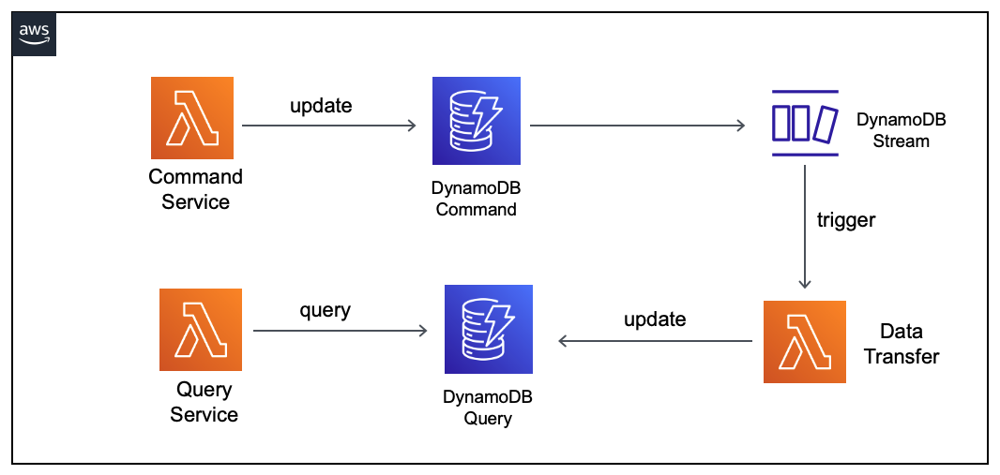

## Description
## The command query responsibility segregation (CQRS) pattern implemented in Java using SAM

This is a Java implementation of the CQRS pattern.
Reference: https://docs.aws.amazon.com/prescriptive-guidance/latest/patterns/decompose-monoliths-into-microservices-by-using-cqrs-and-event-sourcing.html?did=pg_card&trk=pg_card

Important: this application uses various AWS services and there are costs associated with these services after the Free Tier usage - please see the AWS Pricing page for details. You are responsible for any AWS costs incurred.

## Language:
#### This is a Maven project which uses Java 11 and AWS SDK

## Framework

The framework used to deploy the infrastructure is SAM

## Services used

The AWS services used in this pattern are
#### AWS Lambda - DynamoDB - DynamoDB Stream

Topology




## Description
The SAM template contains all the information to deploy AWS resources(three Lambda functions and two DynamoDB table)
and also the permission required by these service to communicate.

You will be able to create and delete the CloudFormation stack using the CLI commands.

The CQRS pattern separates responsibilities of the command and query models.
For more details about this pattern see https://docs.aws.amazon.com/prescriptive-guidance/latest/patterns/decompose-monoliths-into-microservices-by-using-cqrs-and-event-sourcing.html?did=pg_card&trk=pg_card

This is fully functional example implemented in Java 11.

## Deployment commands

````
mvn clean package

# create an S3 bucket where the source code will be stored:
aws s3 mb s3://po8okndasi33dcsws

# copy the source code located in the target folder:
aws s3 cp target/sourceCode.zip s3://po8okndasi33dcsws

# SAM will deploy the CloudFormation stack described in the template.yml file:
sam deploy --s3-bucket po8okndasi33dcsws --stack-name cqrs-pattern --capabilities CAPABILITY_IAM

````

## Testing

To test the endpoint first send data using the following command. Be sure to update the endpoint with endpoint of your stack.

```
# invoke the CommandService function to put two items into the Command DynamoDB table
aws lambda invoke --function-name CommandService --cli-binary-format raw-in-base64-out --payload '{"username":"user111","email":"user111@example.com"}' command-response.json
aws lambda invoke --function-name CommandService --cli-binary-format raw-in-base64-out --payload '{"username":"user222","email":"user222@example.com"}' command-response.json

# invoke the QueryService to read all items from the Query DynamoDB table
aws lambda invoke --function-name QueryService query-response.json

# display the result
cat query-response.json

```

## Cleanup

Run the given command to delete the resources that were created. It might take some time for the CloudFormation stack to get deleted.
```
aws cloudformation delete-stack --stack-name cqrs-pattern

aws s3 rm s3://po8okndasi33dcsws --recursive

aws s3 rb s3://po8okndasi33dcsws
```

## Requirements

* [Create an AWS account](https://portal.aws.amazon.com/gp/aws/developer/registration/index.html) if you do not already have one and log in. The IAM user that you use must have sufficient permissions to make necessary AWS service calls and manage AWS resources.
* [AWS CLI](https://docs.aws.amazon.com/cli/latest/userguide/install-cliv2.html) installed and configured
* [Git Installed](https://git-scm.com/book/en/v2/Getting-Started-Installing-Git)
* [AWS Serverless Application Model](https://docs.aws.amazon.com/serverless-application-model/latest/developerguide/serverless-sam-cli-install.html) (AWS SAM) installed


## Author bio
Name: Razvan Minciuna
LinkedIn: https://www.linkedin.com/in/razvanminciuna/
Description: Software Architect


