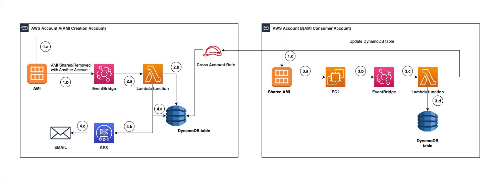
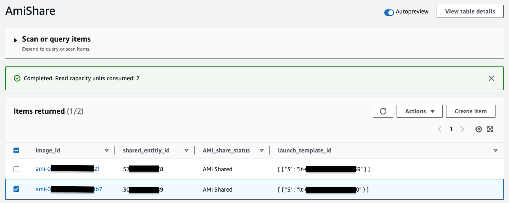
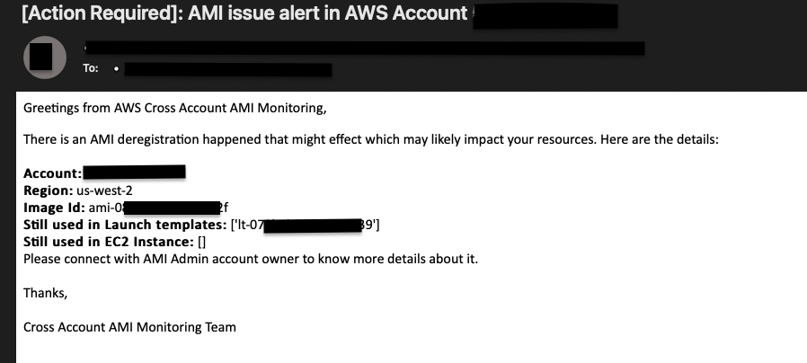

# Setup auditing and monitoring for cross account shared Amazon Machine Image(AMI)

## Introduction
This solution will help customers to create auditing and monitoring solution for cross accounts shared AWS AMI. This will also alert customers when any de-registered AMI is still getting used in any AWS Service. This pattern will help customers to provide insights about AMI usage and reduce any production issue in case any de-registered AMI is referred in customers production account.

## Architecture


### Workflow

- Share AMI with other AWS Accounts.
    1. AWS AMI is shared with another AWS Account.
    2. When AMI is shared, the ModifyImageAttribute event will be captured by an Amazon EventBridge event rule.
    3. The consumer AWS account can view the shared AMI as private image.

- Trigger AWS Lambda function to store data in DynamoDB table.
    1. EventBridge will trigger Lambda function. This function will process the event.
    2. After processing the event, it will store the data related to the shared AMI in DynamoDB table.

- Using shared AWS AMI in consumer AWS Account
    1. Shared AMI in consumer AWS Account will be referred/un-referred to create Launch Configuration, Launch Template, EC2 etc.
    2. When AMI is used/un-referred then its event will be captured by EventBridge rule.
    3. EventBridge will trigger the Lambda function, this Lambda function will update DynamoDB table item and add AMI usage details in Creator account with the help of a cross-account IAM role.
    4. This Lambda function will also update the AMI id and EC2/Launch template id in the Mapping DynamoDB table in the same AWS Account. This is needed when the AMI is deregistered from Launch templates or EC2 instances. 

- Un-register/Delete AMI in Creator account
    1. When ModifyImageAttribute has remove action, then the Lambda function will validate that the given AMI does not have any usage in DynamoDB table.
    2. If AMI is still being referenced, then Lambda function will trigger an email alert using SES.
    3. SES email subscriber will receive the event notification.
## Prerequisites
- At least 2 active AWS accounts.
- AWS AMI should be created in one of the AWS account.
- Terraform (Terraform version 1.2.0 or higher) installed and configured. Please follow this [link](https://www.terraform.io/) for Terraform installation.

## Tools and services
- [AWS Lambda](https://aws.amazon.com/lambda/) - AWS Lambda is a serverless compute service that runs your code in response to events and automatically manages the underlying compute resources for you.
- [Amazon EventBridge](https://docs.aws.amazon.com/eventbridge/latest/userguide/eb-what-is.html) - EventBridge is a serverless service that uses events to connect application components together, making it easier for you to build scalable event-driven applications.
- [Amazon Dynamodb](https://aws.amazon.com/dynamodb/) - Amazon Dynamodb is a fully managed NOSQL database.
- [Amazon SNS](https://aws.amazon.com/sns/) - Amazon SNS is a fully managed service for pub-sub service.
- [Python](https://www.python.org/doc/essays/blurb/) - Python is an interpreted, object-oriented, high-level programming language.

## How to deploy using Terraform
1. Setup AWS CLI profile's with help of this [documentation](https://docs.aws.amazon.com/toolkit-for-visual-studio/latest/user-guide/keys-profiles-credentials.html) for AMI creator and consumer accounts.
2. Update AWS Provider configurations in [provider.tf](./terraform/provider.tf) to refer respective AWS CLI profiles for AMI Creator and Consumer account. This will create respective provider configuration block for creator and consumer AWS accounts. Please refer [Terraform documentation](https://developer.hashicorp.com/terraform/language/providers/configuration) on Provider for more help.
3. Update variable `account_email_mapping` value present [terraform.tfvars](./terraform/terraform.tfvars) file to include account id and its corresponding email id. Terraform variable `account_email_mapping` contains account id and email id mapping for AMI consumer accounts.

    *Note: In case where AMI creator account is consuming the AMI then update details of AMI creator account in `account_email_mapping`.*
    Example:
    ```hcl
    account_email_mapping = [
      { "account" : "111111111111", "email" : "sample1@example.com" },
      { "account" : "222222222222", "email" : "sample2@example.com" }
    ]
    ```

4. [Optional] Please refer this [section](#how-to-add-a-new-consumer-account-for-monitoring) for how to add a new Consumer Account for monitoring.

5. Run terraform commands to deploy these resources in following order:
    - To initialize terraform directory
        ```bash
        terraform init
        ```
    - To format terraform configuration files
        ```bash
        terraform fmt
        ```
    - To validate terraform configuration syntax
        ```bash
        terraform validate
        ```
    - To generate terraform plan using the configuration file
        ```bash
        terraform plan
        ```
    - To apply terraform plan
        ```bash
        terraform apply
        ```

6. Validate Cross Account AMI Monitoring

    To test and validate if Cross Account AMI Monitoring solution has been setup correctly please follow below steps:

    a. AMI Creation Account
    - Create a private AMI. Follow this [documentation](https://docs.aws.amazon.com/toolkit-for-visual-studio/latest/user-guide/tkv-create-ami-from-instance.html) for more help.
    - Share this AMI with one of the consumer AWS account. Follow this [documentation](https://docs.aws.amazon.com/AWSEC2/latest/UserGuide/sharingamis-explicit.html) for more help.
    <!-- - Validate Amazon Dynamodb table `AMIShare` and check after sharing AMI did its entry has been created a new item in a table. -->

    b. AMI Consumer Account
    - Create an EC2 instance or Launch template using the shared AMI. This shared AMI will be present as a private image. Follow below reference documentations.
        - [How to launch EC2 using custom AMI](https://repost.aws/knowledge-center/launch-instance-custom-ami)
        - [How to create launch template](https://docs.aws.amazon.com/autoscaling/ec2/userguide/create-launch-template.html)
    <!-- - After creating EC2 instance/Launch template, validate Amazon Dynamodb table `AMIshare` in creator AWS account has corresponding entries for the item with hash key as Image id and Sort key as Consumer AWS account id. -->

    <!-- Please refer below snippet, to view how data in Dynamodb table `AMIShare` will be present.
     -->
    c. Test Cross Account AMI Monitoring in action
    *Note:  Please confirm the subscription of Amazon SES email service to successfully receive email alerts.*
    - To test this solution confirm if  step 6.a and 6.b has been completed successfully.
    - In AMI Creation account, remove AMI sharing with the consumer AWS Account. Follow this [documentation](https://docs.aws.amazon.com/AWSEC2/latest/UserGuide/sharingamis-explicit.html) for more help.
    - As the shared AMI was still referenced in consumer AWS account(s), so AWS account owners whose details has been specified in [terraform.tfvars](./terraform/terraform.tfvars) will get email notification. Please find below sample email notification.

    


<!-- ## Validating the setup
#### AMI Owner Account
- Share AWS AMI with another AWS account by referring this [documentation](https://docs.aws.amazon.com/AWSEC2/latest/UserGuide/sharingamis-explicit.html).
- After sharing AMI, validate Dynamodb table `AmiShare`. This table will have record of shared AMI.

#### AMI Consumer Account
- Create Launch Template or EC2 using the shared AMI by referring this [documentation](https://docs.aws.amazon.com/autoscaling/ec2/userguide/create-launch-template.html).
- Once this AMI is referred then this solution will update the record in `AmiShare` Dynamodb table in AMI Owner account.
- This updated record will have the AMI reference and EC2 or Launch template id. -->

## How to add a new Consumer Account for monitoring?
1. Setup a new AWS CLI profile with help of this [documentation](https://docs.aws.amazon.com/toolkit-for-visual-studio/latest/user-guide/keys-profiles-credentials.html).
2. Setup a new Terraform AWS Provider in [provider.tf](./terraform/provider.tf) and use the profile created in step above.

    *Example: Suppose you have created AWS CLI profile with name `new_consumer` and you need to setup a provider for `us-west-2` region with alias name `new_alias` then you will need to add terraform configuration block in [provider.tf](./terraform/provider.tf) file.*
    ```hcl
    provider "aws" {
      alias   = "new_alias"
      region  = "us-west-2"
      profile = "new_consumer"
    }
    ```
3. To setup monitoring for new consumer account, use a new terraform provider configuration created in step#2 and create a new terraform module usage block in [main.tf](./terraform/main.tf) referring module `consumer_account_A`.

    *Example: To add a new consumer module with name `consumer_account_B` with the provider alias `new_alias`, add below terraform configuration in [main.tf](./terraform/main.tf) file.*
    ```hcl
    module "consumer_account_B" {
    providers = {
        aws = aws.ami-consumer-account_B
    }
    source               = "./modules/ami_consumer"
    configuration_inputs = module.ami_creator.configurations_details
    }
    ```

4. Update variable `account_email_mapping` value present [terraform.tfvars](./terraform/terraform.tfvars) file to include account id and its corresponding email id. Terraform variable `account_email_mapping` contains account id and email id mapping for AMI creation account as well as AMI consumer accounts.

    *Example: To add new mapping of account id `"333333333333"` and its respective email id `sample3@example.com` then updated value for `account_email_mapping` will be as following:*
    ```hcl
    account_email_mapping = [
      { "account" : "111111111111", "email" : "sample1@example.com" },
      { "account" : "222222222222", "email" : "sample2@example.com" },
      { "account" : "333333333333", "email" : "sample3@example.com" }
    ]
    ```
*Note: Owner email id will be receiving email notifications about AMI issues.*
<!-- - To apply the changes execute below commands
    - To initialize terraform directory with new profile
        ```bash
        terraform init
        ```
    - To format terraform configuration files
        ```bash
        terraform fmt
        ```
    - To validate terraform configuration syntax
        ```bash
        terraform validate
        ```
    - To generate terraform plan using the configuration file
        ```bash
        terraform plan
        ```
    - To apply terraform plan
        ```bash
        terraform apply
        ``` -->

<!-- #### Validation
- If you delete the EC2 instance/Launch template then AMI record in Dynamodb table will be updated with updated value.
- If you try to delete the AMI/Unregister AMI from the owner account, then it will Not Prevent the action but it will send Email alert to subscribed email id. -->


## Troubleshooting
1. How to setup multiple AWS CLI profiles?
   - Refer how to access different AWS Account with the help of named profile.
2.  I have not received an email alert when AMI is still getting referred.
    - There could be multiple reasons why email was not triggered, please follow below steps to debug:
        - Validate if infrastructure has been configured properly in both the AWS Accounts.
        - Validate lambda function CloudWatch logs. [Refer how to view lambda function CloudWatch logs](https://docs.aws.amazon.com/lambda/latest/dg/monitoring-cloudwatchlogs.html). Check if there is any permission issue due to Explicit Deny on permissions.
        - Validate if you have confirmed email subscription from SES service.

----
Copyright 2023 Amazon.com, Inc. or its affiliates. All Rights Reserved.

SPDX-License-Identifier: MIT-0