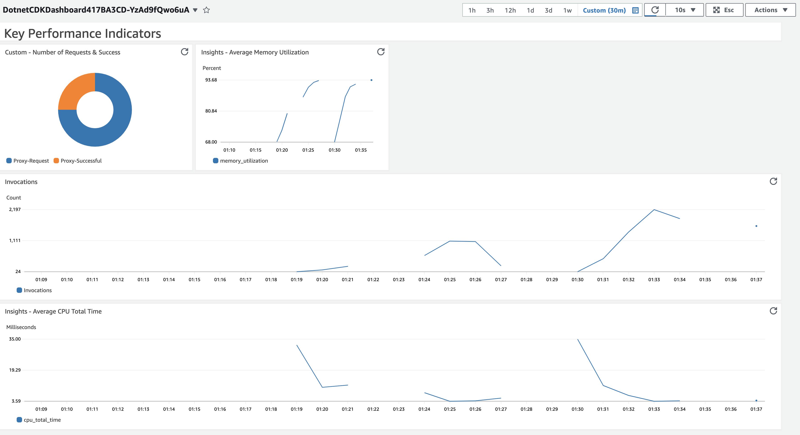

# AWS Lambda with Cloudwatch Metrics & Dashboard

This pattern helps build CloudWatch Dashboard with AWS Lambda Metrics. The Dashboard built with 4 widgets,
1. Invocations - from AWS/Lambda Namespace
2. memory_utilization - from LambdaInsights Namespace
3. cpu_total_time - from LambdaInsights Namespace
4. Custom Metrics (Proxy-Request & Proxy-Successful) - from Custom Namespace

Learn more about this pattern at Serverless Land Patterns: https://serverlessland.com/patterns/

Important: this application uses various AWS services and there are costs associated with these services after the Free Tier usage - please see the [AWS Pricing page](https://aws.amazon.com/pricing/) for details. You are responsible for any AWS costs incurred. No warranty is implied in this example.

## Requirements

* [Create an AWS account](https://portal.aws.amazon.com/gp/aws/developer/registration/index.html) if you do not already have one and log in. The IAM user that you use must have sufficient permissions to make necessary AWS service calls and manage AWS resources.
* [AWS CLI](https://docs.aws.amazon.com/cli/latest/userguide/install-cliv2.html) installed and configured
* [Git Installed](https://git-scm.com/book/en/v2/Getting-Started-Installing-Git)
* [.Net Core](https://dotnet.microsoft.com/en-us/download/dotnet)
    - 6.0 for the Lambda Function - https://dotnet.microsoft.com/en-us/download/dotnet/6.0
* [Docker](https://docs.docker.com/get-docker/) installed and running
* [AWS Cloud Development Kit](https://docs.aws.amazon.com/cdk/latest/guide/cli.html) (AWS CDK) installed

## Deployment Instructions

1. Create a new directory, navigate to that directory in a terminal and clone the GitHub repository:
    ``` 
    git clone https://github.com/aws-samples/serverless-patterns
    ```
2. Change directory to the pattern directory:
    ```
    cd serverless-patterns/cw-dashboard-lambda-metrics
    ```
3. Install dependencies
    ```
    dotnet restore src
    ```
4. Deploy the stack to your default AWS account and region.
    ```
    cdk deploy
    ```

## How it works

A CloudWatch dashboard was created to display metrics from the Lambda function. The dashboard includes the following meterics.

- Default metrics in the Default Namespace
- Insight metrics that were collected by instrumenting the Docker Lambda function with Lambda Insight 
- Custom metrics were sent to CloudWatch by Lambda using Powertools. The Lambda function had two custom metrics: one for all requests, and one for successful requests.

**Lambda**: Lambda is a serverless computing service offered by AWS. It allows you to run code without provisioning or managing servers. Lambda functions are triggered by events, such as HTTP requests, database changes, or file uploads.

**CloudWatch**: CloudWatch is a monitoring service offered by Amazon Web Services (AWS). It collects and stores metrics from AWS resources, such as EC2 instances, RDS databases, and Lambda functions. CloudWatch can be used to track the performance, health, and usage of AWS resources.

**Lambda Insight**: Lambda Insight is a feature of Lambda that allows you to collect and analyze metrics from your Lambda functions. Lambda Insight can be used to track the performance, health, and usage of your Lambda functions.

**LambdaPowertools**: Powertools is a set of tools that can be used to collect and send custom metrics to CloudWatch. Powertools can be used with a variety of AWS services, including Lambda, EC2, and RDS.

**Custom metrics**: Custom metrics are metrics that are not collected by default by CloudWatch. Custom metrics can be collected by using Powertools or by writing your own code.

## Testing

Run some transactions from AWS Console - Lambda - Testing using the following events.

- Payload with validate response

    ```json
    {
        "requestUrl": "https://random.dog/woof.json"
    }
    ```

    ```cmd
    aws lambda invoke --function-name DotnetLambdaCloudwatchDas-containerimagelambdafunc-CBMehNDHGXiY --payload '{"requestUrl": "https://random.dog/woof.json"}' response_1.json  
    ```
- Payload with OK status_code with no response 

    ```json
    {
        "requestUrl": "https://httpbin.org/status/200"
    }
    ```
    ```cmd
    aws lambda invoke --function-name DotnetLambdaCloudwatchDas-containerimagelambdafunc-CBMehNDHGXiY --payload '{ "requestUrl": "https://httpbin.org/status/200" }' response_2.json  
    ```
- Payload with error status_code with no response 

    ```json
    {
        "requestUrl": "https://httpbin.org/status/500"
    }
    ```
    ```cmd
    aws lambda invoke --function-name DotnetLambdaCloudwatchDas-containerimagelambdafunc-CBMehNDHGXiY --payload '{ "requestUrl": "https://httpbin.org/status/500" }' response_3.json  
    ```

After running some transactions. Dashboard should start showing the data in graph.



## Cleanup
 
Run the given command to delete the resources that were created. It might take some time for the CloudFormation stack to get deleted.
```
cdk destroy
```

----
Copyright 2023 Amazon.com, Inc. or its affiliates. All Rights Reserved.

SPDX-License-Identifier: MIT-0
