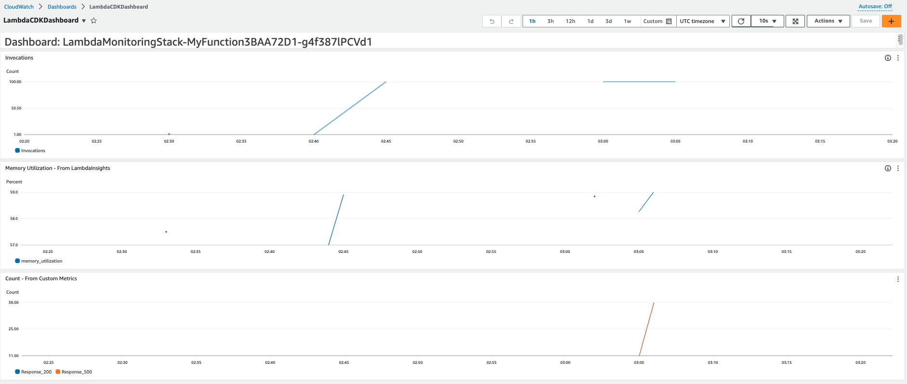

# Amazon CloudWatch Dashboard Monitoring with Lambda PowerTools

The CDK Stack deploys CloudWatch Dashboard with AWS Lambda Metrics. Lambda Function is instrumented with Lambda Insights and leverage Powertools for custom metrics reporting.

The Dashboard is built with 3 widgets with the metrics,
- Invocations - from AWS/Lambda Namespace
- memory_utilization - from LambdaInsights Namespace
- Custom Metrics (Proxy-Request & Proxy-Successful) - from Custom Namespace

Learn more about this pattern at Serverless Land Patterns: https://serverlessland.com/patterns/

Important: this application uses various AWS services and there are costs associated with these services after the Free Tier usage - please see the [AWS Pricing page](https://aws.amazon.com/pricing/) for details. You are responsible for any AWS costs incurred. No warranty is implied in this example.

## Requirements

* [Create an AWS account](https://portal.aws.amazon.com/gp/aws/developer/registration/index.html) if you do not already have one and log in. The IAM user that you use must have sufficient permissions to make necessary AWS service calls and manage AWS resources.
* [AWS CLI](https://docs.aws.amazon.com/cli/latest/userguide/install-cliv2.html) installed and configured
* [Git Installed](https://git-scm.com/book/en/v2/Getting-Started-Installing-Git)
* [Docker](https://docs.docker.com/get-docker/) installed and running on Architecture: x86_64
* [AWS Cloud Development Kit](https://docs.aws.amazon.com/cdk/latest/guide/cli.html) (AWS CDK) installed and configured
* [Python 3.9+](https://www.python.org/downloads/) installed

## Deployment Instructions

1. Create a new directory, navigate to that directory in a terminal and clone the GitHub repository:
    ```
    git clone https://github.com/aws-samples/serverless-patterns
    ```
2. Change directory to the pattern directory:
    ```
    cd serverless-patterns/cw-dashboard-lambda-metrics
    ```
3. Create a virtual environment for Python
    ```
    python3 -m venv .venv
    ```
4. Activate the virtual environment
    ```
    source .venv/bin/activate
    ```
    For a Windows platform, activate the virtualenv like this:
    ```
    .venv\Scripts\activate.bat
    ```
5. Install the Python required dependencies:
    ```
    pip install -r requirements.txt
    ```
6. From the command line, use AWS CDK to deploy the AWS resources for the serverless application as specified in the app.py file:
    ```
    cdk deploy
    ```
7. CDK Output would the Funcation Name. Invoke the function a few times to create Metrics for the Dashboard.
   ```
   aws lambda invoke --function-name <function_name> out --log-type None
   ```

## How it works

Lambda is instrumented with the [Lambda Insights](https://docs.aws.amazon.com/AmazonCloudWatch/latest/monitoring/Lambda-Insights-Getting-Started.html) and leverage [PowerTools](https://docs.powertools.aws.dev/lambda/python/latest/) for custom metrics.

## Testing

You can use command line a few times,

```
aws lambda invoke --function-name <function_name> out --log-type None

```

After generating some load, you should be able to view Graphs in the CloudWatch Dashoboard.




## Cleanup

Delete the stack

```
cdk destroy 
```
