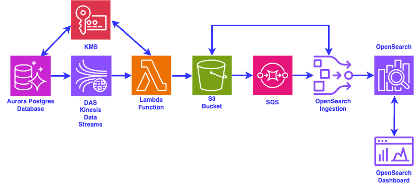
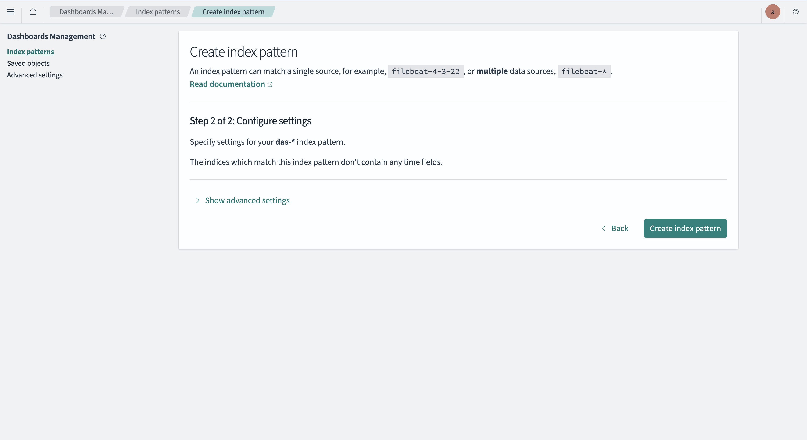

# das-lambda-java-sam
# Java AWS Lambda Database Activity Streams Processing, using AWS SAM

This pattern is an example of a Lambda function that consumes messages from an Amazon Kinesis Data Stream created when Database Activity Streams is enabled on an Amazon Aurora Postgres database. This pattern also demonstrates how the records are decrypted, filtered for heartbeat events and then how an OpenSearch Ingestion Pipeline is set-up to send the Database Activity Stream events to an Amazon OpenSearch domain.

Below is an architecture diagram that depicts the end-to-end flow.



As can be seen in the architecture diagram above, whenever there is any activity on the Aurora Postgres database, the Database Activity Streams (DAS) sends out messages on the Kinesis Data Streams, that is automatically created when DAS is enabled on the database. The messages that are put into the Kinesis Data Stream are encrypted using a KMS key. Apart from user originated database activity, Aurora also sends out heartbeat events and database activity by the RDS administrator. In the Lambda function that has the Kinesis Data Stream as its event source, the messages are decrypted using the same KMS key with which the messages were encrypted by the DAS. All heartbeat events and RDS Admin events are filtered out. The Lambda function formats user originated events into a structured JSON string and writes the JSON string to an S3 bucket as an object. As soon as a new object is written to the S3 bucket, an S3 Event Notification is trigggered and puts a message on an SQS queue. An OpenSearch Ingestion pipeline has been set-up that reads messages from the SQS queue, reads the object from the S3 bucket and then writes out the contents of the S3 object to an Amazon OpenSearch index.

This project contains source code and supporting files for a serverless application that you can deploy with the SAM CLI. It includes the following files and folders.

- das_consumer_sam_project/database_activity_streams_event_consumer_function/src/main/java - Code for the application's Lambda function.
- das_consumer_sam_project/database_activity_streams_event_consumer_function/pom.xml - Maven file for building the Lambda function.
- das_consumer_sam_project/template.yaml - SAM template for deploying the Lambda function.
- setup-das-cfn.yaml - A Cloudformation template file that can be used to deploy all the resources needed as part of this project. The CloudFormation template also deploys an EC2 machine that builds and deploys the AWS Lambda function and performs other necessary configuration scripts in the UserData section.
- BootStrapFromCloudShell.sh - A shell script that needs to be run as an admin user of the AWS account to create a new IAM user that will be used to run the CloudFormation template to create all the resources for the project.
- IngestionPipelineConfig.yaml - A template for the Amazon OpenSearch Ingestion Pipeline that will be executed in the CloudFormation template to create the Amazon OpenSearch Ingestion Pipeline that will send the Database Activity Streams records to an Amazon OpenSearch domain.
- UpdateOSIRole.sh - A shell script that gets called from within the CloudFormation template to add an IAM role as a backend role in the Amazon OpenSearch domain. This will allow the IAM role to index the incoming records in the Amazon OpenSearch domain.
- RestartOSIPipeline.sh - A utility shell script that has been provided in case the Amazon OpenSearch Ingestion Pipeline needs to be restarted.

Important: this application uses various AWS services and there are costs associated with these services after the Free Tier usage - please see the [AWS Pricing page](https://aws.amazon.com/pricing/) for details. You are responsible for any AWS costs incurred. No warranty is implied in this example.

## Requirements

* [Create an AWS account](https://portal.aws.amazon.com/gp/aws/developer/registration/index.html) if you do not already have one and log in as root or an user that has Administrative privileges. We will create a new IAM user for the purpose of setting up the Database Activity Streams end-to-end flow. The IAM user that you will create must have sufficient permissions to make necessary AWS service calls and manage AWS resources.


### Step 1 - Create a service linked role for the Amazon OpenSearch service from CloudShell in your AWS Account

You need a service linked role for the Amazon OpenSearch service to be created in the AWS account.

* [Log in to the AWS Account as Admin User] - You need to log in to the AWS Account as either root or as an user with Admin privileges

* [Open AWS CloudShell] - Once you are inside AWS Cloudshell in the AWS console


In order to create the service linked role for the Amazon OpenSearch service, run the following command from the AWS CloudShell

```
aws iam create-service-linked-role --aws-service-name opensearchservice.amazonaws.com

```

For the above command, you will either get back a JSON response indicating that the service linked role has been successfully created, or you will get an exception like below:

```
An error occurred (InvalidInput) when calling the CreateServiceLinkedRole operation: Service role name AWSServiceRoleForAmazonOpenSearchService has been taken in this account, please try a different suffix.

```
If you get the above error, it is harmless. Please ignore it and move ahead.


### Step 2 - Checkout files from Github from CloudShell in your AWS Account

* [From AWS CloudShell checkout files from Github] - Once you are inside AWS Cloudshell in the AWS console, type the following commands. In case you are using a fork of the aws-samples github repository, then please replace the github URL with your own fork.

```
git clone -n --depth=1 --filter=tree:0 https://github.com/aws-samples/serverless-patterns.git 
cd serverless-patterns
git sparse-checkout set --no-cone /das-lambda-java-sam
git checkout
cd das-lambda-java-sam

```

### Step 3 - Run the BootStrapFromCloudShell.sh or the BootStrapFromCloudShellNoConsoleAccess.sh script from CloudShell in your AWS Account

**Note that in the instructions in this step, you will need to run the BootStrapFromCloudShell.sh only if you allow AWS console access for IAM users.**

**If not, then you will need to run the BootStrapFromCloudShellNoConsoleAccess.sh, so please look at the instructions in the relevant section**


### Option 1 - If IAM users are allowed AWS console access

* [Execute the BootStrapFromCloudShell.sh script to create an IAM user and store keys in Secrets Manager] - Once the BootStrapFromCloudShell.sh script has been checked out from Github, execute the following commands in your CloudShell. Substitute the \<username\> with value for the IAM user you want to create. You will be prompted for a password, which needs to be at least 8 characters long, it needs to include minimum of three of the following mix of character types: uppercase, lowercase, numbers, and non-alphanumeric character and it should not be identical to your AWS account name or email address. 

```
sh ./BootStrapFromCloudShell.sh <username>

```

Once the above command is done executing, log out of the AWS account and log in to the AWS console using the new \<username\> and password you just created. You will be asked to change the password upon first login. Once you are logged in as the IAM user, move to the Step 5 - "Run the CloudFormation template to create the AWS resources"

### Option 2 - If IAM users are not allowed AWS console access

**Note: If you do not have AWS console access and would rather run CloudFormation from the command line, do not run the BootStrapFromCloudShell.sh script. Instead run the BootStrapFromCloudShellNoConsoleAccess.sh script as shown below**

**Make sure to run the BootStrapFromCloudShellNoConsoleAccess.sh command from the CloudShell and not from your local machine**

```
sh ./BootStrapFromCloudShellNoConsoleAccess.sh <username>

```

The above script will generate three outputs, the access key, the secret access key and the default AWS region. Note down the above values. These will be needed in Step 4.


### Step 4 - Setup AWS credentials on local machine


### Option 1 - If IAM users are allowed AWS console access

* [Checkout from Github on your local machine] - Type the following commands from any folder on your local machine to get the CloudFormation template from Github

```
git clone -n --depth=1 --filter=tree:0 https://github.com/aws-samples/serverless-patterns.git
cd serverless-patterns
git sparse-checkout set --no-cone /das-lambda-java-sam
git checkout
cd das-lambda-java-sam

```

Move to Step 5 - "Run the CloudFormation template to create the AWS resources"
    

### Option 2 - If IAM users are not allowed AWS console access

* [Checkout from Github on your local machine] - Type the following commands from any folder on your local machine to get the CloudFormation template from Github

```
git clone -n --depth=1 --filter=tree:0 https://github.com/aws-samples/serverless-patterns.git
cd serverless-patterns
git sparse-checkout set --no-cone /das-lambda-java-sam
git checkout
cd das-lambda-java-sam

```

* [Set environment variables on your local machine] - To facilitate commands below, we'll create a couple of environment variables.
Substitute the values between the brackets "" below as you like. For \<username\>, use the same value that you had specified in Step 3. For \<region\>, use the same value as that was output in Step 3 (Option 2)

```
export AWS_USER=<username>
export AWS_REGION=<region>
export STACK_NAME=das-lambda-serverless-patterns
```

**On your local machine**, run the following:

```
sh ./CreateAWSCLIProfileOnLocalMachine.sh $AWS_USER <access key> <secret access key> $AWS_REGION

```

where the \<access key\> \<secret access key\> need to be replaced with the values of the three outputs from Step 3 (Option 2) above.

**Note: In case you did not note the values of the access key and the secret access key from Step 3 (Option 2), you can log into CloudShell in the same region that you had used earlier and run the following commands. Make sure to replace \<username\> with the value you had user earlier in Step 3**

```
cd serverless-patterns/das-lambda-java-sam
sh ./GetAWSCLIProfileDetailsFromCloudshell.sh <username>

```


Executing the CreateAWSCLIProfileOnLocalMachine.sh script will create an AWS profile for $AWS_USER on your local machine.

Once you have configured the AWS profile on your local machine, run the following command to verify the profile has been created correctly

```
aws sts get-caller-identity --no-cli-pager --profile $AWS_USER

```


### Step 5 - Run the CloudFormation template to create the AWS resources


### Option 1 - If IAM users are allowed AWS console access

You can log in to the AWS console using the new user that was created in Step 3 (Option 1)

Before you deploy the CloudFormation template, you will need to create a key-pair from the EC2 console, under "Network and Security". Name the key-pair "DASKeyPair" and choose RSA as the Key pair type. Choose .pem or .ppk as the Private key file format, depending on how you want to connect to the EC2 instance that will get created by the CloudFormation template. 

Once you have created the key-pair, you can run CloudFormation using the template file setup-das-cfn.yaml

The setup-das-cfn.yaml should be available in the folder on your local machine where you ran the Step 4 (Option 1)

Accept defaults for all the input parameters (or modify them if needed), when running the CloudFormation template.


### Option 2 - If IAM users are not allowed AWS console access

**Note: If you do not have AWS console access, you can deploy the CloudFormation from your local machine.**

**Execute the following commands from a terminal on your local machine**

```
aws ec2 create-key-pair --key-name DASKeyPair --key-format pem --key-type rsa --profile $AWS_USER --query 'KeyMaterial' --output text > DASKeyPair.pem

```

Make sure to save this .pem file in a secure location as you will need it later to ssh into the EC2 machine that will be created as part of the CloudFormation stack

```
chmod 400 DASKeyPair.pem

```

**If you modify the name of the key-name from DASKeyPair, then make sure to replace it in the CloudFormation template as well.**

Verify your identify by running

```
aws sts get-caller-identity --profile $AWS_USER --no-cli-pager
```

Now deploy the CloudFormation stack by running the RunCloudformationStack.sh file as follows

```
sh ./RunCloudformationStack.sh $AWS_USER $STACK_NAME

```
The script will add some random numbers at the end of the s3 bucket, to allow the CloudFormation stack to run multiple times.

**If you need to replace the values of any input parameters to the CloudFormation stack, then add those in the --parameter-overrides section of the RunCloudformationStack.sh**

Wait for the Cloudformation stack to be created. This can take a very long time. Even after the CloudFormation template shows a status of "Create Complete", wait at least another 15 minutes, as the UserData scripts inside the CloudFormation template continues running.

This Cloudformation template will create multiple AWS resources such as an Amazon Aurora Postgres Database, an Amazon OpenSearch domain, an AWS Lambda function that will process the Database Activity Streams (DAS) events, an S3 bucket to which the Lambda function will write the DAS events records, an OpenSearch Ingestion Pipeline, an SQS queue for triggering the OpenSearch Ingestion Pipeline and other supporting resources. It will also create an EC2 machine that already has the Postgres client installed for you to run SQL commands on the Aurora Postgres database.


### Step 6 - Connect to the EC2 machine

### Option 1 - If IAM users are allowed AWS console access

Once the Cloudformation stack is created, you can go to the EC2 console and log into the machine using either "Connect using EC2 Instance Connect" or "Connect using EC2 Instance Connect Endpoint" option under the "EC2 Instance Connect" tab.

**Note: You may need to wait for some time after the Cloudformation stack is created, as some UserData scripts continue running after the Cloudformation stack shows Created.**

Now jump to the section "Step 7 - Pre-requisites to Deploy the sample Lambda function"

### Option 2 - If IAM users are not allowed AWS console access

**If you are not allowed AWS console access as an IAM user, you can ssh into the EC2 machine by running the command below to get the Public DNS Name of the EC2 machine. Before that you will have to open an inbound rule allowing SSH from your local machine's IP address**

You need to first get the public IP address of your local machine. For example, on Mac you can use a command such as:

```
MY_LOCAL_IP=$(curl http://checkip.amazonaws.com | tr -d \")

echo "MY_LOCAL_IP=$MY_LOCAL_IP"

```

Note: The command will vary depending on your OS, so use the relevant command for your own OS to get your machine's public IP address

To get the security group of the EC2 instance, use the following command and replace the values of \<stackname\> and \<username\>

```
EC2_SECURITY_GROUP_ID=$(aws cloudformation describe-stacks --stack-name $STACK_NAME --profile $AWS_USER --query "Stacks[*].Outputs[?OutputKey=='ReverseProxySecurityGroupName'].OutputValue" --output text)

echo "EC2_SECURITY_GROUP_ID=$EC2_SECURITY_GROUP_ID"

```

Now execute the below command to add ssh from your local machine to the EC2 instance. Replace the value of \<username\>

```
aws ec2 authorize-security-group-ingress --profile $AWS_USER --region $AWS_REGION --group-id $EC2_SECURITY_GROUP_ID --protocol tcp --port 22 --cidr $MY_LOCAL_IP/32

```

Next determine the public DNS name of the EC2 instance using the command below. Replace the value of \<username\>

```
EC2_PUBLIC_DNS=$(aws cloudformation describe-stacks --stack-name $STACK_NAME --profile $AWS_USER --query "Stacks[*].Outputs[?OutputKey=='ReverseProxyEC2PublicDNSName'].OutputValue" --output text)

echo "EC2_PUBLIC_DNS=$EC2_PUBLIC_DNS"

```

To ssh you will need the DASKeyPair.pem file that you had created in an earlier step

```
ssh -i "DASKeyPair.pem" ec2-user@$EC2_PUBLIC_DNS

```

## Step 7 - Pre-requisites to Deploy the sample Lambda function

### If you want to understand and deploy the Lambda function yourself

**If you do not want to build and deploy the lambda function yourself, you can jump to the step - "Step 8 - Generate Database Activity"**

If you are interested to understand more details of how the lambda function was built and deployed, or if you want to do it yourself, read the below sections before the "Generate Database Activity" step

* [Install Pre-requisites]

**Note - As part of the CloudFormation template, we have already built and deployed the Lambda Function that will process the incoming Database Activity Streams records from the Kinesis Data Stream.**

**However, in case you want to understand how that was done or want to do it yourself, you can uncomment the commands for building and deploying the Lambda function, from the UserData section of the CloudFormation template before executing it and then run the same commands yourself from the EC2 instance, or even from your own local machine after installing all the pre-requisite software.**

**The following are the software that need to be installed if you are planning to try it out on your own machine**

* Java - On the EC2 instance, we have installed the version of Java that you selected. We have installed Amazon Corretto JDK of the version that you had selected at the time of specifying the input parameters in the Cloudformation template. At the time of publishing this pattern, only Java versions 11, 17 and 21 are supported by AWS SAM
* Maven - On the EC2 machine, we have installed Maven (https://maven.apache.org/install.html)
* AWS SAM CLI - We have installed the AWS SAM CLI (https://docs.aws.amazon.com/serverless-application-model/latest/developerguide/serverless-sam-cli-install.html). The AWS SAM CLI is a serverless tool for building and testing Lambda applications.

The EC2 instance that was created by running the CloudFormation template has all the software that is needed to deploy the Lambda function.

We have also cloned the Github repository for serverless-patterns on the EC2 machine already by running the below command

```
git clone https://github.com/aws-samples/serverless-patterns.git

```

* [Build and Deployment of Lambda Function] - The Lambda Function gets built and deployed as part of the CloudFormation template automatically. However, if you need to know how that was done, we make use of AWS SAM.

You can take a look at the below commands that are included in the UserData section of the CloudFormation template to understand how the Lambda Function was deployed. The code for the Lambda Function is also included in Github and checked out into the EC2 instance:

```
# Building and Deploying Lambda Function
cd /home/ec2-user
cd serverless-patterns
cd ./das-lambda-java-sam/das_consumer_sam_project
source /home/ec2-user/.bash_profile
sam build
sleep 60
sam deploy --capabilities CAPABILITY_IAM --stack-name das-lambda-stack --no-confirm-changeset --no-disable-rollback --resolve-s3 --region $AWS_REGION

```

Once the Lambda Function gets deployed, you can go to the AWS Lambda console and you should see the function deployed and running - 
java-database-activity-streams-consumer-function

In case you do not have AWS console access for IAM users, you can list all the Lambda functions in the AWS account and AWS region by running the below command

```
aws lambda list-functions --profile $AWS_USER --region $AWS_REGION --no-cli-pager | jq -r '.Functions[].FunctionName'

```

You should see java-database-activity-streams-consumer-function listed as one of the functions in the account

You can get more details about this function by using the following command:

```
aws lambda list-functions --profile $AWS_USER --region $AWS_REGION --no-cli-pager | jq -r '.Functions[] | select (.FunctionName=="java-database-activity-streams-consumer-function")'

```

## Step 8 - Generate Database Activity

In order to generate activity on the Aurora Postgres database, you can make use of the Postgres Client that is already installed for your convenience on the EC2 instance that was deployed as part of the CloudFormation stack.

We have even created a script file that will help you connect to the Aurora Postgres database.

We have also provided a SQL file that has some sample SQL commands that show you how to create a new table, insert some records and query the records in the database.

These files can be found under the folder /home/ec2-user

To connect to the Aurora Postgres database use

```
sh /home/ec2-user/db_connect.sh

```

Sample SQL commands can be found in the file /home/ec2-user/db_commands.sql

They are also listed here for convenience:

```
create table persons(firstname varchar(25) not null, lastname varchar(25) not null, middle_initial varchar(1) null, street_address varchar(100) not null, unit_number varchar(10) null, city varchar(25) not null, state varchar(2) not null, zip varchar(10) not null);

insert into persons values ('John', 'Cummins', 'M', '1320 Hollywood Blvd.', 'Apt - 213', 'London', 'KY', '40740');

insert into persons values ('Bryan', 'Starc', 'M', '89075 Parkwood Dr.', 'Unit-M', 'Paris', 'TX', '75461');

select * from persons;

```


## Step 9 - Test that the Database Activity Streams are flowing

When the Lambda function gets a Database Activity Streams event, it parses the event, filters out heartbeat events and write out the unfiltered events to an S3 bucket. S3 Object Notifications get triggered when a new object is created and generates a new message in an SQS queue. An OpenSearch Ingestion (OSI) Pipeline gets triggered whenever there are new messages in the SQS queue. The OSI pipeline then reads the object from the S3 bucket and writes out the records to an OpenSearch domain in an index called "das-records". In order to validate that the Database Activity Streams records are being written to OpenSearch, you need to log in to the OpenSearch domain.

If you have access to the AWS console for IAM users, you can take a look at the outputs tab of the CloudFormation stack. You will need the following output parameters - AOSDashboardsPublicIP, AOSDomainUserName and AOSDomainPassword.

If you don't have access to the AWS console for IAM users, you can find out the values of the above output parameters using AWS CLI commands:

**Note: Run the below commands from your local machine and not from the EC2 machine**

```

AOS_DASHBOARD_IP=$(aws cloudformation describe-stacks --stack-name $STACK_NAME --profile $AWS_USER --query "Stacks[*].Outputs[?OutputKey=='AOSDashboardsPublicIP'].OutputValue" --output text)

echo "AOS_DASHBOARD_IP=$AOS_DASHBOARD_IP"

AOS_DASHBOARD_USERNAME=$(aws cloudformation describe-stacks --stack-name $STACK_NAME --profile $AWS_USER --query "Stacks[*].Outputs[?OutputKey=='AOSDomainUserName'].OutputValue" --output text)

echo "AOS_DASHBOARD_USERNAME=$AOS_DASHBOARD_USERNAME"

AOS_DASHBOARD_PASSWORD=$(aws cloudformation describe-stacks --stack-name $STACK_NAME --profile $AWS_USER --query "Stacks[*].Outputs[?OutputKey=='AOSDomainPassword'].OutputValue" --output text)

echo "AOS_DASHBOARD_PASSWORD=$AOS_DASHBOARD_PASSWORD"

```

Log in to OpenSearch and ignore any SSL certificate related warnings, as shown below
**Note - We have set-up a self-signed certificate and therefore you will get this SSL certificate related warning**


Click on "Explore On My Own" once you are logged into the OpenSearch Dashboard, as shown below


Leave the tenant as "Global" and click on the Confirm button, as shown below


Click on the "Dismiss" button in the next screen, as shown below


Next open the menu on the left and click on "Discover" under "OpenSearch Dashboards", as shown below


Click on the "Create Index Pattern" button, as shown below


Add "das-*" in the "Index Pattern Name" field, as shown below


Once again click on the "Create Index Pattern" button, as shown below



You should now see the fields in the index as shown below


Once again click on "Discover" on the left menu, as shown below


You should now be able to see the Database Activity Streams records in OpenSearch

## Cleanup

You can first clean-up the Lambda function by running the sam delete command from the EC2 instance

```
cd /home/ec2-user/serverless-patterns/das-lambda-java-sam/das_consumer_sam_project
sam delete --stack-name das-lambda-stack --region $AWS_REGION --no-prompts

```
You should see the lambda function getting deleted and a final confirmation "Deleted successfully" on the command-line

Next, you need to empty the contents of the S3 bucket that was being used to store the Database Activity Streams events by first getting the name of the bucket and then empty its contents. Run the following commands from your local machine.

```
DAS_BUCKET_NAME=$(aws cloudformation describe-stacks --stack-name $STACK_NAME --profile $AWS_USER --query "Stacks[*].Outputs[?OutputKey=='S3BucketName'].OutputValue" --output text)

aws s3 rm s3://$DAS_BUCKET_NAME --recursive --profile $AWS_USER

```

Now, you need to delete the Cloudformation template by going to the Cloudformation console and selecting the stack and then hitting the "Delete" button. It will run for sometime but eventually you should see the stack getting cleaned up. If you get an error message that says the stack could not be deleted, please retry again and do a Force Delete. The reason this may happen is because ENIs created by the deployed Lambda function in your VPC may prevent the VPC from being deleted even after deleting the lambda function.

If your IAM users do not have access to the AWS console, you can also use the AWS CLI to delete the CloudFormation stack by using the command below on your local machine.

```
aws cloudformation delete-stack --stack-name $STACK_NAME --deletion-mode STANDARD --region $AWS_REGION --profile $AWS_USER

```

If the deletion fails the first time, do a force delete using the command.

```
aws cloudformation delete-stack --stack-name $STACK_NAME --deletion-mode FORCE_DELETE_STACK --region $AWS_REGION --profile $AWS_USER

```
In our tests this usually took 15 to 20 minutes.

Once done, we need to delete the "aws-sam-cli-managed-default" CloudFormation stack. Run the command below from your local machine.

```
aws cloudformation delete-stack --stack-name aws-sam-cli-managed-default --deletion-mode STANDARD --region $AWS_REGION --profile $AWS_USER

```

Lastly, there are some resources that don't get deleted, so we have made a script to complete the cleanup, you can find it in the repo you cloned. The script will remove the DAS s3 bucket, OpenSearch Pipeline, IAM access key secrets, SAM, CFT and CF template s3 buckets. Run the command below from your local machine.

```
sh ./cleanup-script.sh

```

Now log in to the AWS Cloudshell as the root user and then run the following command to delete the IAM user that was created for running this project:

```
USER_POLICY_ARN=$(aws iam list-attached-user-policies --user-name $AWS_USER | jq -r '.AttachedPolicies[].PolicyArn')

aws iam detach-user-policy --policy-arn $USER_POLICY_ARN --user-name $AWS_USER

ACCESS_KEY_ID=$(aws iam list-access-keys --user-name $AWS_USER | jq -r '.AccessKeyMetadata[].AccessKeyId')

aws iam delete-access-key --access-key-id $ACCESS_KEY_ID --user-name $AWS_USER

aws iam delete-user --user-name $AWS_USER

```
