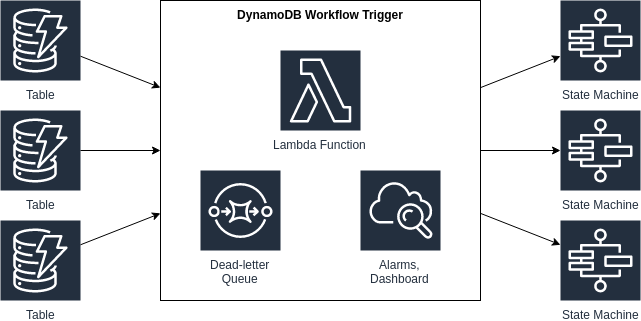

# Amazon DynamoDB Stream to AWS Step Functions Trigger

This Pattern demonstrates how to automatically trigger AWS Step Functions workflows in response to changes in DynamoDB tables. `DynamoWorkflowTrigger` lets you connect DynamoDB and Step Functions by allowing you to define event handlers that monitor specific changes in your DynamoDB tables and trigger workflows in response. It leverages Lambda functions to evaluate conditions and start Step Functions state machines with inputs derived from the DynamoDB events.

Learn more about this pattern at Serverless Land Patterns: https://serverlessland.com/patterns/{}

Important: this application uses various AWS services and there are costs associated with these services after the Free Tier usage - please see the [AWS Pricing page](https://aws.amazon.com/pricing/) for details. You are responsible for any AWS costs incurred. No warranty is implied in this example.

## Requirements

* [Create an AWS account](https://portal.aws.amazon.com/gp/aws/developer/registration/index.html) if you do not already have one and log in. The IAM user that you use must have sufficient permissions to make necessary AWS service calls and manage AWS resources.
* [AWS CLI](https://docs.aws.amazon.com/cli/latest/userguide/install-cliv2.html) installed and configured
* [Node and NPM](https://nodejs.org/en/download/) installed
* [Git Installed](https://git-scm.com/book/en/v2/Getting-Started-Installing-Git)
* [AWS Cloud Development Kit](https://docs.aws.amazon.com/cdk/latest/guide/cli.html) (AWS CDK) installed

## Deployment Instructions

1. Create a new directory, navigate to that directory in a terminal and clone the GitHub repository:
    ```
    git clone https://github.com/aws-samples/serverless-patterns
    ```
2. Change directory to the pattern directory:
    ```
    cd ddbstream-lambda-sfn-cdk-ts
    ```
3. (Optional) Update the environment settings in `app.ts`  if you know exactly what Account and Region you want to deploy the stack to.
    ```typescript
    env: { 
        account: 'YOUR_ACCOUNT_NUMBER', // Replace with your AWS account number
        region: 'YOUR_REGION'          // Replace with your desired region
    }
    ```
4. To deploy from the command line use the following:
    ```bash
      npm install
      npx cdk bootstrap aws://accountnumber/region
      npm run lambda
      npx cdk synth
      npx cdk deploy --all
    ```

## How It Works



The `DdbstreamLambdaSfnExampleStack` demonstrates how to use the the pattern:

1. It creates a DynamoDB table (`TestTable`) with streaming enabled
2. It creates a simple Step Functions state machine (`TestStateMachine`)
3. It sets up a trigger with the following behavior:
   - It applies a filter to ignore events where a `SkipMe` attribute exists in the new image
   - It only processes `MODIFY` events (updates to existing items)
   - It checks two conditions:
     - The new value of `testKey` must be "test8"
     - The old value of `testKey` must have been "test9"
   - When all conditions are met, it triggers the state machine with input parameters extracted from the DynamoDB event:
     - `Index` taken from the item's partition key
     - `MapAttribute` taken from the first element in a list attribute

This workflow allows you to respond to specific data changes in DynamoDB by executing custom workflows with Step Functions.


#### Features

- Dead letter queue for failed invocations
- VPC support
- Custom security groups
- Fine-grained event filtering
- Multiple event handlers per construct
- JSONPath-based condition evaluation
- Input mapping for state machines

#### Limitations

- Tables must have streams enabled with `NEW_AND_OLD_IMAGES`
- Conditions currently only support exact matches via the `value` property
- For complex filtering, use Lambda event source filters


Here's a suggested testing section for the README:

## Testing

You can test the workflow using the AWS CLI to create and modify items in the DynamoDB table. Here are some example commands to test different scenarios:

1. First, create an item that shouldn't trigger the workflow (initial state):
```bash
aws dynamodb put-item \
    --table-name TestTable \
    --item '{ 
        "Index": {"S": "test-item-1"},
        "testKey": {"S": "test9"},
        "ListAttribute": {"L": [{"S": "first-element"}]}
    }'
```

2. Update the item to trigger the workflow (meets all conditions):
```bash
aws dynamodb update-item \
    --table-name TestTable \
    --key '{"Index": {"S": "test-item-1"}}' \
    --update-expression "SET testKey = :newval" \
    --expression-attribute-values '{":newval": {"S": "test8"}}'
```

3. Test the SkipMe filter by creating an item that should be ignored:
```bash
aws dynamodb put-item \
    --table-name TestTable \
    --item '{ 
        "Index": {"S": "test-item-2"},
        "testKey": {"S": "test9"},
        "SkipMe": {"S": "true"}
    }'
```
This should not trigger DDBEventTrigger lambda at all.  

To verify the results:

1. Check if the Step Function was triggered:
```bash
aws stepfunctions list-executions \
    --state-machine-arn <your-state-machine-arn>
```

2. View the execution details:
```bash
aws stepfunctions get-execution-history \
    --execution-arn <execution-arn-from-previous-command>
```

3. Monitor Lambda function logs:
```bash
aws logs tail /aws/lambda/<your-lambda-function-name> --follow
```

Note: Replace `TestTable` with your actual table name if different. You may need to adjust the region using `--region` if not using your default region.


#### Troubleshooting

- Check CloudWatch Logs for the Lambda function
- Monitor the dead letter queue for failed events
- Ensure IAM permissions are correct for DynamoDB stream access and Step Functions execution

## Cleanup

1. From the command line, use the following in the source folder
    ```bash
    npx cdk destroy
    ```
2. Confirm the removal and wait for the resource deletion to complete.
----


Copyright 2025 Amazon.com, Inc. or its affiliates. All Rights Reserved.

SPDX-License-Identifier: MIT-0
