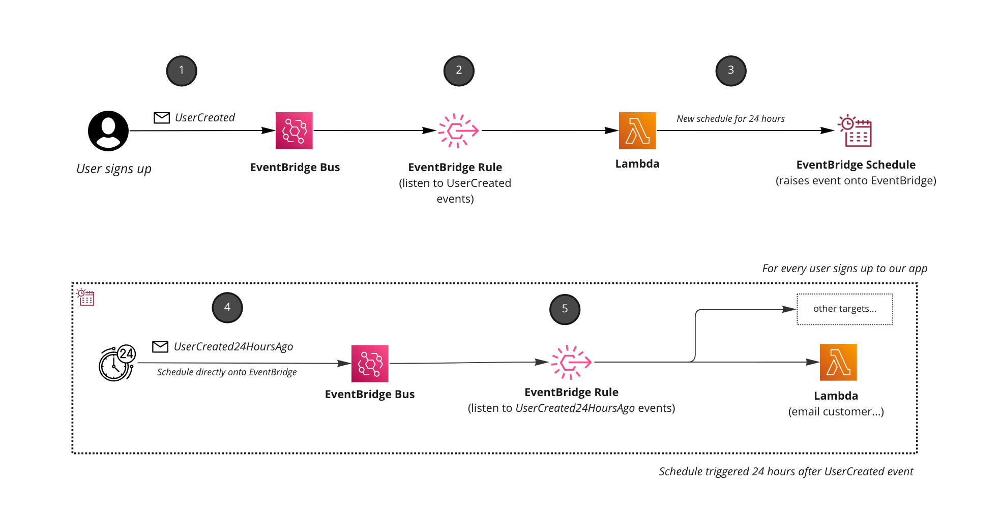

<div align="center">

<h1>⏱ Delayed EventBridge events with EventBridge Scheduler</h1>

<hr />



  <h3>Example pattern that will create dynamic schedule to trigger an event sometime in the future with direct integration into EventBridge.</h3>

</div>

---

## Understanding the pattern

1. UserCreated event is triggered. In this example we assume a UserCreated event is triggered into our event bus.
1. Rule setup to listen to the `UserCreated` event.
1. Lambda function listens to `UserCreated` and creates an [Amazon EventBridge Schedule](https://docs.aws.amazon.com/scheduler/latest/UserGuide/what-is-scheduler.html) for 24 hours in the future (2 mins for development mode) 
1. 24 hours pass, and schedule is triggered and raises `UserCreated24HoursAgo` event **directly into EventBridge.** 
1. Consumers listen for event and process it. An example would be email a welcome message to customers or an offer etc.

## Why schedule events in the future?

[Amazon EventBridge Scheduler](https://docs.aws.amazon.com/scheduler/latest/UserGuide/what-is-scheduler.html) is a great service that allows us to create schedules at scale. It gives us the opportunity to create millions of schedules that can trigger over 200 services and 6000 API calls.

Using [Templated Targets](https://docs.aws.amazon.com/scheduler/latest/UserGuide/managing-targets-templated.html) we can target EventBridge directly with our schedule without needing any compute to do this for us. We can target `PutEvents` and raise events directly.

This allows us to publish events sometime in the future.

This pattern is an example of publishing an event 24 hours after a user has been created in our application. We can use this event to send the user some emails, notifications or give them access to extra functionality as an example.

Remember if you are raising events into EventBridge try and make sure your event name is past tense. **You want to raise events as facts**, so make sure your event name represents that (best practice).


## Deploying and testing this pattern
Clone the project an run:

`npm run build && cdk deploy`

Once deployed trigger a `UserCreated` event.

```
aws events put-events --entries file://events/UserCreated.json
```

The event will create the schedule that will be triggered in 2 minutes (unless you configure it). Then you can view the logs of the `email-customer` lambda to see it triggered in the future.


