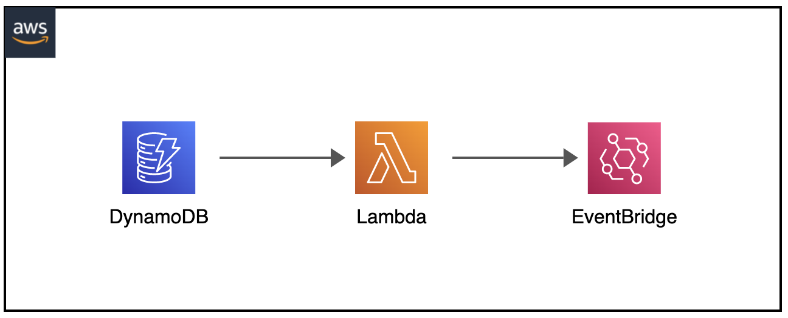
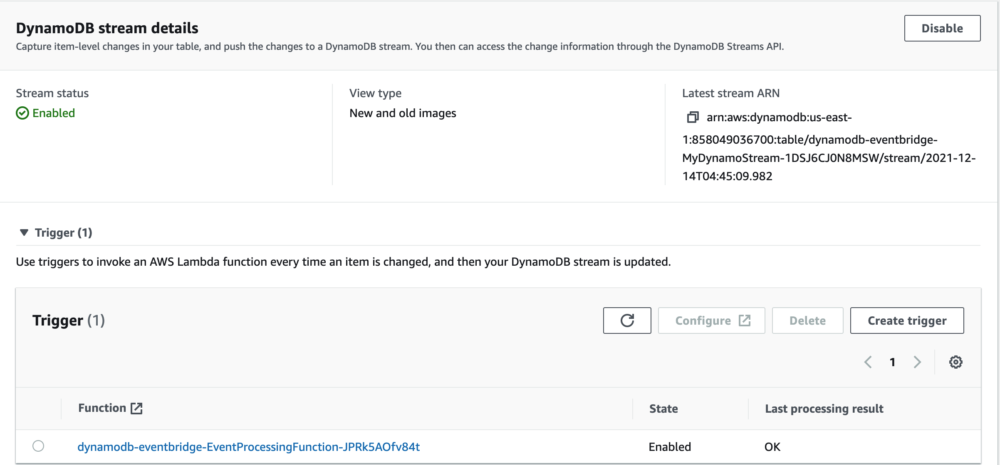
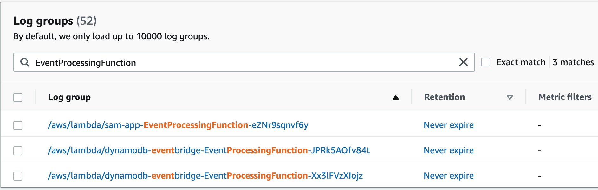
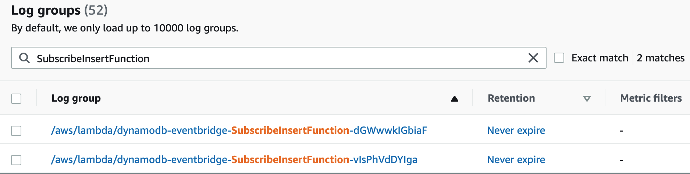
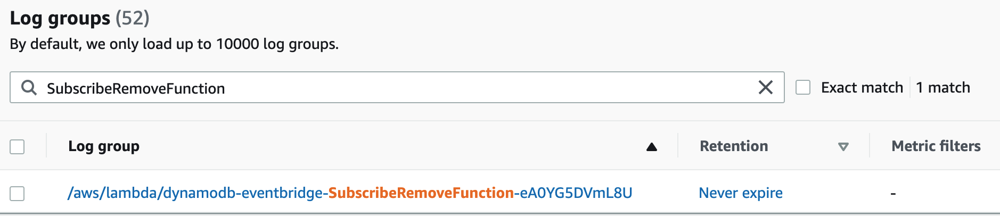

# AWS DynamoDB Streams to Event Bridge

The SAM template deploys a DynamoDB Streams to capture changed data and push to EventBridge routing rules.

When new items are added, updated or deleted on the DynamoDB table, the item-level changes in the table will be streamed to EventBridge bus where given routing rules for different types of changes are applied. 

For example, insert events and deleted events are routed to different targets by EventBridge rules.

Learn more about this pattern at Serverless Land Patterns: https://serverlessland.com/patterns/dynamodb-lambda-eventbridge

Important: this application uses various AWS services and there are costs associated with these services after the Free Tier usage - please see the [AWS Pricing page](https://aws.amazon.com/pricing/) for details. You are responsible for any AWS costs incurred. No warranty is implied in this example.

## Requirements

* [Create an AWS account](https://portal.aws.amazon.com/gp/aws/developer/registration/index.html) if you do not already have one and log in. The IAM user that you use must have sufficient permissions to make necessary AWS service calls and manage AWS resources.
* [AWS CLI](https://docs.aws.amazon.com/cli/latest/userguide/install-cliv2.html) installed and configured
* [Git Installed](https://git-scm.com/book/en/v2/Getting-Started-Installing-Git)
* [AWS Serverless Application Model](https://docs.aws.amazon.com/serverless-application-model/latest/developerguide/serverless-sam-cli-install.html) (AWS SAM) installed

## Deployment Instructions

1. Create a new directory, navigate to that directory in a terminal and clone the GitHub repository:
    ``` 
    git clone https://github.com/aws-samples/serverless-patterns
    ```
1. Change directory to the pattern directory:
    ```
    cd dynamodb-eventbridge
    ```
1. From the command line, use AWS SAM to deploy the AWS resources for the pattern as specified in the template.yml file:
    ```
    sam deploy --guided
    ```
1. During the prompts:
    * Enter a stack name
    * Enter the desired AWS Region
    * Allow SAM CLI to create IAM roles with the required permissions.
    * Choose Save Arguments to Configuration File if you desire reuse all information as defaults. So you can use `sam deploy` without --guided argument in future.

1. Note the outputs from the SAM deployment process. These contain the resource names and/or ARNs which are used for testing.

## How it works

When new items are added to the DynamoDB table, a payload with item-level changes will pushed in EventBridge bus.

## Testing

* After deployment is complete, add an item to the DynamoDB table and check status of lambda processing function through `Exports and streams` tab on table details console.


* For logs of Lambda processing function, check on CloudWatch Logs with pattern "EventProcessingFunction".


* For logs of Insert events on DynamoDB Stream, check on CloudWatch Logs with pattern "SubscribeInsertFunction".


* For logs of Insert events on DynamoDB Stream, check on CloudWatch Logs with pattern "SubscribeRemoveFunction".


* For check processed rules on Event Bridge and metrics, select "MyEventBus" on EventBrdige Rules console.


## Cleanup
 
1. Delete the stack
    ```bash
    sam delete --stack-name STACK_NAME
    ```
1. Confirm the stack has been deleted
    ```bash
    aws cloudformation list-stacks --query "StackSummaries[?contains(StackName,'STACK_NAME')].StackStatus"
    ```
----
Copyright 2021 Amazon.com, Inc. or its affiliates. All Rights Reserved.

SPDX-License-Identifier: MIT-0
