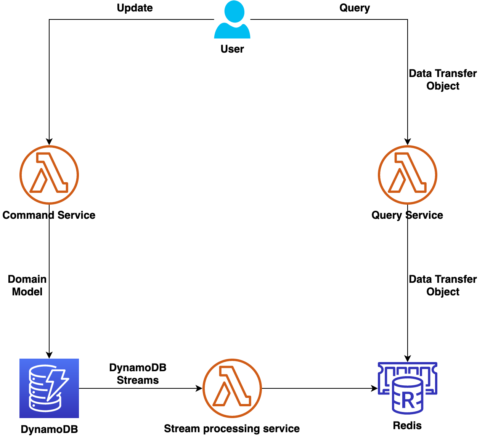

# CQRS pattern with Amazon DynamoDB, AWS Lambda and Amazon Elasticache for Redis

This project contains an event-driven microservices design pattern that is influenced by the [CQRS Pattern](https://microservices.io/patterns/data/cqrs.html).

This pattern will write data into a DynamoDB table and then create a stream from it. Lambda is then used to process the change events in the database and replicate the data in Elasticache for faster reads.

Learn more about this pattern at Serverless Land Patterns: https://github.com/aws-samples/serverless-patterns/tree/main/dynamodb-lambda-elasticache

Important: this application uses various AWS services and there are costs associated with these services after the Free Tier usage - please see the [AWS Pricing page](https://aws.amazon.com/pricing/) for details. You are responsible for any AWS costs incurred. No warranty is implied in this example.

## Requirements

* Java11
* [Maven installed](https://maven.apache.org/)
* [Create an AWS account](https://portal.aws.amazon.com/gp/aws/developer/registration/index.html) if you do not already have one and log in. The IAM user that you use must have sufficient permissions to make necessary AWS service calls and manage AWS resources.
* [AWS CLI](https://docs.aws.amazon.com/cli/latest/userguide/install-cliv2.html) installed and configured
* [Git Installed](https://git-scm.com/book/en/v2/Getting-Started-Installing-Git)
* [AWS Serverless Application Model](https://docs.aws.amazon.com/serverless-application-model/latest/developerguide/serverless-sam-cli-install.html) (AWS SAM) installed

## Deployment Instructions

1. Create a new directory, navigate to that directory in a terminal and clone the GitHub repository:
    ``` 
    git clone https://github.com/aws-samples/serverless-patterns
    ```
2. Change directory to the pattern directory:
    ```
    cd dynamodb-lambda-elasticache
    ```
3. Build the project using the below Maven command in your terminal:
    ```
    mvn clean install
    ```
4. From the command line, use AWS SAM to deploy the AWS resources for the pattern as specified in the template.yml file:
    ```
    sam deploy --guided
    ```
5. During the prompts:
    * Enter a stack name
    * Enter the desired AWS Region
    * Allow SAM CLI to create IAM roles with the required permissions.

    Once you have run `sam deploy --guided` mode once and saved arguments to a configuration file (samconfig.toml), you can use `sam deploy` in future to use these defaults.

6. Note the outputs from the SAM deployment process. These contain the resource names and/or ARNs which are used for testing.

## Architecture


## How it works

The sam template creates the Amazon DynamoDB Table with streams enabled, Publisher and Subscriber AWS Lambda functions and Amazon Elasticache cluster.
* The OrderPublisher Lambda can be invoked from the console, using the sample request payload provided below.
* As soon as the Lambda receives the request, a new order record is created in the DynamoDB table.
* DynamoDB streams then captures this new record creation event and triggers the OrderSubscriber Lambda function.
* OrderSubscriber Lambda function processes this event and creates the record in Elasticache for Redis cluster for the Read queries.
* The data can be fetched from Amazon Elasticache by invoking OrderQueryService using the sample request payload provided below.

## Testing

Invoke the OrderPublisher Lambda function with the following payload, which will create the new order in the DynamoDB table. Note the order id received as a response from the Lambda function, which can be used to query the order data.
```json
{"cliendId":"123456789","productId":"abc-def-ghi"}
```

Invoke the OrderQueryService Lambda function with the following payload. Replace the ```<order-id>``` with the Order Id returned by the previous Lambda function, to view the order details fetched from the Elasticache.
```json
{"orderId":"<order-id>"}
```

## Cleanup
 
1. Delete the stack
    ```bash
    sam delete --stack-name STACK_NAME
    ```
2. Confirm the stack has been deleted
    ```bash
    aws cloudformation list-stacks --query "StackSummaries[?contains(StackName,'STACK_NAME')].StackStatus"
    ```
----
Copyright 2023 Amazon.com, Inc. or its affiliates. All Rights Reserved.

SPDX-License-Identifier: MIT-0