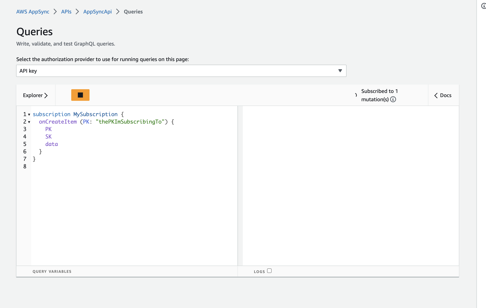
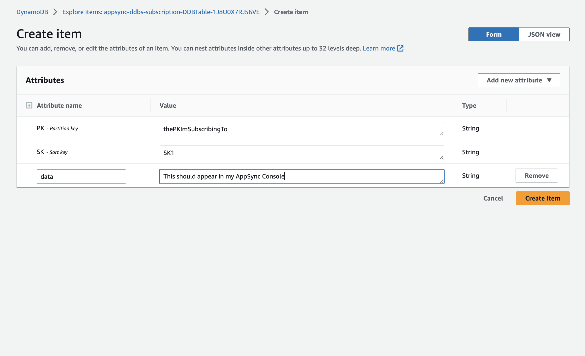
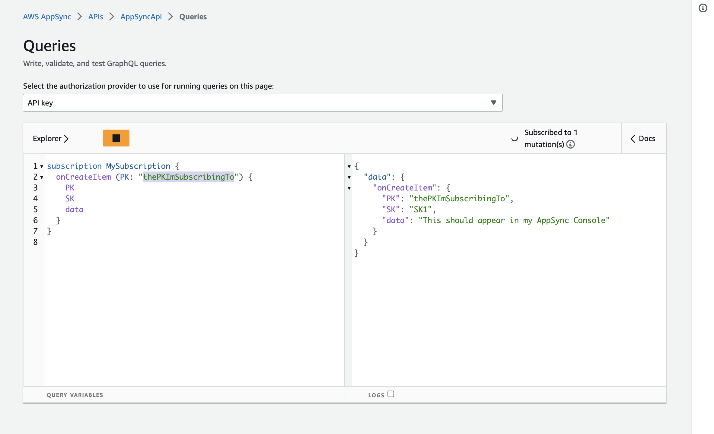

# Amazon DynamoDB Streams to AppSync Subscription

This pattern creates an AppSync API allowing you to listen to new items being created on a specific DynamoDB table through AWS AppSync subscriptions. With this pattern, a Lambda function will be invoked that will in turn call an AppSync mutation with data source set as `None`. An AppSync subscription will be subscribed to that mutation allowing end users to be notified of a newly created DynamoDB item.

Learn more about this pattern at ServerlessLand Patterns: https://serverlessland.com/patterns/dynamodb-streams-appsync-subscription

Important: this application uses various AWS services and there are costs associated with these services after the Free Tier usage - please see the [AWS Pricing page](https://aws.amazon.com/pricing/) for details. You are responsible for any AWS costs incurred. No warranty is implied in this example.

## Requirements

* [Create an AWS account](https://portal.aws.amazon.com/gp/aws/developer/registration/index.html) if you do not already have one and log in. The IAM user that you use must have sufficient permissions to make necessary AWS service calls and manage AWS resources.
* [AWS CLI](https://docs.aws.amazon.com/cli/latest/userguide/install-cliv2.html) installed and configured
* [Git Installed](https://git-scm.com/book/en/v2/Getting-Started-Installing-Git)
* [AWS Serverless Application Model](https://docs.aws.amazon.com/serverless-application-model/latest/developerguide/serverless-sam-cli-install.html) (AWS SAM) installed

## Deployment Instructions

1. Create a new directory, navigate to that directory in a terminal and clone the GitHub repository:
    ``` 
    git clone https://github.com/aws-samples/serverless-patterns
    ```
2. Change directory to the pattern directory:
    ```
    cd dynamodb-streams-appsync-subscription
    ```
3. From the command line, use AWS SAM to deploy the AWS resources for the pattern as specified in the template.yml file:
    ```
    sam build
    sam deploy --guided
    ```
4. During the prompts:
    * Enter a stack name
    * Enter the desired AWS Region
    * Allow SAM CLI to create IAM roles with the required permissions.

    Once you have run `sam deploy --guided` mode once and saved arguments to a configuration file (samconfig.toml), you can use `sam deploy` in future to use these defaults.

## How it works

This template creates an AppSync api. Any new item being created on the DynamoDB table created with this example will invoke a Lambda function that will in turn call an AppSync mutation with data source set as `None`. An AppSync subscription will be subscribed to that mutation allowing end users to be notified of a newly created DynamoDB item.

More information is available [here](https://repost.aws/knowledge-center/appsync-notify-subscribers-real-time).

## Testing

The easiest way to test the AppSync API is with the AppSync console at https://console.aws.amazon.com/appsync/home#/apis (change to your appropriate region)

1. Click on the API you created and visit the Queries tab
2. Subscribe to `onCreateItem` as follows
  ```graphql
  subscription MySubscription {
    onCreateItem (PK: "thePKImSubscribingTo") {
      PK
      SK
      data
    }
  }
  ```
  
3. Open the [DynamoDB console](https://console.aws.amazon.com/dynamodbv2/home?#item-explorer) in another tab.
4. Create a new item with a `PK` equal to `thePKImSubscribingTo`. Choose any value for `SK` AND `data` for this example to work.
  
5. Click on `Create item` \
6. The item should appear in your AppSync console opened in the other tab.
  

## Cleanup
 
1. Delete the stack
    ```bash
    sam delete
    ```
----
Copyright 2023 Amazon.com, Inc. or its affiliates. All Rights Reserved.

SPDX-License-Identifier: MIT-0
