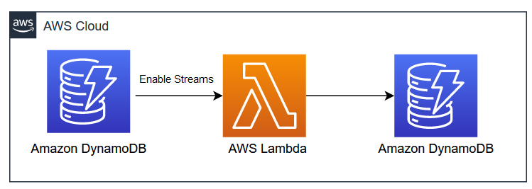

# Leverage AWS CDK, Lambda and DynamoDB Streams to copy data from Source to Target DynamoDB table

DynamoDB is being used by thousands of customers globally to build the mission-critical business applications due to various benefits such as scalability, reliability, low latency, high durability etc. While leveraging DynamoDB database, customers come across many scenarios where they want to copy data from one DynamoDB table to another at near real-time. This pattern addresses that use-case. 

In this pattern, you'll learn how you can leverage .NET based CDK application along-with Lambda function and DynamoDB streams to copy data between source and target DynamoDB tables.

## Architecture 


Learn more about this pattern at Serverless Land Patterns: https://serverlessland.com/patterns/eventbridge-schedule-lambda-to-dynamodb

**Important**: this application uses various AWS services and there are costs associated with these services after the Free Tier usage - please see the [AWS Pricing page](https://aws.amazon.com/pricing/) for details. You are responsible for any AWS costs incurred. No warranty is implied in this example.

## Requirements

* [Create an AWS account](https://portal.aws.amazon.com/gp/aws/developer/registration/index.html) if you do not already have one and log in. The IAM user that you use must have sufficient permissions to make necessary AWS service calls and manage AWS resources.
* [AWS CLI](https://docs.aws.amazon.com/cli/latest/userguide/install-cliv2.html) installed and configured
* [Git Installed](https://git-scm.com/book/en/v2/Getting-Started-Installing-Git)
* [.NET 7](https://dotnet.microsoft.com/en-us/download/dotnet/7.0) installed
* [AWS Cloud Development Kit](https://docs.aws.amazon.com/cdk/latest/guide/cli.html) (AWS CDK) installed

## Deployment Instructions

1. Clone the project to your local working directory.
    ```
    git clone https://github.com/aws-samples/serverless-patterns
    ```
2. Change the working directory.
    ```
    cd dynamodb-streams-lambda-dynamodb/cdk
    ```
3. Bootstrap AWS Environment.
    ```
    cdk bootstrap
    ```
4. Deploy the stack to your default AWS account and region.
    ```
    cdk deploy
    ```

## Testing

1. Create a new JSON file named `TestData.json` and add the following JSON.

   ```
   {
    "SourceDynamoDB": [
        {
            "PutRequest": {
                "Item": {
                    "Id": {
                        "S": "Item101"
                    }
                }
            }
        },
        {
            "PutRequest": {
                "Item": {
                    "Id": {
                        "S": "Item102"
                    }
                }
            }
        },
        {
            "PutRequest": {
                "Item": {
                    "Id": {
                        "S": "Item103"
                    }
                }
            }
        },
        {
            "PutRequest": {
                "Item": {
                    "Id": {
                        "S": "Item104"
                    }
                }
            }
        }]
    }
    ```
2. Open command prompt and navigate to the folder where TestData.json file is available. Run the following CLI command to create test items in source DynamoDB table.
    ```
    aws dynamodb batch-write-item --request-items file://TestData.json
    ```
3. Open AWS Console, navigate to DynamoDB service. In the left navigation, click Explore items and verify if the items in both SourceDynamoDB and TargetDynamoDB tables are same as TestData.json.
4. Open AWS Console, navigate to CloudWatch service. In the left navigation, expand Logs and click Log groups.  Click `/aws/lambda/ProcessDynamoDBRecords` and verify the logs. 
    ```
    Beginning to process 4 records...
    Stream processing complete.
    ```

## Cleanup

Run the given command to delete the resources that were created. It might take some time for the CloudFormation stack to get deleted.
```
cdk destroy
```
----
Copyright 2023 Amazon.com, Inc. or its affiliates. All Rights Reserved.

SPDX-License-Identifier: MIT-0