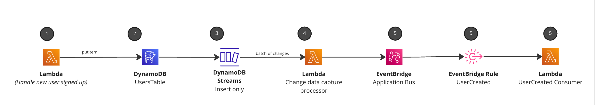

<div align="center">

<h1>📂 Outbox pattern with DynamoDB, streams, and EventBridge</h1>

<hr />



  <h3>Example outbox messaging pattern that first stores data, uses change data capture to raise events for downstream consumers .</h3>

</div>

---

## Understanding the pattern

1. Lambda is triggered to insert data into DynamoDB (new user in this example). _This Lambda would be triggered from other event in reality, e.g API Gateway for example_
1. Table to store new information (user in this example)
1. Change data capture stream setup for table to listen for `New Image` (new items into the table)
1. Lambda connects to stream to process the change events, and processed them into `Domain` events (in this example `UserCreated`)
1. Events are sent to business event bus, and rules setup for downstream consumers. In this example we have a basic Lambda function listening for the new `UserCreated` event.

## Why the outbox pattern?

When building event-driven applications you will often need to update a database and also send messages at the same time, for example (pseudo code below)

```js
 await insertUserIntoDatabase(user)
 await sendMessage('UserCreated', user)
```

What happens if the `insert` was successful but the `sendMessage` failed, we may run into data inconsistencies and issues.

So how can we reliably/atomically update the database and send messages/events? This is where the outbox pattern can help.

Rather than inserting and sending messages one after another, we can use streams to help us process events once the write has been successful. The change events are then taken and forwarded onto our event bus. 


[Read more about the Outbox pattern](https://microservices.io/patterns/data/transactional-outbox.html)


## Deploying and testing this pattern
Clone the project an run:

`npm run build && cdk deploy`

Once deployed then trigger the `write-to-ddb` function. This will add a new user to the table.

Then view the logs from the `userCreatedConsumer` file.

_Once the new user has been added into DynamoDB, the stream will pick up the change and forward it to the Lambda function to put onto the EventBus. Then the rule is setup to listen to the event and forwarded onto the userCreatedConsumer._


### Why would you use this pattern?

The outbox pattern is a great way to have a more resilent event-driven architecture. Using streams and DLQ it's possbile to catpture failures and retry these events into your architecture.

