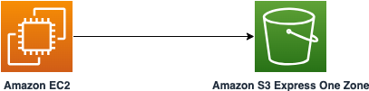

# Amazon EC2 to Amazon S3 Express One Zone directory bucket

This sample project creates an Amazon EC2 Instance and Amazon S3 Express One Zone Direct Bucket under the same availability zone. 

Learn more about this pattern at Serverless Land Patterns: https://serverlessland.com/patterns/ec2-s3-express-one-zone-sam

Important: this application uses various AWS services and there are costs associated with these services after the Free Tier usage - please see the [AWS Pricing page](https://aws.amazon.com/pricing/) for details. You are responsible for any AWS costs incurred. No warranty is implied in this example.

## Requirements

- [Create an AWS account](https://portal.aws.amazon.com/gp/aws/developer/registration/index.html) if you do not already have one and log in. The IAM user that you use must have sufficient permissions to make necessary AWS service calls and manage AWS resources.
- [AWS CLI](https://docs.aws.amazon.com/cli/latest/userguide/install-cliv2.html) installed and configured
- [Git Installed](https://git-scm.com/book/en/v2/Getting-Started-Installing-Git)
- [AWS Serverless Application Model](https://docs.aws.amazon.com/serverless-application-model/latest/developerguide/serverless-sam-cli-install.html) (AWS SAM) installed

## Prerequisite
1. Please refer to the [list of availability zones where Amazon S3 Express One Zone is currently supported](https://docs.aws.amazon.com/AmazonS3/latest/userguide/s3-express-Endpoints.html) and choose one.
2. Execute the below from command line and make a note of the `ZoneName` and `ZoneId`. It will be required during deployment:
   ```bash
   aws ec2 describe-availability-zones --region {region-name}
   ```
3. Choose an AMI Id for your region.

## Deployment Instructions

1. Create a new directory, navigate to that directory in a terminal and clone the GitHub repository:
   ```bash
   git clone https://github.com/aws-samples/serverless-patterns
   ```
2. Change directory to the pattern directory:
   ```bash
   cd ec2-s3-express-one-zone-sam
   ```
3. From the command line, use AWS SAM to deploy the AWS resources for the pattern as specified in the template.yml file:
   ```bash
   sam deploy --guided
   ```
4. During the prompts:

   - Enter a stack name
   - Enter the desired AWS Region. Please refer to the prerequisite 1 and choose a region.
   - Enter `AvailabilityZoneName` and `AvailabilityZoneId` as per the prerequisite 2.
   - Enter the `ImageId` as per prerequisite 3.
   - Allow SAM CLI to create IAM roles with the required permissions.

   Once you have run `sam deploy --guided` mode once and saved arguments to a configuration file (samconfig.toml), you can use `sam deploy` in future to use these defaults.

5. Note the outputs from the SAM deployment process. These contain the resource names and/or ARNs which are used for next step as well as testing.


## How it works


Please refer to the architecture diagram below:



S3 Express One Zone is the first S3 storage class that gives you the option to co-locate high-performance object storage and AWS compute resources, such as Amazon Elastic Compute Cloud, Amazon Elastic Kubernetes Service, and Amazon Elastic Container Service, within a single Availability Zone.
Here, we provisioned both the Amazon EC2 instance and the S3 Express One Zone Directory bucket within same availability zone. We will perform both read and write opertation from the directory bucket from within the EC2 instance and outside. 

## Testing


1. Log into the Amazon EC2 instance using AWS console and execute the following command to upload file into Amazon S3 Express One Zone diretory bucket. Please replace `BucketExpressOneZoneName` from the `sam deploy -g` output.
   ```bash
   echo "Hello World!" > sample.txt
   aws s3api put-object --bucket {BucketExpressOneZoneName}  --key sample.txt --body sample.txt

   ```
2. Now, download the same file from your laptop command line using the following command and validate the content.: 
   ```bash
   aws s3api get-object --bucket {BucketExpressOneZoneName} --key sample.txt ./sample.txt --region {my-region}
   cat sample.txt
   ```


## Cleanup

1. Delete the content in the Amazon S3 bucket using the following command. Please *ensure* that the correct bucket name is provided to avoid accidental data loss:
   ```bash
   aws s3 rm s3://{BucketExpressOneZoneName} --recursive --region {my-region}
   ```

2. To delete the resources deployed to your AWS account via AWS SAM, run the following command:
   ```bash
   sam delete
   ```

---

Copyright 2024 Amazon.com, Inc. or its affiliates. All Rights Reserved.

SPDX-License-Identifier: MIT-0
