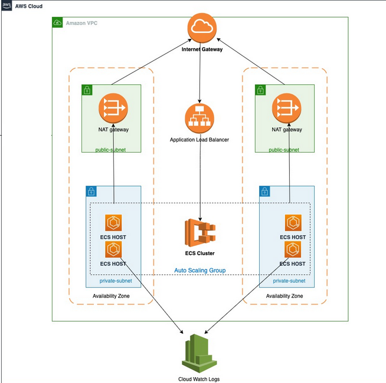

# Running Web API on ECS Fargate with custom domain backed with ALB, fronted by Route53, and secured with ACM Certificate

This AWS CDK application demonstrates how to deploy a application on Windows based Amazon Elastic Container Service (Amazon ECS) Cluster.

This pattern uses .NET as a programming language to create the entire AWS CDK stack. For demonstration purpose, Windows sample image is used (mcr.microsoft.com/windows/servercore/iis), however same steps can be performed if Windows Docker image need to be deployed from Amazon Elastic Container Registry (Amazon ECR) repository.

## Architecture 


Learn more about this pattern at Serverless Land Patterns: https://serverlessland.com/patterns/ecs-windows-cdk-dotnet

**Important**: this application uses various AWS services and there are costs associated with these services after the Free Tier usage - please see the [AWS Pricing page](https://aws.amazon.com/pricing/) for details. You are responsible for any AWS costs incurred. No warranty is implied in this example.

## Requirements

* [Create an AWS account](https://portal.aws.amazon.com/gp/aws/developer/registration/index.html) if you do not already have one and log in. The IAM user that you use must have sufficient permissions to make necessary AWS service calls and manage AWS resources.
* [AWS CLI](https://docs.aws.amazon.com/cli/latest/userguide/install-cliv2.html) installed and configured
* [Git Installed](https://git-scm.com/book/en/v2/Getting-Started-Installing-Git)
* [.NET 6](https://dotnet.microsoft.com/en-us/download/dotnet/7.0) installed
* [AWS Cloud Development Kit](https://docs.aws.amazon.com/cdk/latest/guide/cli.html) (AWS CDK) installed

## Deployment Instructions

1. Clone the project to your local working directory.
    ```
    git clone https://github.com/aws-samples/serverless-patterns
    ```

    ```
2. Change the working directory to this pattern's directory.
    ```
    cd ecs-windows-cdk-dotnet/cdk/src/WindowsECS
    ```
3. Build the application.
    ```
    dotnet build
    ```
4. Change the working directory.
    ```
    cd ecs-windows-cdk-dotnet/cdk
    ```
5. Bootstrap AWS Environment.
    ```
    cdk bootstrap
    ```
6. Deploy the stack to your default AWS account and region.
    ```
    cdk deploy --all --require-approval never
    ```

## Testing

1. After deployment, copy the URL for the following ALBStack output.    
   - ALBStack.ApplicationLoadBalancer = `ALBSt-Appli-******R2TM3H-******171.us-east-1.elb.amazonaws.com`   
3. Enter this URL into your browser, you should view the IIS site.

## Cleanup

Run the given command to delete the resources that were created. It might take some time for the CloudFormation stack to get deleted.
```
cdk destroy --all --require-approval never
```
----
Copyright 2023 Amazon.com, Inc. or its affiliates. All Rights Reserved.

SPDX-License-Identifier: MIT-0