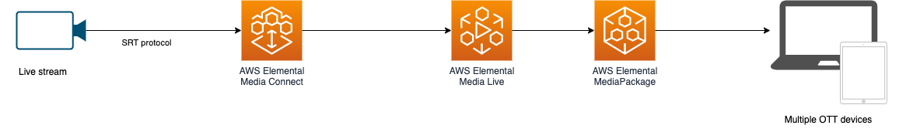

# Live Streaming on AWS for SRT/Zixi/RIST/RTP FEC input sources

This pattern creates a live streaming stack leveraging AWS MediaConnect, AWS Elemental MediaLive and MediaPackage for SRT/Zixi/RIST/RTP FEC input sources.



## AWS Elemental MediaLive

To solution Configures AWS Elemental MediaLive with one of three encoding profiles.

  source/custom-resource/lib/medialive/encoding-profiles/

The encoding profile used when deploying the stack is specified using the parameter ```type``` in the file:

```
config/media_live.json
````

3 encoding profiles are available:

```
config/encoding-profiles/hd-1080p.json
config/encoding-profiles/hd-720p.json
config/encoding-profiles/sd-540p.json
```

- **HD-1080p** profile: 1920x1080, 1280x720, 960x540, 768x432, 640x360, 512x288
- **HD-720p** profile: 1280x720, 960x540, 768x432, 640x360, 512x288
- **SD-540p** profile: 960x540, 768x432, 640x360, 512x288

## AWS Elemental MediaPackage

Ingests the MediaLive Output and package the Live stream into:

- HLS
- DASH
- CMAF

Each format is delivered through a MediaPackage custom endpoint.

Learn more about this pattern at: https://serverlessland.com/patterns/elemental-mediaconnect-medialive-mediapackage-cdk-ts

Important: this application uses various AWS services and there are costs associated with these services after the Free Tier usage - please see the AWS Pricing page for details. You are responsible for any AWS costs incurred. No warranty is implied in this example.


## Requirements

* [Create an AWS account](https://portal.aws.amazon.com/gp/aws/developer/registration/index.html) if you do not already have one and log in. The IAM user that you use must have sufficient permissions to make necessary AWS service calls and manage AWS resources.
* [AWS CLI](https://docs.aws.amazon.com/cli/latest/userguide/install-cliv2.html) installed and configured
* [Git Installed](https://git-scm.com/book/en/v2/Getting-Started-Installing-Git)
* [AWS Cloud Development Kit](https://docs.aws.amazon.com/cdk/v2/guide/getting_started.html) (AWS CDK >= 2.2.0) Installed

## Language

Typescript

## Framework

CDK

## Services From/To

AWS MediaConnect -> AWS Elemental Media Live -> Aws Elemental Media Package

## Deployment Instructions

1. Create a new directory, navigate to that directory in a terminal and clone the GitHub repository:

    ```bash
    git clone https://github.com/aws-samples/serverless-patterns
    ```

1. Change directory to the pattern directory:

    ```bash
    cd elemental-mediaconnect-medialive-mediapackage-cdk-ts
    ```

1. Install node modules:

    ```bash
    npm install
    ```

1. From the command line, use CDK to deploy the stack:

    ```bash
    cdk deploy
    ```

    Expected result:

    ```bash
    Outputs:
    StreamingStack.MediaLiveMediaLiveChannelArn9CBFE74E = arn:aws:medialive:eu-west-1:xxxxxxxxxx:channel:1726551

    StreamingStack.MediaPackageDashEndpointURL82BF6F56 = https://aaaabbbbcccccc.mediapackage.eu-west-1.amazonaws.com/out/v1/bffed8f1b33c428ca5d701b2023fde26/index.mpd

    StreamingStack.MediaPackageHlsEndpointURL1474D860 = https://aaaabbbbcccccc.mediapackage.eu-west-1.amazonaws.com/out/v1/e4e4df6e2f804e6897f96e72d8b18752/index.m3u8

    StreamingStack.MediaPackageMssEndpointURL90F79028 = https://aaaabbbbcccccc.mediapackage.eu-west-1.amazonaws.com/out/v1/dee22f1df1b24549b0ed85d680a51f50/index.ism/Manifest

    StreamingStack.MyMediaConnectMediaConnectFlowA2E879511 = STREAMING_IP_ADDRESS:STREAMING_PORT

    StreamingStack.MyMediaConnectMediaConnectFlowB85BD748A = STREAMING_IP_ADDRESS:STREAMING_PORT

    StreamingStack.MyMediaConnectflowAArn9DBB5FF0 = arn:aws:mediaconnect:eu-west-1:xxxxxxxxxx:flow:1-CgNWUVFTA1JfBABR-202d3bf01a03:StreamingStack_FlowA

    StreamingStack.MyMediaConnectflowBArn1EEEEAE8 = arn:aws:mediaconnect:eu-west-1:xxxxxxxxxx:flow:1-VQUABVVWVFUHWQ5R-dd306642e63d:StreamingStack_FlowB
    ```

1. Note the outputs from the CDK deployment process. These contain the resource names and/or ARNs which are used for testing.

### Testing

1. Start Media Live channel using the channelId from the MediaLiveChannelArn:

    ```bash
    aws medialive start-channel --channel-id 1726551
    ```

    Wait for the channel to start

    ```bash
    while true ; do CHANNEL_STATUS=`aws medialive describe-channel --channel-id 1726551 --query "State" --output text` ; if [ $CHANNEL_STATUS == "RUNNING" ] ; then echo "Channel 1726551 is started" ; break ; else echo "Channel 1726551 is not started"; fi ; sleep 5 ; done
    ```

2. Start MediaConnect Flow A and B using the arn from the output above

    ```bash
    FLOW_A=arn:aws:mediaconnect:eu-west-1:xxxxxxxxxx:flow:1-CgNWUVFTA1JfBABR-202d3bf01a03:StreamingStack_Flo
    FLOW_B=arn:aws:mediaconnect:eu-west-1:xxxxxxxxxx:flow:1-VQUABVVWVFUHWQ5R-dd306642e63d:StreamingStack_FlowB

    aws mediaconnect start-flow --flow-arn $FLOW_A
    aws mediaconnect start-flow --flow-arn $FLOW_B
    ```

    Wait for both to start

    ```bash
    while true ; do FLOW_STATUS=`aws mediaconnect describe-flow --flow-arn $FLOW_A --query "Flow.Status" --output text` ; if [ $FLOW_STATUS == "ACTIVE" ] ; then echo "Flow $FLOW_A is started" ; break ; else echo "Flow $FLOW_A is not started"; fi ; sleep 5 ; done

    while true ; do FLOW_STATUS=`aws mediaconnect describe-flow --flow-arn $FLOW_B --query "Flow.Status" --output text` ; if [ $FLOW_STATUS == "ACTIVE" ] ; then echo "Flow $FLOW_B is started" ; break ; else echo "Flow $FLOW_B is not started"; fi ; sleep 5 ; done

    ```

3. Configure your streaming app using the url from `MyMediaConnectflowAArn9DBB5FF0` or `MyMediaConnectflowBArn1EEEEAE8` and start streaming

4. Use the Endpoint URL (`MediaPackageDashEndpointURL82BF6F56` or `MediaPackageHlsEndpointURL1474D860` or `MediaPackageMssEndpointURL90F79028`) to play the video stream in any compatible player

## Cleanup

1. Stop Media Live channel

    ```bash
    aws medialive stop-channel --channel-id 1726551
    ```

    Wait for the channel to stop

    ```bash
    while true ; do CHANNEL_STATUS=`aws medialive describe-channel --channel-id 1726551 --query "State" --output text` ; if [ $CHANNEL_STATUS == "IDLE" ] ; then echo "Channel 1726551 is stopped" ; break ; else echo "Channel 1726551 is not stopped"; fi ; sleep 5 ; done
    ```

2. Stop Media Connect FLOW A and FLOW B

    ```bash
    FLOW_A=arn:aws:mediaconnect:eu-west-1:xxxxxxxxxx:flow:1-CgNWUVFTA1JfBABR-202d3bf01a03:StreamingStack_Flo
    FLOW_B=arn:aws:mediaconnect:eu-west-1:xxxxxxxxxx:flow:1-VQUABVVWVFUHWQ5R-dd306642e63d:StreamingStack_FlowB

    aws mediaconnect stop-flow --flow-arn $FLOW_A
    aws mediaconnect stop-flow --flow-arn $FLOW_B
    ```

    Wait for both to stop

    ```bash
    while true ; do FLOW_STATUS=`aws mediaconnect describe-flow --flow-arn $FLOW_A --query "Flow.Status" --output text` ; if [ $FLOW_STATUS == "STANDBY" ] ; then echo "Flow $FLOW_A is stopped" ; break ; else echo "Flow $FLOW_A is not stopped"; fi ; sleep 5 ; done

    while true ; do FLOW_STATUS=`aws mediaconnect describe-flow --flow-arn $FLOW_B --query "Flow.Status" --output text` ; if [ $FLOW_STATUS == "STANDBY" ] ; then echo "Flow $FLOW_B is stopped" ; break ; else echo "Flow $FLOW_B is not stopped"; fi ; sleep 5 ; done

    ```

3. Delete the stack

    ```bash
    cdk destroy
    ```

## Tutorial

See [this useful workshop](https://cdkworkshop.com/20-typescript.html) on working with the AWS CDK for typescript projects.

## Useful commands

 * `cdk ls`          list all stacks in the app
 * `cdk synth`       emits the synthesized CloudFormation template
 * `cdk deploy`      deploy this stack to your default AWS account/region
 * `cdk diff`        compare deployed stack with current state
 * `cdk docs`        open CDK documentation


Enjoy!
