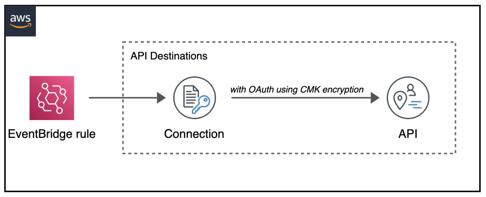

# EventBridge API Destinations with OAuth and CMK Encryption

Amazon EventBridge announces support for Amazon Key Management Service (KMS) Customer Managed Keys (CMK) in API destinations connections. This enhancement enables you to encrypt your HTTPS endpoint authentication credentials managed by API destinations with your own keys instead of an AWS owned key (which is used by default). With CMK support, you now have more granular security control over your authentication credentials used in API destinations, helping you meet your organization's security requirements and governance policies.

This sample demonstrates how to use Amazon EventBridge API Destinations with OAuth authentication and AWS CMK encryption.

## Overview

- **EventBridge API Destinations**: Send events to external HTTP endpoints.
- **OAuth Authentication**: Secure API calls using OAuth 2.0.
- **CMK Encryption**: Protect sensitive data using a customer managed KMS key.

## Architecture

1. **EventBridge Rule** triggers on specific events.
2. **API Destination** sends the event to an external API using OAuth.
3. **KMS CMK** encrypts secrets and sensitive data.



## Prerequisites

* [Create an AWS account](https://portal.aws.amazon.com/gp/aws/developer/registration/index.html) if you do not already have one and log in. The IAM user that you use must have sufficient permissions to make necessary AWS service calls and manage AWS resources.
* [AWS CLI](https://docs.aws.amazon.com/cli/latest/userguide/install-cliv2.html) installed and configured
* [Git Installed](https://git-scm.com/book/en/v2/Getting-Started-Installing-Git)
* [AWS Serverless Application Model](https://docs.aws.amazon.com/serverless-application-model/latest/developerguide/serverless-sam-cli-install.html) (AWS SAM) installed

* Also, run the below CloudFormation (CFN) command to create pre-requisit resources:
```bash
aws cloudformation create-stack --stack-name serverlessland-prerequisite --template-body file://prerequsite.yaml
```
* Above command will create stack with the below resources, please goto the CFN console and select your pre-requisite stack. Copy the output in the notepad, we'll need this later.
- External API URL for HTTP API Endpoint. If you already have one you can also use that.
- Cognito Authorization Endpoint. If you have any external authorizer endpoint you can use that.
- Cognito OAuth Client ID. 
- OAuth Client Secret. To get that you need to goto aws cognito console, goto your MyServerlessLandUserPool and click on your App Client -> MyWebClient and copy the Client secret, we'll need this later.
- CMK key in KMS. Please not the arn, we'll use this later.

## Deployment

* Run the below command and provide all the parameter details which we can saved previously.
```bash
sam deploy --guided
```

## Testing

1. From a command line in this directory, send a test event to EventBridge simulating a \"EventBridge CMK Demo success\" event.
```bash
aws events put-events --entries file://testEvent.json
```
2. To verify if everything works correctly, you can check the execution logs of your api.

## Cleanup
 
1. Delete the stack
    ```bash
    sam delete --stack-name STACK_NAME
    ```
2. Confirm the stack has been deleted
    ```bash
    aws cloudformation list-stacks --query "StackSummaries[?contains(StackName,'STACK_NAME')].StackStatus"    
    ```

## Resources

- [Amazon EventBridge now supports Customer Managed Keys (CMK) in API destinations connections](https://aws.amazon.com/about-aws/whats-new/2025/04/amazon-eventbridge-customer-managed-keys-api/)

- [Encrypting EventBridge connection authorization with AWS KMS keys](https://docs.aws.amazon.com/eventbridge/latest/userguide/encryption-connections.html)

- [Using API destinations with Amazon EventBridge](https://aws.amazon.com/blogs/compute/using-api-destinations-with-amazon-eventbridge/)

- [Use Amazon EventBridge to Build Decoupled, Event-Driven Architectures](https://serverlessland.com/learn/eventbridge)


----

Copyright 2025 Amazon.com, Inc. or its affiliates. All Rights Reserved.

SPDX-License-Identifier: MIT-0