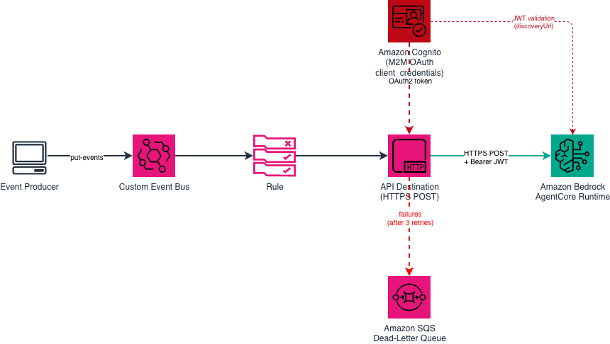

# Amazon EventBridge API Destination to Amazon Bedrock AgentCore Runtime

This pattern demonstrates **Lambda-less, event-driven invocation of an AI agent**: an EventBridge rule delivers events directly to an Amazon Bedrock AgentCore Runtime endpoint via an API Destination, authenticated with Cognito machine-to-machine (M2M) OAuth. No Lambda function, no glue code.

The CDK stack is **fully self-contained** — it builds and deploys the AgentCore Runtime (from the bundled `agent-code/` Docker image) alongside the EventBridge plumbing, so a single `cdk deploy` gives you a working, testable pattern.



```
EventBridge Rule ──▶ API Destination (HTTPS + OAuth) ──▶ AgentCore Runtime
     │                        │                                 │
custom event bus     Connection: Cognito             async processing
(demo.orders)        client_credentials JWT          (ack < 5s, work in
                                                      background)
```

Learn more about this pattern at Serverless Land Patterns: https://serverlessland.com/patterns/

Important: this application uses various AWS services and there are costs associated with these services after the Free Tier usage - please see the [AWS Pricing page](https://aws.amazon.com/pricing/) for details. You are responsible for any AWS costs incurred. No warranty is implied in this example.

## How it works

1. An event (e.g. `source: demo.orders`, `detail-type: OrderCreated`) is published to a custom event bus.
2. An EventBridge rule matches the event and forwards it to an **API Destination** whose endpoint is the AgentCore Runtime `InvokeAgentRuntime` HTTPS API.
3. The API Destination's **Connection** obtains an OAuth access token from a **Cognito user pool token endpoint** using the `client_credentials` grant, and attaches it as a Bearer token.
4. The AgentCore Runtime validates the JWT against the Cognito user pool (inbound identity / `customJwtAuthorizer`), **acknowledges the request within 5 seconds**, and processes the event **asynchronously**.
5. Failed deliveries (after 3 retries) are sent to an SQS dead-letter queue.

## Key technical details

### 1. The 5-second timeout → async execution

EventBridge API Destinations enforce a hard **5-second response timeout**. Agent reasoning takes much longer than that. The AgentCore Runtime therefore runs in **asynchronous mode**: the agent entrypoint returns an acknowledgment immediately (HTTP 2xx) and continues working in the background. See [`agent-code/agent.py`](agent-code/agent.py) for the implementation — it uses `asyncio.create_task` to kick off the real work, then returns `{"status": "accepted"}` well within the 5-second window.

```python
from bedrock_agentcore import BedrockAgentCoreApp
import asyncio

app = BedrockAgentCoreApp()

@app.entrypoint
async def invoke(payload):
    # Kick off long-running agent work in the background
    asyncio.create_task(process_event(payload))
    # Acknowledge within the 5-second API Destination timeout
    return {"status": "accepted"}
```

### 2. The URL-encoding gotcha → use the agent ID, not the ARN

API Destinations **automatically decode `%XX` sequences** in the endpoint URL. A URL-encoded runtime ARN in the path (containing `:` and `/`) gets decoded back and breaks the request signature/routing.

The fix: use the **agent runtime ID in the path** and pass the **account ID as a query parameter**. Per the AWS docs: *"When you use the agent ID instead of the full ARN, you don't need to URL-encode the identifier."* The stack derives this URL automatically from the runtime it creates (`CfnRuntime.attrAgentRuntimeId`):

```
https://bedrock-agentcore.<region>.amazonaws.com/runtimes/<agentRuntimeId>/invocations?accountId=<accountId>&qualifier=DEFAULT
```

### 3. Authentication → Cognito M2M (client_credentials)

The stack creates:
- A **Cognito user pool** with a hosted domain (provides the `/oauth2/token` endpoint)
- A **resource server** (`agentcore`) with a custom scope (`agentcore/invoke`)
- An **app client** with a secret and the `client_credentials` grant

The EventBridge Connection is configured with OAuth (client credentials) against the Cognito token endpoint. The AgentCore Runtime's `customJwtAuthorizer` is wired to the **same** user pool at creation time (its `discoveryUrl` and `allowedClients` reference the pool and app client this stack creates), so there is no manual post-deploy step.

## Prerequisites

- [AWS account](https://portal.aws.amazon.com/gp/aws/developer/registration/index.html) with sufficient permissions
- [AWS CLI](https://docs.aws.amazon.com/cli/latest/userguide/install-cli.html) installed and configured
- [Node.js 20+](https://nodejs.org/en/download/) and npm
- [AWS CDK CLI](https://docs.aws.amazon.com/cdk/v2/guide/getting_started.html) (`npm i -g aws-cdk`), bootstrapped in the target account/region
- [Docker](https://docs.docker.com/get-docker/) installed and running (the CDK build packages the agent into a container image)
- Access to the Amazon Bedrock model your agent uses (the bundled agent uses the [Strands](https://strandsagents.com/) default model; enable model access in the Amazon Bedrock console for your region)

## Deployment

1. Clone and enter the pattern directory:

   ```bash
   git clone https://github.com/aws-samples/serverless-patterns
   cd serverless-patterns/eventbridge-apidestination-agentcore-cdk/cdk
   npm install
   ```

2. Deploy. The stack builds the agent container image, deploys the AgentCore Runtime, and wires up EventBridge — all in one command:

   ```bash
   cdk deploy
   ```

3. Note the stack outputs — in particular `EventBusName`, `AgentRuntimeId`, and `DeadLetterQueueUrl`. No further configuration is required: the runtime's JWT authorizer already trusts the Cognito app client created by this stack.

## Testing

Publish a test event to the custom bus (`EventBusName` output):

```bash
aws events put-events --entries '[
  {
    "EventBusName": "agentcore-events",
    "Source": "demo.orders",
    "DetailType": "OrderCreated",
    "Detail": "{\"orderId\": \"12345\", \"prompt\": \"Summarize this order and flag any anomalies.\"}"
  }
]'
```

Verify the invocation:

1. **AgentCore Runtime logs** — check CloudWatch Logs for the runtime (`/aws/bedrock-agentcore/runtimes/<AgentRuntimeId>-DEFAULT`) to see the event arrive and background processing run.
2. **Connection health** — `aws events describe-connection --name agentcore-cognito-oauth` should show `AUTHORIZED`.
3. **Failures** — if delivery fails after retries, events land in the DLQ:

   ```bash
   aws sqs receive-message --queue-url <DeadLetterQueueUrl output>
   ```

Common failure causes:
- HTTP 401/403 in the DLQ → the Connection couldn't obtain or present a valid token (check the Connection status and the Cognito app client secret).
- Timeouts → the agent isn't acknowledging within 5 seconds (keep the entrypoint async; see `agent-code/agent.py`).

## Cleanup

```bash
cdk destroy
```

---

Copyright 2026 Amazon.com, Inc. or its affiliates. All Rights Reserved.

SPDX-License-Identifier: MIT-0
