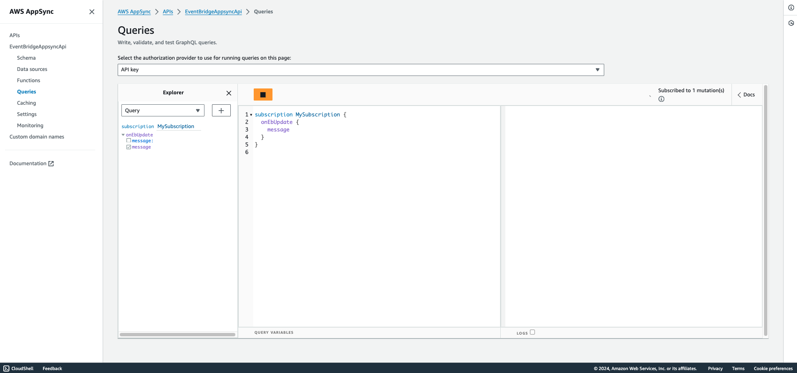
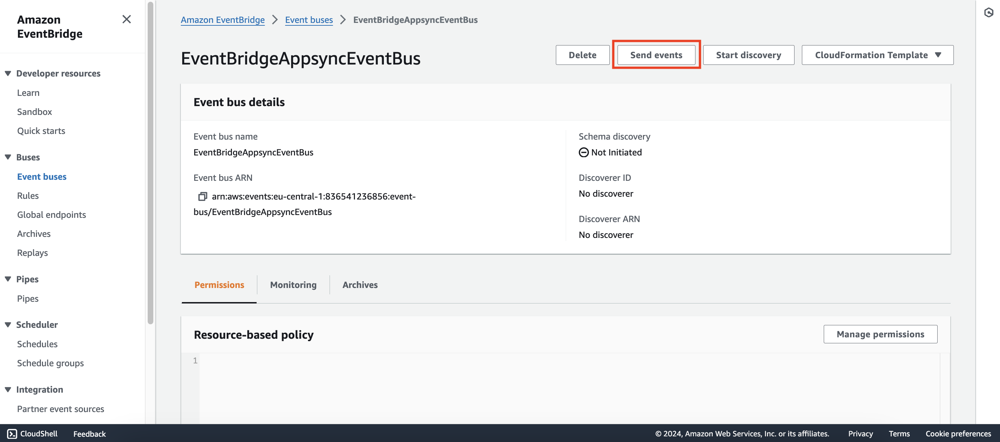
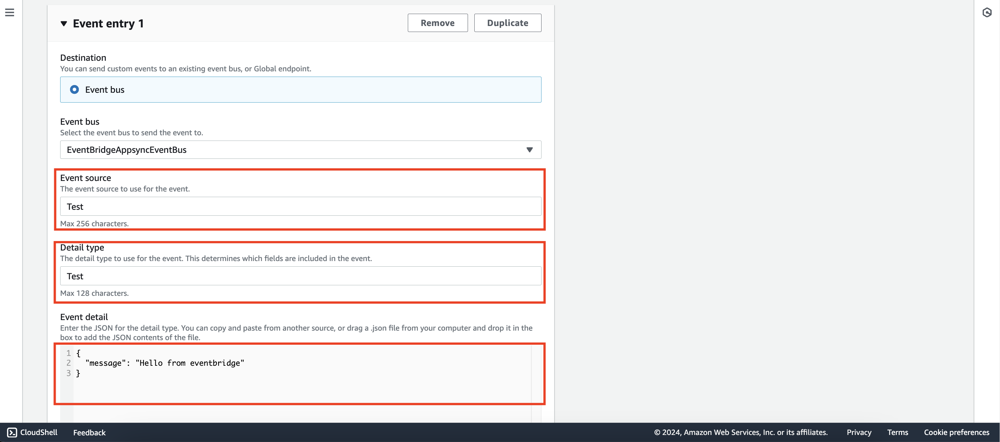
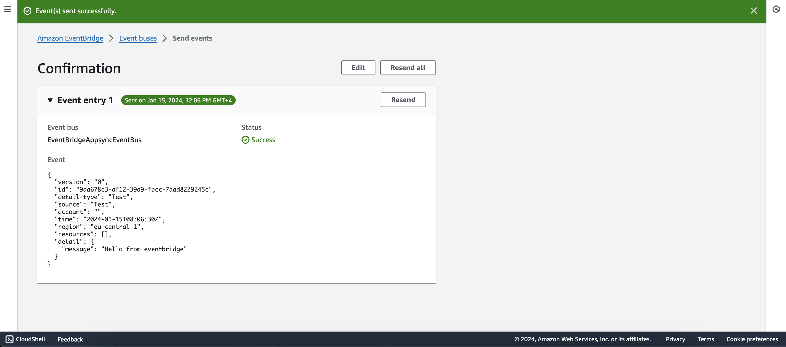
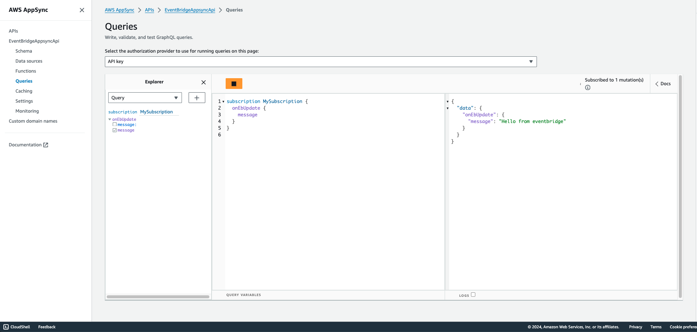

# Amazon Eventbridge to Appsync

This pattern shows how to create an Appsync API that allows you to listen to events going into an Eventbridge event bus. This is especially useful if you want your frontend users to be aware of changes happening in your backend. Those events coming in your event bus can either be pushed as custom events or can come from AWS services.

Learn more about this pattern at Serverless Land Patterns: https://serverlessland.com/patterns/eventbridge-appsync-subscription-sam

Important: this application uses various AWS services and there are costs associated with these services after the Free Tier usage - please see the [AWS Pricing page](https://aws.amazon.com/pricing/) for details. You are responsible for any AWS costs incurred. No warranty is implied in this example.

## Requirements

* [Create an AWS account](https://portal.aws.amazon.com/gp/aws/developer/registration/index.html) if you do not already have one and log in. The IAM user that you use must have sufficient permissions to make necessary AWS service calls and manage AWS resources.
* [AWS CLI](https://docs.aws.amazon.com/cli/latest/userguide/install-cliv2.html) installed and configured
* [Git Installed](https://git-scm.com/book/en/v2/Getting-Started-Installing-Git)
* [AWS Serverless Application Model](https://docs.aws.amazon.com/serverless-application-model/latest/developerguide/serverless-sam-cli-install.html) (AWS SAM) installed

## Deployment Instructions

1. Create a new directory, navigate to that directory in a terminal and clone the GitHub repository:
    ``` 
    git clone https://github.com/aws-samples/serverless-patterns
    ```
1. Change directory to the pattern directory:
    ```
    cd eventbridge-appsync-subscription-sam
    ```
1. From the command line, use AWS SAM to deploy the AWS resources for the pattern as specified in the template.yml file:
    ```
    sam deploy --guided
    ```
1. During the prompts:
    * Enter a stack name
    * Enter the desired AWS Region
    * Allow SAM CLI to create IAM roles with the required permissions.

    Once you have run `sam deploy --guided` mode once and saved arguments to a configuration file (samconfig.toml), you can use `sam deploy` in future to use these defaults.

1. Note the outputs from the SAM deployment process. These contain the resource names and/or ARNs which are used for testing.

## How it works

Whenever an event comes into your Amazon Eventbridge event bus, it will trigger an AWS Appsync subscription on your API and notify all subscribers of the change. You can further enhance the solution by creating specific rules that listen to specific events. The current example listens to (and publishes) all events coming in the event bus.

## Testing

1. Navigate to the Appsync console
2. Select the API we have just created (`EventBridgeAppsyncApi`)
3. Click on `Queries` in the left pane
4. Enter the following AppSync query:
    ```graphql
    subscription MySubscription {
        onEbUpdate {
            message
        }
    }
    ```
5. Click on `Run` > `MySubscription`
    

On another tab:
1. Navigate to the Eventbridge console
2. Select the event bus we have created (`EventBridgeAppsyncEventBus`)
3. Click on `Send events`
    
4. Create an event with following fields
   1. Event Source: `test`
   2. Detail Type: `test`
   3. Event detail
        ```json
        {
            "message": "Hello from Eventbridge"
        }
        ```
5. Click on `Send event`
    
6. You should see the following confirmation
    

On the Appsync tab with the subscription running, you should see the message coming from the Eventbridge event we just created.
    

## Cleanup
 
1. Delete the stack
    ```bash
    sam delete
    ```
----
Copyright 2023 Amazon.com, Inc. or its affiliates. All Rights Reserved.

SPDX-License-Identifier: MIT-0