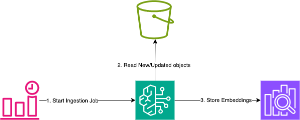
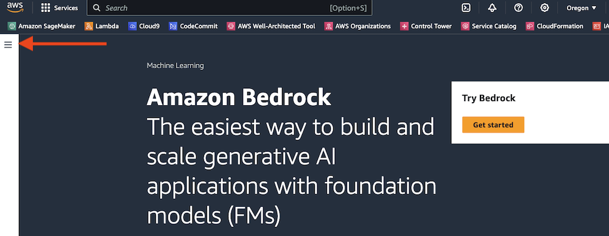
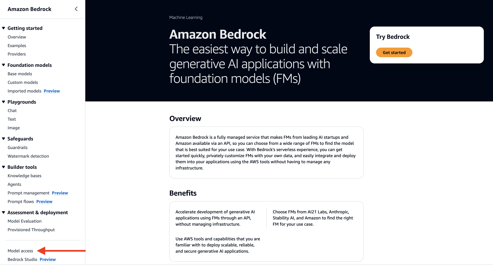
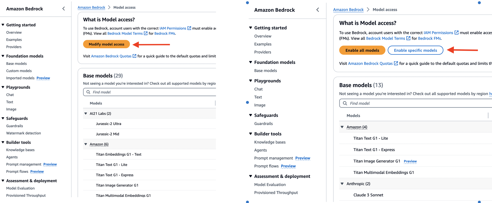
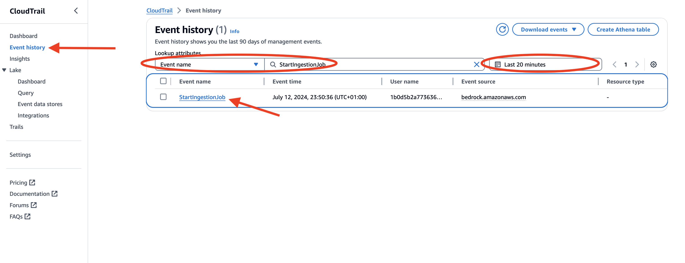
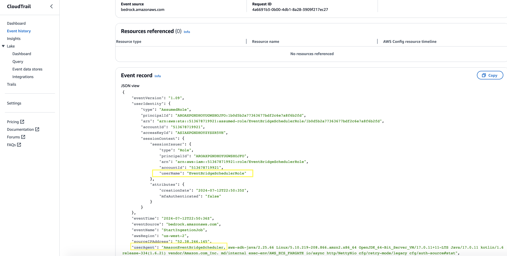
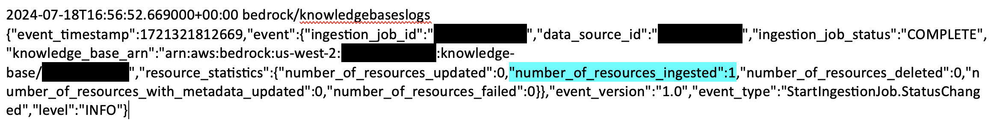
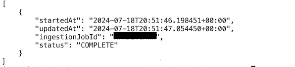

# Automatically sync your data with your Amazon Bedrock knowledge base using Amazon EventBridge Scheduler


This pattern demonstrates an approach to automatically sync datasource associated with [Amazon Bedrock Knowledge Bases](https://aws.amazon.com/bedrock/knowledge-bases/). Knowledge Bases help you take advantage of [Retrieval Augmented Generation](https://aws.amazon.com/what-is/retrieval-augmented-generation/) (RAG), a popular technique that involves drawing information from a data store to augment the responses generated by Large Language Models (LLMs). When you set up a knowledge base with your data sources, your application can query the knowledge base to return information to answer the query either with direct quotations from sources or with natural responses generated from the query results.

After you create your knowledge base, you ingest your data source/sources into your knowledge base so that they're indexed and are able to be queried. Additionally each time you add, modify, or remove files from your data source, you must sync the data source so that it is re-indexed to the knowledge base. Syncing is incremental, so Bedrock only processes added, modified, or deleted documents since the last sync.

At the time of writing, knowledge bases doesn't have a native feature to periodically sync the datasource associated with a Knowledge Base. So customers who need to refresh their datasources periodically to ensure their knowledge base is up-to-date have to rely on bespoke solution. This pattern shows one way of implementing the solution, using [Amazon EventBridge Scheduler](https://docs.aws.amazon.com/scheduler/latest/UserGuide/what-is-scheduler.html).

EventBridge Scheduler simplifies scheduling tasks by providing a centralized, serverless service that reliably executes schedules and invokes targets across various AWS services. In this particular pattern, we configure an EventBridge schedule that runs periodically (using a schedule expression). As part of the EventBridge schedule creation, we configure a target. A target is an API operation that EventBridge Scheduler invokes on your behalf whenever the schedule runs. In our case the target API would be the [`StartIngestionJob`](https://docs.aws.amazon.com/bedrock/latest/APIReference/API_agent_StartIngestionJob.html) operation on the Bedrock Agents API.

Learn more about this pattern at Serverless Land Patterns: https://serverlessland.com/patterns/eventbridge-bedrock-s3-aoss

> [!Important]
>This application uses various AWS services and there are costs associated with these services after the Free Tier usage - please see the [AWS Pricing page](https://aws.amazon.com/pricing/) for details. You are responsible for any AWS costs incurred. No warranty is implied in this example.

## Requirements

* [Create an AWS account](https://portal.aws.amazon.com/gp/aws/developer/registration/index.html) if you do not already have one and log in. The IAM user that you use must have sufficient permissions to make necessary AWS service calls and manage AWS resources.
* [AWS CLI](https://docs.aws.amazon.com/cli/latest/userguide/install-cliv2.html) installed and configured
* [Git Installed](https://git-scm.com/book/en/v2/Getting-Started-Installing-Git)
* [Node and NPM](https://nodejs.org/en/download/) installed
* [AWS Cloud Development Kit](https://docs.aws.amazon.com/cdk/latest/guide/cli.html) (AWS CDK) installed

> [!Important]
> This pattern uses Knowledge Bases and the Titan Text Embeddings V2 model. See [Supported regions and models for Amazon Bedrock knowledge bases](https://docs.aws.amazon.com/bedrock/latest/userguide/knowledge-base-supported.html) to select a region where knowledge bases  is supported

## Enable Model Access in Bedrock console
  Knowledge bases use a foundation model to embed your data sources in a vector store. Before creating a knowledge base and selecting an embeddings model for the Knowledge Base, You must request access to the model. If you try to use the model (with the API or console) before you have requested access to it, you receive an error message. For more information, see [Model access](https://docs.aws.amazon.com/bedrock/latest/userguide/model-access.html).

1. In the AWS console, select the region from which you want to access Bedrock. 

    

2. Find **Amazon Bedrock** by searching in the AWS console.

    

3. Expand the side menu.

    

4. From the side menu, select **Model access**.

    

5. Depending on your view, Select the **Enable specific models** button or the **Modify Model Access** button

   
    

6. Use the checkboxes to select the models you wish to enable. Review the applicable EULAs as needed. Click **Next** to go to the Review screen and then **Submit** to enable the required models in your account. For this pattern, by default, we would only need Titan Text Embeddings V2  /  model id: _amazon.titan-embed-text-v2:0_.

## Deployment Instructions

1. Create a new directory, navigate to that directory in a terminal and clone the GitHub repository:
    ``` 
    git clone https://github.com/aws-samples/serverless-patterns
    ```
2. Change directory to the pattern directory:
    ```
    cd serverless-patterns/eventbridge-bedrock-s3-aoss
    ```
3. Create virtual environment for Python
    ```
    python3 -m venv .venv
    ```
4.  Activate the virtualenv like this:
    
     ```
    source .venv/bin/activate
    ```
5. Install the Python required dependencies:
    ```
    pip install -r requirements.txt
    ```
6. Install dependencies to be used in Lambda Layer
    
    ```
    pip install --target layers/python -r layers/requirements.txt
    ```

7. Run the command below to bootstrap your account. CDK needs it to deploy
    ```
    cdk bootstrap
    ```
8. see the list of the IDs of the stacks in the AWS CDK application:
    ```
    cdk list
    ```

9. Review the CloudFormation template CDK generates for the included stacks using the following AWS CDK CLI command:


> [!NOTE]  
> Substitute the stack_id with one from the list in output from the `cdk list` command
    ```
    cdk synth <stack_id>
    ```

10. From the command line, use AWS CDK to deploy the AWS resources.

    ```
    cdk deploy --all
    ```
    Enter `y` if prompted `Do you wish to deploy these changes (y/n)?`
    
> [!NOTE]  
> You can optionally change the `collection_name`, `index_name`, `knowledge_base_name`, `kb_s3_datasource_name`
parameters in the `cdk.context.json`. The parameters are used to name the OpenSearch Serverless collection, index, the knowledge base and the associated S3 data source, respectively.

## How it works
Upon deployment, the CDK stack will create a Bedrock Knowledge Base configured with S3 Bucket as data source and an OpenSearch Serverless collection to store vector data. A data source repository contains files or content with information that can be retrieved when your knowledge base is queried. The stack also include an EventBridge scheduler that is configured to run every 5 mins and invoke the `StartIngestionJob` operation on Bedrock Agents API. Bedrock supports a monitoring system to help you understand the execution of any data ingestion jobs. The Stack would create the neccessary CloudWatch log groups and CloudWatch delivery. You can gain visibility into the ingestion of your knowledge base resources with this logging system. Additionally,  Bedrock is integrated with AWS CloudTrail, a service that provides a record of actions taken by a user, role, or an AWS service in  Bedrock. CloudTrail captures all API calls for Bedrock as events.


## Testing

### Verify Event Scheduler is ENABLED
The EventScheduler should be enabled by default when the stack creation is complete. You can verify this by running the below command. The expected output of the command is the text `ENABLED`. This means that the scheduler is enabled and is ready to run at the next schedule time. 

```
aws scheduler get-schedule --name BedrockKBDataSourceSyncSchedule --group BedrockKBSyncScheduleGroup --query 'State' --output text
```
### Upload Document(s) to S3 Bucket
Upload a sample pdf document to S3 bucket that is configured as the KB Datasource. You can provide your own or use one of the pdfs provided in  ```examples``` folder. You can find the bucketname in the Outputs section of the CDK command output of the BedrockKBStack
> [!NOTE]  
> Substitute the value from `BedrockKBStack.bucketname` found in the Outputs section of the `cdk deploy` command output of the `BedrockKBStack`

```
aws s3 cp examples/2022-Shareholder-Letter.pdf s3://<BedrockKBStack.bucketname>
```


> [!Important]
> Wait for for the next scheduled run before running the below commands. By default, this stack configures a scheduler to run every 5 minutes. You can find the scheduler rate by running the below command. The expected output is `rate(5 minutes)`
```
aws scheduler get-schedule --name BedrockKBDataSourceSyncSchedule --group BedrockKBSyncScheduleGroup --query 'ScheduleExpression' --output text
```

### View CloudTrail log for StartIngestionJob
1. In the CloudTrail console, click on Event history. Event history provides a viewable, searchable, downloadable, and immutable record of the past 90 days of management events. 


2. Filter using the Event Name as StartIngestionJob as well as by date and time (for example, Last 20 minutes)


3. In the Event Record, notice that the `sessionContext.sessionIssuer.userName` mentions `EventBridgeSchedulerRole` which is the role that was created by the CDK stack, and assigned to the EventBridge Schedule. Also the `userAgent` indicates `AmazonEventBridgeScheduler` as the agent through which the request was made. 

### Tail the CloudWatch Logs to look for Sync Events
The CDK creates resources to enable logging for a knowledge base using the CloudWatch contructs.
See [Knowledge bases logging](https://docs.aws.amazon.com/bedrock/latest/userguide/knowledge-bases-logging.html) for more information.
The following command tails the CloudWatch log to view KnowledgeBase events as they are logged.

> [!NOTE]  
> Substitute the `BedrockKBStack.knowledgebaseid` found in the CDK Output section of the `cdk deploy` command output of the `BedrockKBStack`

```
aws logs tail --follow --since 20m BedrockKnowledgeBase-`<BedrockKBStack.knowledgebaseid>`
```

The command should output cloudwatch log entries, for the various stages of the ingestion process (such as INGESTION_JOB_STARTED, CRAWLING_COMPLETED, EMBEDDING_STARTED and so on). The final log statement for a given ingestion job id should be the entry to indicate the COMPLETED status of the job as in the screenshot below. The log entry also outputs the resource stats include the number of documents ingested to the Knowledge Base.

Sample Output



### View Ingestion Job timestamp and status
You can also use the following command to check the status of ingestion job(s). The command outputs the most recent ingestion job.

> [!NOTE]  
> Substitute the BedrockKBStack.knowledgebaseid and BedrockKBStack.datasourceid found in the  Output section of the `cdk deploy` command output of the `BedrockKBStack`

```
aws bedrock-agent list-ingestion-jobs --knowledge-base-id <BedrockKBStack.knowledgebaseid> --data-source-id <BedrockKBStack.datasourceid> --query 'reverse(sort_by(ingestionJobSummaries,&startedAt))[:1].{startedAt:startedAt, updatedAt:updatedAt,ingestionJobId:ingestionJobId,status:status}'
```
Sample Output 



## Cleanup
 
1. Run below script in the `eventbridge-bedrock-s3-aoss` directory to delete AWS resources created by this sample stack.
    ```bash
    cdk destroy --all
    ```

## Extra Resources
* [Bedrock Api Reference](https://docs.aws.amazon.com/bedrock/latest/APIReference/welcome.html)
* [Sync to ingest your data sources into the knowledge base](https://docs.aws.amazon.com/bedrock/latest/userguide/knowledge-base-ingest.html)
* [What is Amazon EventBridge Scheduler?](https://docs.aws.amazon.com/scheduler/latest/UserGuide/what-is-scheduler.html)
* [Using universal targets with EventBridge Scheduler](https://docs.aws.amazon.com/scheduler/latest/UserGuide/managing-targets-universal.html)

----
Copyright 2024 Amazon.com, Inc. or its affiliates. All Rights Reserved.

SPDX-License-Identifier: MIT-0