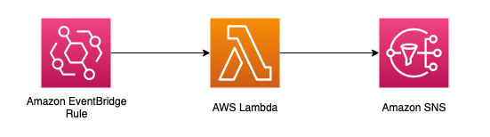
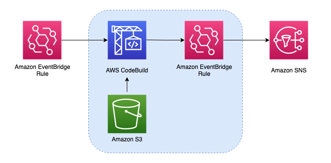

# Executing Long-Running Scripts in a Serverless Application Using AWS CodeBuild

AWS Lambda is a core serverless compute service that lets you run code without provisioning or managing servers. It's cost-effective, highly scalable and highly available, allowing our customers to decrease time to market, optimize costs, encourage innovation, and improve agility. 

Developers sometimes encounter the 15-minute timeout limit for Lambda functions. This pattern demonstrates how to use AWS CodeBuild to run long-running scripts (scripts that run for more than 15 minutes) in a serverless application. This examples creates a CodeBuild project that runs a sample script triggered by a scheduled EventBridge rule, and a SNS topic to inform the completion of the CodeBuild project. A S3 bucket is also created to upload sample script. 

Learn more about this pattern at Serverless Land Patterns: << Add the live URL here >>

Important: this application uses various AWS services and there are costs associated with these services after the Free Tier usage - please see the [AWS Pricing page](https://aws.amazon.com/pricing/) for details. You are responsible for any AWS costs incurred. No warranty is implied in this example.

## Requirements

* [Create an AWS account](https://portal.aws.amazon.com/gp/aws/developer/registration/index.html) if you do not already have one and log in. The IAM user that you use must have sufficient permissions to make necessary AWS service calls and manage AWS resources.
* [AWS CLI](https://docs.aws.amazon.com/cli/latest/userguide/install-cliv2.html) installed and configured
* [Git Installed](https://git-scm.com/book/en/v2/Getting-Started-Installing-Git)
* [Python, pip, virtuenv](https://docs.aws.amazon.com/cdk/latest/guide/work-with-cdk-python.html) installed
* [AWS Cloud Developer Kit](https://docs.aws.amazon.com/cdk/v2/guide/cli.html) installed and configured

## Deployment Instructions

1. Create a new directory, navigate to that directory in a terminal and clone the GitHub repository:
    ``` 
    git clone https://github.com/aws-samples/serverless-patterns
    ```
2. Change directory to the pattern directory:
    ```
    cd serverless-patterns/eventbridge-codebuild-sns/cdk
    ```
3. Create and activate the project's virtual environment. This allows the project's dependencies to be installed locally in the project folder, instead of globally. 
   ```
    python3 -m venv .venv
    source .venv/bin/activate
   ```    
4. Once the virtualenv is activated, you can install the required dependencies.
    ```
    $ pip install -r requirements.txt
    ```
5. Configure your AWS CLI to point to the AWS account and region where you want to deploy the solution. You can run the following command to verify which AWS account you are currently logged on:
    ```
    aws sts get-caller-identity
    ```
6. If you are using CDK to deploy to your AWS account for the first time, you will have to bootstrap your account. To do this, run the command:
    ```
    cdk bootstrap aws://<account-number>/<region>
    ```
7. Deploy the stack
    ```
    cdk deploy
    ```
8. Once deployment completes, you will see the name of the artifacts bucket and SNS topic ARN as outputs. Now we can upload the sample script from `/src/script.py` to the artifacts bucket. 
   ```
   aws s3 cp src/script.py s3://<your-bucket-name>/script.py
   ```
   Make a note of the SNS topic ARN output. You will use this value for testing.   


## How it works

It's a common pattern to use an EventBridge rule to trigger a Lambda function, and then use the Lambda function to publish a message to a SNS topic upon its completion. 
    


This CDK application deploys a CodeBuild project that is triggered by an EventBridge rule scheduled for every hour. The CodeBuild project downloads the long-running script from S3, and execute it with a timeout limit configured at 1 hour. Once the Build project completes (either with a state of "SUCCEEDED", "FAILED" or "STOPPED"), another EventBridge rule will send this event to a SNS topic. To view the messages, you can subscribe to the topic with your email address or Lambda functions. 
    



## Testing

1. Use the AWS CLI to subscribe to the SNS topic with your email address
    ```
    aws sns subscribe --topic-arn <your-topic-arn> --protocol email --notification-endpoint <your-email-address>
    ```
   You should get an output like this:
   ```
   {
    "SubscriptionArn": "pending confirmation"
   }
   ```

2. Click the confirmation link delivered to your email to finish subscribing to the topic. 

3. Now you can trigger the CodeBuild project. You can either wait for the scheduled Build project to kick off on its own (every 1 hour) or manually start the project for testing. To manually start the project, navigate to the AWS CodeBuild console, click into the project created by the CDK stack, and click "Start Build". The sample script doesn't take long to execute; we are including a small script to demonstrate functionality. 

4. Once the Build project finishes, you will receive an email via SNS shortly with a json object describing the event. Now you can verify that change in status of the Build project can trigger downstream services. 


## Cleanup

1. Remove the sample script from S3 bucket

    ```
    aws s3 rm s3://<your-bucket-name>/script.py
    ```
2. Find out the SNS topic subscription id 

    ```
    aws sns list-subscriptions-by-topic --topic-arn <your-topic-arn>    
    ```
3. Unsubscribe to SNS topic using the Subscription ARN from the output of the previous step

    ```
    aws sns unsubscribe --subscription-arn <your-subscription-arn>
    ```
2. Delete the stack

    ```
    cdk destroy
    ```
----
Copyright 2021 Amazon.com, Inc. or its affiliates. All Rights Reserved.

SPDX-License-Identifier: MIT-0
