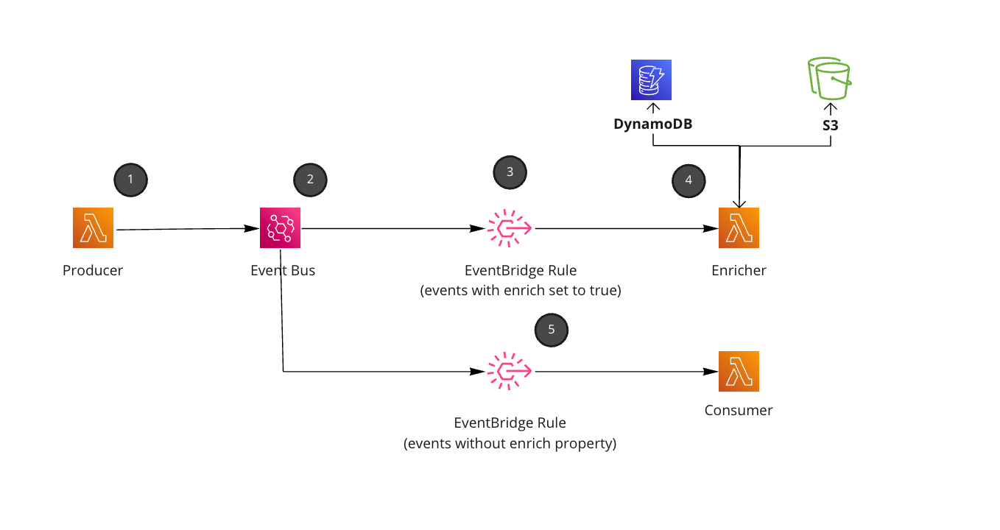

<div align="center">

<h1>📂 Single bus enrichment with Lambda</h1>

<hr />



  <h3>Using single bus pattern to enrich events to downstream consumers using metadata enrich property.</h3>

</div>

---

## How the enrichment pattern works

1. Producer raise event and stores `enrich:true` into the `metadata` of the event.
1. Event bus consumes event
1. Rule is setup to listen to all events that need enriching (using the metadata field and EventBridge filters)
1. Enricher takes event, strips of the enrichment flag, and continues to enrich event using the `detailType` as the key. The enricher is opinionated and knows how to enrich based on the event and schema of the event. 
1. Every downstream consumer acts as usual, but now they have to add a filter onto the rule that makes sure `enrich:true` is not set onto the event (downside of the pattern).

## Why the enrichment pattern

Sending message from producer and consumer it can be common for consumers to want to know more information. This pattern allows you to keep contracts simple (from producer), enrich them and pass them onto the consumer.


[Read more about the Content Enricher Pattern](https://www.enterpriseintegrationpatterns.com/DataEnricher.html)

This enrichment pattern allows producers to remain small in contract (schema), but allow downstream consumers the ability to setup rules with enriched events still.


## Deploying and testing this pattern
Clone the project an run:

`npm run build && cdk deploy`

Once deployed then trigger the `producer` lambda function. This should producer the enriched event, get consumed by the enricher and publish more events downstream.

## Understanding the enrichment property

The producer raises and event, and inside the `metadata` contains the `enrich` flag. The `enrich` flag is used to filter events to downstream consumers and the "enricher".

```js
{
  detailType: 'OrderCreated'
  detail: {
    metadata: {
      enrich: true
    },
    detail: {
      user: {
        id: 'some-random-user-id'
      }
    },
    ....
  }
}
```

Once events are enriched using the Lambda function, the event is thrown back onto the bus and enrich flag is removed. Downstream consumers continue business as usual.

### Run the example

1. Trigger the `SingleBusEnrichmentWithLambda-producer` function 
2. View the cloudwatch log group for the `SingleBusEnrichmentWithLambda-consumer` function (see the enrichment)

The producer will raise the event that needs to be enriched.

The consumer will get the payload that is enriched.


### Things to consider before using this pattern
- All downstream consumers have to make sure they filter out events (with the rule enrich: [{ exists: false }]), and only consume events that do not have the `enrich` flag within the metadata (if they want to the data to be enriched).
- Producers have to be aware of the `enrich` flag on the events.
