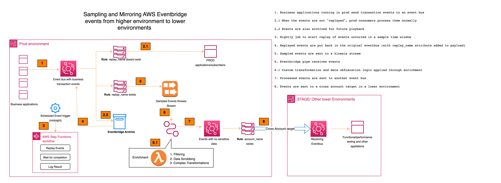

# Sample and Mirror Prod Events to Lower Environments

This pattern helps sample AWS EventBridge events (select a subset of events based on specific timeframe) and send the events from higher environments (such as production) lower environments (such as dev or stage). The events in prod represents real world data and they can be very useful in lower environments for testing new versions of applications, investigate issues or conduct performance testing. This patern will seamlessly move the prod events to lower environments in an automated and scheduled fashion. 

AWS Eventbridge comes with "archive" feature which can be turned on so that a future playback of events is possible. This pattern uses this feature and automates the process of triggering replay of events for a smaller sampling timeframe (ex. 1 hour) using a step function workflow. These replayed events then flow through an eventbridge rule to a kinesis stream. Note that the normal subscribers of the main event bus do not see the replayed events as the rules are configured appropriately. The sampled events that are sent to Kinesis will go through an AWS Eventbridge pipe. "Enrichment" lambda in the pipe is used to perform filtering, transformation and scrubbing of sensitive data from the events. Once the events are cleaned up, they flow through another eventbus rule for which an eventbus from another account is assiged as a target. This account can be dev, stage etc and they can use this near-real-world events to test applications in development, run performance testing, investigate issues etc. 

Here is the detailed architechture
