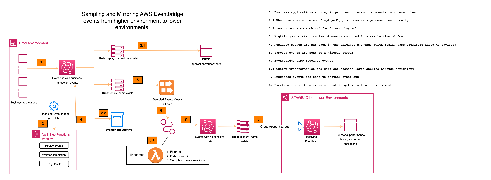

# Sample and Mirror Prod Events to Lower Environments
This is python CDK for the pattern described here. 

This pattern helps sample AWS EventBridge events (select a subset of events based on specific timeframe) and send the events from higher environments (such as production) lower environments (such as dev or stage). The events in prod represents real world data and they can be very useful in lower environments for testing new versions of applications, investigate issues or conduct performance testing. This patern will seamlessly move the prod events to lower environments in an automated and scheduled fashion. 

Here is the detailed architechture


## How it works

AWS Eventbridge comes with "archive" feature which can be turned on so that a future playback of events is possible. This pattern uses this feature and automates the process of triggering replay of events for a smaller sampling timeframe (ex. 1 hour) using a step function workflow. These replayed events then flow through an eventbridge rule to a kinesis stream. Note that the normal subscribers of the main event bus do not see the replayed events as the rules are configured appropriately. The sampled events that are sent to Kinesis will go through an AWS Eventbridge pipe. "Enrichment" lambda in the pipe is used to perform filtering, transformation and scrubbing of sensitive data from the events. Once the events are cleaned up, they flow through another eventbus rule for which an eventbus from another account is assiged as a target. This account can be dev, stage etc and they can use this near-real-world events to test applications in development, run performance testing, investigate issues etc. 

There is a step function that takes care of replaying the event. In a real world situation, the sampling and mirroring process can be automated by creating a scheduled cron event to trigger this step function. For now, we will be manually triggering this when testing this pattern.
## Requirements

- [Create an AWS account](https://portal.aws.amazon.com/gp/aws/developer/registration/index.html) if you do not already have one and log in. The IAM user that you use must have sufficient permissions to make necessary AWS service calls and manage AWS resources.
- [AWS CLI](https://docs.aws.amazon.com/cli/latest/userguide/install-cliv2.html) installed and configured
- [Git Installed](https://git-scm.com/book/en/v2/Getting-Started-Installing-Git)
- [Python 3](https://www.python.org/downloads/)

## Deployment Instructions

# General Steps

*Note:* We will be using 2 different aws accounts to deploy and test the 2 stacks that are part of this pattern. Stack "SimpleLowerEnvironmentStack" represents a dev or stage account and stack "EventbridgeEventsReplayStack" represents a PROD or other higher environment where real world events exist. Please make sure that the aws cli in your local environment is configured with access credentials for both these accounts. The following steps will assume that the credentials file in .aws folder contains a "prod" profile with access details pertaining to PROD and another profile called "stage" with access details for dev or stage account. 

For more information on how to configure aws profiles for cli, pleas refer to the AWS documentation (here)[https://docs.aws.amazon.com/cli/latest/userguide/cli-configure-files.html] 

1. Create a new directory, navigate to that directory in a terminal and clone the GitHub repository:
   ```
   git clone https://github.com/aws-samples/serverless-patterns
   ```
2. Change directory to the pattern directory:
   ```
   cd serverless-patterns/eventbridge-events-replay-cdk
   ```
3. Create a virtual environment for Python:
   ```
   python3 -m venv .venv
   ```
4. Activate the virtual environment
   ```
   source .venv/bin/activate
   ```
   For a Windows platform, activate the virtualenv like this:
   ```
   .venv\Scripts\activate.bat
   ```
5. Install the Python required dependencies:
   ```
   pip install -r requirements.txt
   ```
6. Review the CloudFormation template the cdk generates for you stack using the following AWS CDK CLI command:
   ```
   cdk synth
   ```
# Deploy Lower environment stack 

1. Open python/cdk.json file and update "prodAccountId" value to the account number of the prod account. 

2. From the command line, use AWS CDK to deploy the AWS resources for the serverless application as specified in the app.py file:
   ```
   cdk deploy SimpleLowerEnvironmentStack --profile "stage"
   ```
3. Once deployment is successful, CDK will output arn of the receiving event bus. Copy this and we will use this in the next step.

4. Also, this stack would have created a simple EventBridge rule and an SNS target for testing. Login to AWS console and create an email subscription for this SNS topic with your email Id so you will receive the events coming into the event bus in the stage environment to your email. More details (here) [https://docs.aws.amazon.com/sns/latest/dg/sns-email-notifications.html]

# Deploy Prod environment stack

1. Open python/cdk.json file and update the "crossAccountEventBusArn" value with the arn copied in the above step. 

2. From the command line, use AWS CDK to deploy the AWS resources for the serverless application as specified in the app.py file:
   ```
   cdk deploy EventbridgeEventsReplayStack --profile "prod"
   ```
3. Once deployment is successful, the ARN of the main event bus will be in the output with the name "EventBusWithBizTransactionsArn". Copy the value of this ARN. We will use this in testing.
Note the value of the other output parameter "ReplayEventsStateMachineArn". We will need this for testing as well. 

## Testing

To test this pattern, you can use AWS CLI to drop events into the main event bus in the prod account. 

```
aws events put-events --entries file://resources/test_events.json
```

After a few minutes, the events will get archived into the archive created for the main event bus. You can verify this with the following command 

```
aws events describe-archive --archive-name "ArhiveOfMainBus"
```

The response of the above command will show you the updated number of events in "EventCount" field. 

Once the events are in archive, you can start the step function manually by executing this command

```
aws stepfunctions start-execution --state-machine-arn <cloudformation output value ReplayEventsStateMachineArn>
```

This will replay the events and the events will land in the event bus we created in the stage environment and from there they will be delivered to your email that is subscribed earlier to the SNS topic in the stage environment. 
## Cleanup

Run the given command to delete the resources that were created. It might take some time for the CloudFormation stack to get deleted.

```
cdk destroy EventbridgeEventsReplayStack --profile="prod"
```

```
cdk destroy SimpleLowerEnvironmentStack --profile="stage"
```

---

Copyright 2021 Amazon.com, Inc. or its affiliates. All Rights Reserved.

SPDX-License-Identifier: MIT-0
